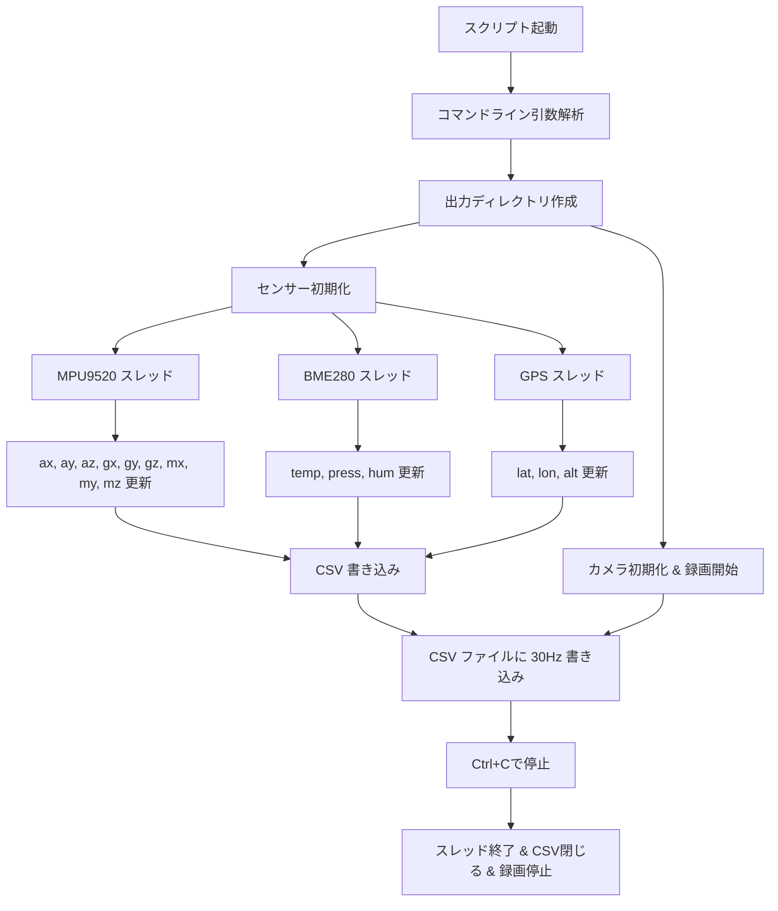

# Sensor + Camera Logger

Raspberry Pi 上で複数センサー（MPU9520、BME280、GPS）とカメラを同時に操作し、**CSV データ取得**と**動画録画**を同時に行う Python スクリプトです。

ソースコード名: `mod_mat_OK_final_space_balloon.py`

---

## 対応センサー

- **MPU9520**: 加速度・ジャイロ・磁気
- **BME280**: 温度・湿度・気圧
- **GPS**: 緯度・経度・高度
- **カメラ**: Picamera2（FHD 1920x1080、H264 エンコード）

---

## 必要ライブラリ

```bash
pip install smbus2 bme280 serial pynmea2 picamera2
```

インポートできない場合は警告が出ますが、他の処理は継続されます。


## 実行方法

```bash
python mod_mat_OK_final_space_balloon.py --mode 0 --mpu9520 --gps_port /dev/serial/by-id/usb-u-blox_AG_-_www.u-blox.com_u-blox_7_-_GPS_GNSS_Receiver-if00
```
## 引数
- --mode, -m : 実行モード（現在は 0 のみ対応）
- --mpu9520 : MPU9520 を有効化
- --mpu9520_i2cbus : MPU9520 の I2C バス番号（デフォルト 1）
- --mpu9520_addr : MPU9520 の I2C アドレス（デフォルト 0x68）
- --gps_port : GPS モジュールのシリアルポート

## 出力

### CSV データ: 

./csv/<タイムスタンプ>/sensor.csv

カラム:

```
timestamp, ax, ay, az, gx, gy, gz, mx, my, mz, temp, press, hum, lat, lon, alt
```

### 動画: 

./movie/<タイムスタンプ>/movie.h264

解像度: 1920x1080

フレームレート: 約30fps



- 各センサーは独立スレッドで約30Hzで値を更新
- メインスレッドで CSV に書き込み
- Picamera2 で動画を録画（フレームレート約30fps）

### 注意点
- モードは現状 0 のみサポート
- CSV と動画は同時出力
- SDカード速度が遅い場合、書き込み遅延やフレーム落ちが発生する可能性あり
- 地磁気センサーの補正処理にバグあり（locals()[v] は反映されません）

参考リンク
