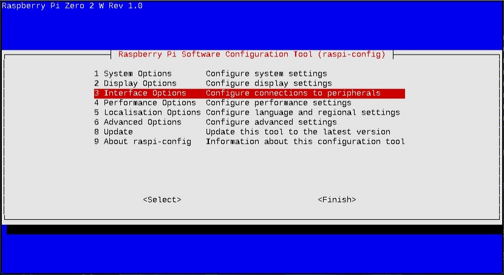
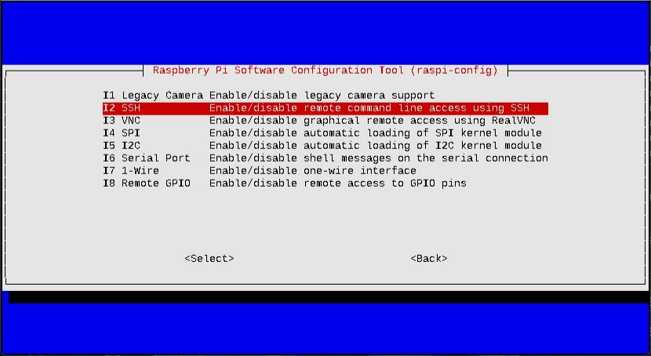
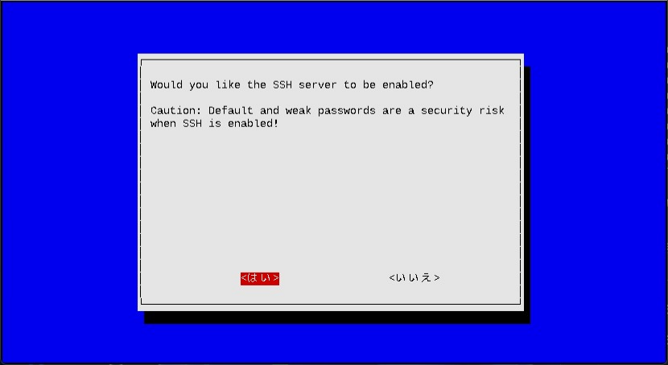
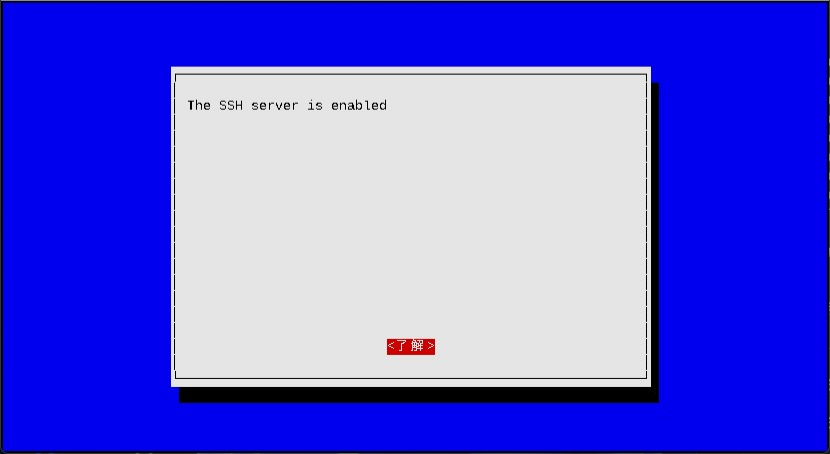
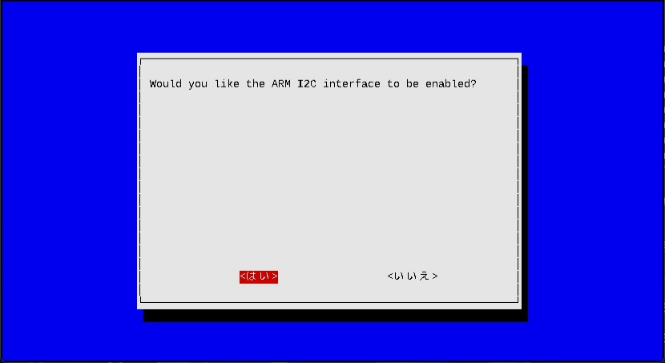
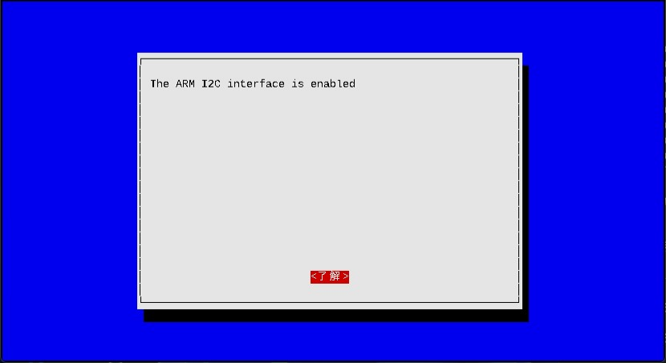

# space_balloon.pyについて

## 変更履歴

| 日付 | 変更概要 |
|-----------------------------------------------|--------------------|
| 2025/05/04 | 新規作成 |
| 2025/05/21 | 「1. space_balloon.py概要」について<br>　「1-2. クラス構成」の図修正<br>　「1-3-1. 実行オプション」へオプション追加<br>　「1-4-3.モード別クラスデータパス」の図修正<br>「4. カメラモジュールを用いた動画取得について」について<br>　「4-3. センサーデータ解析モード時の動画ファイル」追加<br>「8. ICM-20948を用いた加速度、角速度および地磁気の取得について」を追加<br>「9. IVK172 G-Mouse USB GPSを用いた計測データの取得について」を追加<br>「11. 今後の課題」について<br>　「11-4. 動画データと計測データのハードウェア同期」を追加<br>「付録」について<br>　「Python実行環境準備」へライブラリ追加<br>　「I2C通信」へICM-20948追加<br>　「カメラモジュールの比較」へRaspberry Pi HQ Cameraを追加<br>　「Raspberry Piのスペック表」へCPUコア数追加<br>　「消費電力の見積り」の内容修正<br>　「GoogleEarth Proでの可視化」を追加<br>「参考情報」を追加 |

## 1. space_balloon.py概要

### 1-1. 機能概要

space_balloon.pyは以下機能を提供する。
センサーからデータを取得しcsv形式で出力する機能。
センサーから取得したデータを解析し加工する機能。

### 1-2. クラス構成

space_balloon.pyのクラス構成を以下に示す。


| クラス名                   | 説明                                                              |
|---------------------------|-------------------------------------------------------------------|
| `SensorWrapper`クラス      | 入力オプションによってモード別動作を管理する。                        |
| `CameraModuleImpl`クラス   | カメラモジュールから動画を取得するためlibcamera-vidコマンドを実行する。|
| `BME280Impl`クラス         | BME280から温度、気圧および湿度を取得しcsvに出力する。                 |
| `MPU6050Impl`クラス        | MPU6050から加速度、角速度および温度を取得しcsvに出力する。            |
| `MPU9250Impl`クラス        | MPU9250から加速度、角速度および地磁気を取得しcsvに出力する。          |
| `ICM20948Impl`クラス       | ICM-20948から加速度、角速度および地磁気を取得しcsvに出力する。          |
| `IVK172GpsImpl`クラス        | IVK172 G-Mouse USB GPSから加速度、角速度および地磁気を取得しcsvに出力する。 |
| `SensorAnalyzerImpl`クラス | 各センサーから取得したデータを解析し加工データを出力する。             |

### 1-3. 入出力

space_balloon.pyは実行開始時および実行中に有効機能に応じて以下を入力とする。

- モード選択
- 機能イネーブル
- 機能別パラメータ
- 出力格納先
-  センサー計測データ

次に実行結果として以下を出力する。

- センサー計測データ
- センサー計測加工後データ

#### 1-3-1. 実行オプション

前述した入力は実行オプションで設定する。
以下にオプション一覧を示す。

| オプション                                 | モード                    | デフォルト値   | 説明                       |
|--------------------------------------------|---------------------------|----------------|--------------------------- |
|`--help`                                    | -                         | -              | ヘルプメッセージを表示する |
|`--mode <モード番号>`                       | -                         | 0              | モード選択<br>センサー取得モード:0<br>センサーデータ解析モード:1<br>例: `--mode 0` |
|`--output_dir <出力先ディレクトリ名>`       | センサー取得モード        | ./             | センサーから取得したデータの出力先ディレクトリを指定する<br>ディレクトリは事前に作成しておく必要がある<br>例: `--output_dir ./output` |
|`--camera`                                  | センサー取得モード        | FalseでOFF     | カメラモジュールによる撮影を有効化するイネーブルオプション |
|`--interval <計測間隔>`                  | センサー取得モード        | 0.0015(1.5msec) | カメラモジュール以外のセンサーからデータを取得する間隔<br>csvへの出力は1/3を掛けた秒数<br>例: `--bitrate 0.0015` |
|`--framerate <フレームレート>`              | センサー取得モード        | 30             | 撮影時のフレームレート設定<br>例: `--framerate 30` |
|`--bitrate <ビットレート>`                  | センサー取得モード        | 8000000(8Mbps) | 撮影時のビットレート設定<br>ビット単位で指定する<br>例: `--bitrate 8000000` |
|`--width <水平サイズ>`                      | センサー取得モード        | 1920           | 撮影時の水平サイズ設定<br>例: `--width 1920` |
|`--height <垂直サイズ>`                     | センサー取得モード        | 1080           | 撮影時の垂直サイズ設定<br>例: `--height 1080` |
|`--gps`                                    | センサー取得モード        | FalseでOFF     | IVK172 G-Mouse USB GPSからのデータ取得を有効化するイネーブルオプション |
|`--gps_port`                               | センサー取得モード        | /dev/ttyACM0     | IVK172 G-Mouse USB GPSのUSBシリアルポート |
|`--bme280`                                 | センサー取得モード        | FalseでOFF     | BME280からのデータ取得を有効化するイネーブルオプション |
|`--mpu6050`                                | センサー取得モード        | FalseでOFF     | MPU6050からのデータ取得を有効化するイネーブルオプション |
|`--mpu9250`                                | センサー取得モード        | FalseでOFF     | MPU9250からのデータ取得を有効化するイネーブルオプション |
|`--icm20948`                              | センサー取得モード        | FalseでOFF     | ICM-20948からのデータ取得を有効化するイネーブルオプション |
|`--bme280_addr <BME280のデバイスアドレス>`  | センサー取得モード        | 0x76           | BME280のデバイスアドレス<br>16進数で先頭に0xをつける必要あり<br>例: `--bme280_addr 0x76` |
|`--mpu6050_addr <MPU6050のデバイスアドレス>`| センサー取得モード        | 0x68           | MPU6050のデバイスアドレス<br>16進数で先頭に0xをつける必要あり<br>例: `--mpu6050_addr 0x68` |
|`--icm20948_addr <ICM-20948のデバイスアドレス>`| センサー取得モード        | 0x69           | ICM-20948のデバイスアドレス<br>16進数で先頭に0xをつける必要あり<br>例: `--icm20948_addr 0x69` |
|`--frame_sync`                              | センサーデータ解析モード  | FalseでOFF     | センサー取得モードにおいて、カメラモジュールから取得したデータと他センサーの計測データを同期する<br>--movie_csvは必須で指定しないと何も実行しせず、他--bme280_csv、--altitude、--mpu6050_csv、--mpu9250_csv、--movieおよび--toleranceを設定しカスタマイズ可能 |
|`--movie_csv <動画のcsvファイル>`           | センサーデータ解析モード  | FalseでOFF     | センサー取得モードにおいて取得した各フレームのタイムスタンプ出力ファイルを指定する<br>例: `--movie_csv video.csv` |
|`--gps_csv <IVK172 G-Mouse USB GPSのcsvファイル>`          | センサーデータ解析モード  | -              | センサー取得モードにおいて、IVK172 G-Mouse USB GPSから取得した計測データのcsvファイル名<br>例: `--gps_csv ./gps.csv` |
|`--bme280_csv <BME280のcsvファイル>`        | センサーデータ解析モード  | -              | センサー取得モードにおいて、BME280から取得した計測データのcsvファイル名<br>例: `--bme280_csv ./bme280.csv` |
|`--mpu6050_csv <MPU6050のcsvファイル>`      | センサーデータ解析モード  | -              | センサー取得モードにおいて、MPU6050から取得した計測データのcsvファイル名<br>例: `--mpu6050_csv ./mpu6050.csv` |
|`--mpu9250_csv <MPU9250のcsvファイル>`      | センサーデータ解析モード  | -              | センサー取得モードにおいて、MPU9250から取得した計測データのcsvファイル名<br>例: `--mpu9250_csv ./mpu9250.csv` |
|`--icm20948_csv <ICM-20948のcsvファイル>`      | センサーデータ解析モード  | -              | センサー取得モードにおいて、ICM-20948から取得した計測データのcsvファイル名<br>例: `--icm20948_csv ./icm20948.csv` |
|`--mp4`                                     | センサーデータ解析モード  | FalseでOFF     | H264形式動画ファイルをMP4形式で出力<br>--movieオプションで動画ファイル名を指定する<br>--frame_syncオプションを有効にすることで同期データを加えた動画もMP4で出力する |
|`--altitude`                                | センサーデータ解析モード  | FalseでOFF     | BME280で取得したデータをもとに高度を算出する<br>--bme280_csvオプションでBME280計測データを指定する必要がある<br>--frame_syncオプションで本オプションを有効にすれば高度データも追加する |
|`--bme280_graph`                            | センサーデータ解析モード  | FalseでOFF     | 機能未実装のため指定しても動作しない |
|`--mpu6050_graph`                           | センサーデータ解析モード  | FalseでOFF     | 機能未実装のため指定しても動作しない |
|`--mpu9250_graph`                           | センサーデータ解析モード  | FalseでOFF     | 機能未実装のため指定しても動作しない |
|`--icm20948_graph`                          | センサーデータ解析モード  | FalseでOFF     | 機能未実装のため指定しても動作しない |
|`--movie <動画ファイル名>`                  | センサーデータ解析モード  | -              | センサー取得モードにおいて、カメラモジュールから取得したH264形式動画ファイルを指定する<br>例: `--movie video.h264` |
|`--tolerance <許容誤差>`                    | センサーデータ解析モード  | 0.032          | --frame_syncオプションでフレーム毎の取得時間とセンサー取得時間で同期を取る際に取得時間で発生する時間の誤差許容範囲を指定する<br>秒単位で指定する<br>例: `--tolerance 0.015` |
|`--tolerance_gps <許容誤差>`                    | センサーデータ解析モード  | 1          | --frame_syncオプションでフレーム毎の取得時間とIVK172 G-Mouse USB GPSからの取得時間で同期を取る際に取得時間で発生する時間の誤差許容範囲を指定する<br>秒単位で指定する<br>例: `--tolerance_gps 1` |
|`--excel`                                   | センサーデータ解析モード  | FalseでOFF     | センサーデータ解析モードで出力する加工csvファイルをcsvでなく.xlsx形式で出力する |
|`--map_animation`                           |  センサーデータ解析モード  | FalseでOFF     | GPS取得データをもとにアニメーション付きマップデータ出力をする<br>時系列データ加工機能未実装のため指定しても動作しない |

#### 1-3-3. csvファイルおよびDataFrame

csvファイルについてセンサー取得モード時はオプションで有効設定にしたセンサーから取得したデータを出力する。センサーデータ解析モードでは解析対象をオプションで設定し、それに応じて加工したcsvを出力する。
また、Excelでの出力オプションを有効にすることで、Excelファイルとして出力可能。
後述する[1-4. 動作モード](#1-4-動作モード)にcsvの形式を示している。

#### 1-3-2. 動画ファイル

動画ファイルについてセンサー取得モード時はカメラモジュールから取得したデータをもとに動画を出力する。一方、センサーデータ解析モードは加工した動画を出力する。加工には読み込んだcsvファイルから取得したデータを動画に埋め込む。

以下は、カメラモジュールから取得したデータを表している。
(※一部別ソフトウェアを通してぼかしをいれている。)


以下は、カメラモジュールの出力csvおよび他センサーデータ計測データをカメラモジュールから取得したデータに埋め込んだ結果を表している。


### 1-4. 動作モード

#### 1-4-1.センサー取得モード

センサー取得モードでは、オプションに応じて以下を取得する。
- カメラモジュールからH264フォーマットの動画
- 動画の1フレーム毎のタイムスタンプ
- BME280の計測温度、気圧および湿度
- MPU6050の計測加速度、角速度および温度
- ICM-20948の計測加速度、角速度、地磁気および温度
- IVK172 G-Mouse USB GPSの計測緯度・経度など

##### 1-4-1-1. 動画取得

以下はカメラモジュールの出力csvは以下で、*センサー取得モード*時に出力する。
先頭行にカメラモジュールバージョンがログ説明が必ず入る。
なお、後述する[4. カメラモジュールを用いた動画取得について](#4-カメラモジュールを用いた動画取得について)の[4-2. Pythonコードの説明](#4-2-pythonコードの説明)に記載してあるように、libcamera-vidのオプションで出力するログの形式となる。
このcsvはlibcamera-vidで撮影した動画における1フレームあたりの撮影時間をミリ秒で表している。

```text
# timecode format v2
               0.000
              33.327
              66.655
              99.981
             133.308
                 ...
            6032.182
            6065.511
            6098.837
            6132.164
            6165.490
```

##### 1-4-1-2. BME280計測データ取得

以下はBME280の出力csvは以下で、*センサー取得モード*時に出力する。
- elapsed_timeは初回計測開始からの経過時間を秒単位で表している。
- start_epoch_timeは初回計測開始時刻のUNIXエポックタイムを表している。
- unix_epoch_timeはcsv出力可能時刻のUNIXエポックタイムを表している。
- temperatureはBME280から取得した温度、pressureは気圧、humidityは湿度を表している。

```text
elapsed_time  start_epoch_time  unix_epoch_time  temperature    pressure   humidity
    0.021416      1.745854e+09     1.745854e+09    28.675836  998.101465  39.258262
    0.041374      1.745854e+09     1.745854e+09    28.680888  998.030453  39.078561
    0.062080      1.745854e+09     1.745854e+09    28.690990  998.101007  38.806262
    0.082345      1.745854e+09     1.745854e+09    28.690990  998.074434  38.768136
    0.102556      1.745854e+09     1.745854e+09    28.685939  998.039157  39.231050
         ...               ...              ...          ...         ...        ...
    8.797503      1.745854e+09     1.745854e+09    28.766757  998.018973  38.931588
    8.818225      1.745854e+09     1.745854e+09    28.751604  998.019438  38.779058
    8.838896      1.745854e+09     1.745854e+09    28.766757  998.045549  38.969718
    8.859625      1.745854e+09     1.745854e+09    28.756655  998.081292  39.018731
    8.880499      1.745854e+09     1.745854e+09    28.751604  998.125739  39.726741
```

##### 1-4-1-3. MPU6050計測データ取得

以下はMPU6050の出力csvは以下で、*センサー取得モード*時に出力する。
- elapsed_timeは初回計測開始からの経過時間を秒単位で表している。
- start_epoch_timeは初回計測開始時刻のUNIXエポックタイムを表している。
- unix_epoch_timeはcsv出力可能時刻のUNIXエポックタイムを表している。
- ax、ayおよびazはMPU6050から取得した加速度を表している。
- gx、gyおよびgzはMPU6050から取得した角速度を表している。
- temperatureはMPU6050から取得した温度を表している。

```text
elapsed_time  start_epoch_time  unix_epoch_time        ax        ay        az        gx        gy        gz  temperature
    0.009498      1.745854e+09     1.745854e+09  0.351196 -0.060059  0.898926 -0.900763 -0.404580 -6.946565    31.202941
    0.016580      1.745854e+09     1.745854e+09  0.351196 -0.058350  0.898682 -0.954198 -0.450382 -6.908397    31.217647
    0.025280      1.745854e+09     1.745854e+09  0.352661 -0.054321  0.897217 -0.984733 -0.427481 -7.061069    31.214706
    0.032365      1.745854e+09     1.745854e+09  0.350098 -0.060059  0.895630 -1.007634 -0.564885 -7.160305    31.205882
    0.038829      1.745854e+09     1.745854e+09  0.348267 -0.058716  0.898438 -1.083969 -0.549618 -7.229008    31.200000
         ...               ...              ...       ...       ...       ...       ...       ...       ...          ...
    8.856019      1.745854e+09     1.745854e+09  0.353149 -0.058105  0.893433 -1.068702 -0.557252 -6.984733    31.232353
    8.865768      1.745854e+09     1.745854e+09  0.353027 -0.059204  0.895630 -1.145038 -0.511450 -7.053435    31.250000
    8.873570      1.745854e+09     1.745854e+09  0.350464 -0.057861  0.898926 -1.091603 -0.473282 -7.122137    31.255882
    8.883144      1.745854e+09     1.745854e+09  0.351685 -0.058472  0.900635 -1.213740 -0.534351 -7.175573    31.229412
    8.891014      1.745854e+09     1.745854e+09  0.352417 -0.058472  0.897705 -1.175573 -0.534351 -7.137405    31.241176
```

##### 1-4-1-4. MPU9250計測データ取得

MPU9250は生産終了に伴い未実装となっている。

##### 1-4-1-5. ICM-20948計測データ取得

以下はICM-20948の出力csvは以下で、*センサー取得モード*時に出力する。
- elapsed_timeは初回計測開始からの経過時間を秒単位で表している。
- start_epoch_timeは初回計測開始時刻のUNIXエポックタイムを表している。
- unix_epoch_timeはcsv出力可能時刻のUNIXエポックタイムを表している。
- ax、ayおよびazはICM-20948から取得した加速度を表している。
- gx、gyおよびgzはICM-20948から取得した角速度を表している。
- mx、myおよびmzはICM-20948から取得した地磁気を表している。
- temperatureはICM-20948から取得した温度を表している。

```text
ICM-20948を5Vの繋いだところ、発熱し破損したため後日追加
```


##### 1-4-1-6. IVK172 G-Mouse USB GPS計測データ取得

以下はIVK172 G-Mouse USB GPSの出力csvは以下で、*センサー取得モード*時に出力する。
- elapsed_timeは初回計測開始からの経過時間を秒単位で表している。
- start_epoch_timeは初回計測開始時刻のUNIXエポックタイムを表している。
- 他計測値は、[9. IVK172 G-Mouse USB GPSを用いた計測データの取得について](#9-IVK172-G-Mouse-USB-GPSを用いた計測データの取得について)に記載している。
- GPSデータの計測でNaNが多いのは、IVK172 G-Mouse USB GPSからのデータ更新時間が長く、経度、緯度および高度を優先してcsv出力するためである。

```text
elapsed_time  start_epoch_time  unix_epoch_time   latitude   longitude  altitude altitude_units  num_sats   datestam       timestamp  spd_over_grnd  true_course  true_track  spd_over_grnd_kmph  pdop  hdop  vdop  num_sv_in_view
    2.381274        1747789812       1747789815  35.452590  139.643981         0              M       3.0  2025/5/21  01:10:13+00:00          1.577          NaN         NaN               2.921  3.39  3.24     1              11
    4.752172        1747789812       1747789817  35.453642  139.644025        40              M       3.0  2025/5/21  01:10:14+00:00          1.144          NaN         NaN               2.119  3.39  3.23     1              11
    6.398502        1747789812       1747789819  35.462870  139.645365        80              M       3.0  2025/5/21  01:10:15+00:00          0.771          NaN         NaN               1.427  3.38  3.23     1              11
    9.141196        1747789812       1747789821  35.465572  139.645680       120              M       3.0  2025/5/21  01:10:16+00:00          0.234          NaN         NaN               0.433  3.38  3.23     1              11
   12.202159        1747789812       1747789824  35.476835  139.645683       160              M       3.0  2025/5/21  01:10:17+00:00          0.108          NaN         NaN               0.199  3.38  3.23     1              11
         ...               ...              ...        ...         ...       ...            ...       ...        ...             ...            ...          ...         ...                 ...   ...   ...   ...             ...
 1030.583782        1747789812       1747790843  40.962111  140.174137        26              M       NaN        NaN             NaN            NaN          NaN         NaN               4.620  3.35  3.20     1              11
 1031.583782        1747789812       1747790844  40.980784  140.174461        25              M       NaN        NaN             NaN            NaN          NaN         NaN               3.424  3.34  3.19     1              11
 1032.583782        1747789812       1747790845  40.968532  140.174894        20              M       NaN        NaN             NaN            NaN          NaN         NaN               2.941  3.34  3.19     1              11
 1033.583782        1747789812       1747790846  40.989889  140.175123        10              M       NaN        NaN             NaN            NaN          NaN         NaN               3.361  3.34  3.19     1              11
 1034.583782        1747789812       1747790847  40.981492  140.175168         0              M       NaN        NaN             NaN            NaN          NaN         NaN               2.804  3.34  3.19     1              11
```

#### 1-4-2.センサーデータ解析モード

センサーデータ解析モードでは、オプションに応じて以下を取得する。
- カメラモジュールからH264フォーマットの動画
- 動画の1フレーム毎のタイムスタンプ
- BME280の計測温度、気圧および湿度
- MPU6050の計測加速度、角速度および温度

#### 1-4-3.モード別クラスデータパス

センサー取得モード時は以下のデータパスで動作する。


センサーデータ解析モード時は以下のデータパスで動作する。


##### 1-4-2-1. 高度の算出

以下は*センサーデータ解析モード*時に出力する、BME280計測結果を加工したcsvである。
*センサー取得モード*時に出力したcsvに高度を追加している。
- current_timeは、BME280から*センサー取得モード*時に取得したunix_epoch_timeを日時・時刻形式にした結果を表している。
- altitudeは、BME280*センサー取得モード*時に取得した温度、気圧および湿度をもとに算出した高度を表している。

なお、高度の算出は後述する[5-2. 高度の算出方法について](#5-2-高度の算出方法について)に示す。

```text
elapsed_time  start_epoch_time  unix_epoch_time             current_time  temperature    pressure   humidity    altitude
    0.021416      1.745854e+09     1.745854e+09  2025-04-29 00:21:54.168    28.675836  998.101465  39.258262  132.894387
    0.041374      1.745854e+09     1.745854e+09  2025-04-29 00:21:54.188    28.680888  998.030453  39.078561  133.523423
    0.062080      1.745854e+09     1.745854e+09  2025-04-29 00:21:54.209    28.690990  998.101007  38.806262  132.905097
    0.082345      1.745854e+09     1.745854e+09  2025-04-29 00:21:54.229    28.690990  998.074434  38.768136  133.139654
    0.102556      1.745854e+09     1.745854e+09  2025-04-29 00:21:54.249    28.685939  998.039157  39.231050  133.448827
         ...               ...              ...                      ...          ...         ...        ...         ...
    8.797503      1.745854e+09     1.745854e+09  2025-04-29 00:22:02.944    28.766757  998.018973  38.931588  133.662778
    8.818225      1.745854e+09     1.745854e+09  2025-04-29 00:22:02.965    28.751604  998.019438  38.779058  133.651959
    8.838896      1.745854e+09     1.745854e+09  2025-04-29 00:22:02.985    28.766757  998.045549  38.969718  133.428124
    8.859625      1.745854e+09     1.745854e+09  2025-04-29 00:22:03.006    28.756655  998.081292  39.018731  133.108075
    8.880499      1.745854e+09     1.745854e+09  2025-04-29 00:22:03.027    28.751604  998.125739  39.726741  132.713458
```

##### 1-4-2-2. BME280から取得したデータのグラフ作成機能

matplotlibライブラリで出力するようにする予定だが、今回は未実装となっている。

##### 1-4-2-3. MPU6050から取得したデータのグラフ作成機能

matplotlibライブラリで出力するようにする予定だが、今回は未実装となっている。

##### 1-4-2-4. MPU9250から取得したデータのグラフ作成機能

matplotlibライブラリで出力するようにする予定だが、今回は未実装となっている。

##### 1-4-2-5. 動画データとセンサーデータの同期

以下は*センサーデータ解析モード*時に出力する、カメラモジュールの出力csvおよびBME280計測結果をマージしたcsvである。
- current_timeは、カメラモジュールの出力csvから*センサー取得モード*時に取得したunix_epoch_timeを日時・時刻形式にした結果を表している。
- マージデータはBME280の*センサー取得モード*時のcsvから抽出し、unix_epoch_timeが近いデータを表している。
  - 近いデータの抽出には、`--tolerance`オプションで指定した許容差分範囲以内のデータを抽出する。
  - `--tolerance`オプションで指定した許容差分に収まるデータが無い場合計測データがないと判断し空欄となる。
- bme280_unix_epoch_time_deltaはカメラモジュールの出力csvおよびBME280の*センサー取得モード*時のcsvにおけるunix_epoch_timeから差分を表している。
  - 例えば、bme280_unix_epoch_time_deltaが0.001412であると、カメラモジュールから取得した時刻とBME280からデータを取得した時刻は1.4msecの時間差があることを表している。

なお、今回の例はBME280だが、MPU6050など他センサーの計測結果もマージ可能である。

```text
milli_sec_elapsed_time  sec_elapsed_time  unix_epoch_time             current_time  bme280_elapsed_time  ...  bme280_unix_epoch_time  bme280_temperature  bme280_pressure  bme280_humidity  bme280_unix_epoch_time_delta
                 0.000          0.000000     1.745854e+09  2025-04-29 00:21:55.150             1.001782  ...            1.745854e+09           28.721297       997.993792        38.740915                      0.001412
                33.327          0.033327     1.745854e+09  2025-04-29 00:21:55.183             1.045655  ...            1.745854e+09           28.721297       998.020366        38.986017                      0.009134
                66.655          0.066655     1.745854e+09  2025-04-29 00:21:55.216             1.067328  ...            1.745854e+09           28.716246       998.038235        39.209310                      0.002522
                99.981          0.099981     1.745854e+09  2025-04-29 00:21:55.250             1.109899  ...            1.745854e+09           28.726348       998.082217        38.659212                      0.006723
               133.308          0.133308     1.745854e+09  2025-04-29 00:21:55.283             1.131053  ...            1.745854e+09           28.721297       998.073513        39.040482                      0.005450
                   ...               ...              ...                      ...                  ...  ...                     ...                 ...              ...              ...                           ...
              6032.182          6.032182     1.745854e+09  2025-04-29 00:22:01.182             7.042190  ...            1.745854e+09           28.751604       998.072588        38.697348                      0.006813
              6065.511          6.065511     1.745854e+09  2025-04-29 00:22:01.215             7.063206  ...            1.745854e+09           28.736450       998.019902        39.242017                      0.005499
              6098.837          6.098837     1.745854e+09  2025-04-29 00:22:01.249             7.104738  ...            1.745854e+09           28.741502       998.002031        38.958802                      0.002707
              6132.164          6.132164     1.745854e+09  2025-04-29 00:22:01.282             7.125377  ...            1.745854e+09           28.746553       998.037310        38.604742                      0.009982
              6165.490          6.165490     1.745854e+09  2025-04-29 00:22:01.315             7.166440  ...            1.745854e+09           28.756655       998.054717        38.294218                      0.002244
```

## 2. 動作環境

計測はRaspberry Pi Zero 2 W、計測結果の加工はRaspberry Pi 4Bを使用する。
それぞれのスペックについては[付録](#付録)の[Raspberry Piのスペック表](#Raspberry-Piのスペック表)に記載している。
OSはRaspberry Pi OSでDebinanベースのディストリビューションバージョンBullseyeを使用する。

## 3. 実行方法

実行にはモードを選択し*センサー取得モード*または*センサーデータ解析モード*を選択する。
また有効にしたいセンサーを選択し実行する。

*センサー取得モード*でカメラ、BME280およびMPU6050を有効にし各デバイスアドレスを指定した上で、出力結果格納先を指定した実行例は以下となる。

```sh
$ python space_balloon.py   \
       --mode 0             \
       --camera             \
       --bme280             \
       --bme280_addr 0x76   \
       --mpu6050            \
       --mpu6050_addr 0x68  \
       --output_dir ./output
```

*センサーデータ解析モード*でカメラ、BME280およびMPU6050を取得結果を指定し、高度算出および動画データに同期した計測結果を生成するための実行例は以下となる。

```sh
$ python space_balloon.py                                     \
        --mode 1                                              \
        --frame_sync                                          \
        --altitude                                            \
        --movie       ./output/video_1745853715.150165.h264   \
        --movie_csv   ./output/video_1745853715.1501062.csv   \
        --tolerance   0.015                                   \
        --bme280_csv  ./output/bme280_1745853714.1328616.csv  \
        --mpu6050_csv ./output/mpu6050_1745853714.1328616.csv
```

## 4. カメラモジュールを用いた動画取得について

カメラモジュールはv2およびv3での2種類で撮影可能である。
v2かv3でPythonスクリプトの差分は発生しないが、今回はv2で撮影した場合の説明で記載する。

### 4-1. センサー取得モード時の動画ファイルおよび出力csvファイル

[1-3-3. csvファイルおよびDataFrame](#1-3-3-csvファイルおよびdataframe)に示すようなcsvファイルを出力する。

### 4-2. Pythonコードの説明

カメラモジュールを用いて撮影し動画を出力するには、libcamera-vidコマンドで取得できる。
Pythonのコードでは以下のようにlibcamera-vidを呼び出している。

```py
    def __start_camera_module( self ):
        time.sleep(1)
        subprocess.run(
            "libcamera-vid --framerate "    + str( self.__framerate) +
            " --bitrate "                   + str( self.__bitrate ) +
            " --width "                     + str( self.__width ) +
            " --height "                    + str( self.__height ) +
            " --save-pts "                  + str( self.__csvFilePath ) + "/video_"
            + str(time.time()) + ".csv -o " + str( self.__csvFilePath ) +"/video_"
            + str(time.time()) +".h264 --timeout 0 --nopreview",
            shell          = True ,
            capture_output = True ,
            text           = True
        )
```

libcamera-vidの呼び出ではオプションで以下を指定している。
- --framerate：撮影時のフレームレート設定
- --bitrate：撮影時のビットレート設定
- --width：撮影時に水平サイズ
- --height：撮影時に垂直サイズ
- --save-opt：フレーム毎のタイムスタンプをミリ秒単位で出力する設定
- -o：出力先動画ファイル名
- --timeout：タイムアウト時間をミリ秒で設定(0にすることで無制限)
- --nopreview：GUIで撮影プレビューを表示しなくする設定

### 4-3. センサーデータ解析モード時の動画ファイル

***センサーデータ解析モード***では`SensorAnalyzerImpl`クラスの`__separation_h264_to_jpeg`、`__merge_jpeg_to_h264`および`__convert_h264_to_mp4`関数を用いて***センサー取得モード時***のH.264動画を変換している。

以下に実行の流れを記載する。
- `__separation_h264_to_jpeg`関数で***センサー取得モード時***のH.264動画をJPEG画像に1フレームずつ分割する。
  - 出力先はカレントディレクトリ以下にtmpディレクトリを自動生成し保存する。
  - `__add_sensor_frame`関数でOpenCVを用いて動画以外のセンサー計測データを文字列でJPEG画像に埋め込む
- `__merge_jpeg_to_h264`関数でJPEG画像を再度動画データにまとめる
- `__convert_h264_to_mp4`関数で動画を確認しやすいようにMP4に変換する。

```py
    def __separation_h264_to_jpeg( self , movieFileName ):
        print("[Info] Start the __separation_h264_to_jpeg function.")
        if shutil.which("ffmpeg") is not None:
            print("[Info] ffmpeg -i " + movieFileName + " -qscale:v 2 tmp/frame_%08d.jpg")
            subprocess.run(
                "ffmpeg -i " + movieFileName +
                " -qscale:v 2 tmp/frame_%08d.jpg" ,
                shell          = True ,
                capture_output = True ,
                text           = True
            )
        else:
            print("[Warn] apt install -y ffmpeg")       
```

`__separation_h264_to_jpeg`関数でH.264動画をJPEGに分割するのに`ffmpeg`コマンドを用いて分割している。
以下、実際に実行するコマンドとなる。

```sh
$ ffmpeg -i ./output/video_UNIXエポックタイム.h264 -qscale:v 2 tmp/frame_%08d.jpg
```

```py
    def __merge_jpeg_to_h264( self , movieFileName , framerate ):
        print("[Info] Start the __merge_jpeg_to_h264 function.")
        if shutil.which("ffmpeg") is not None:
            print(
                "[Info] ffmpeg -framerate " + str(framerate) +
                " -i tmp/frame_opencv_%08d.jpg -c:v libx264 -f h264 -y " + movieFileName
            )
            subprocess.run(
                "ffmpeg -framerate " + str(framerate) +
                " -i tmp/frame_opencv_%08d.jpg -c:v libx264 -f h264 -y " + movieFileName ,
                shell          = True ,
                capture_output = True ,
                text           = True
            )
        else:
            print("[Warn] Install it with the following command.")
            print("[Warn] apt install -y ffmpeg")
```

`__merge_jpeg_to_h264`関数でJPEG画像を動画をまとめるのにも`ffmpeg`コマンドを用いてまとめている。
以下、実際に実行するコマンドとなる。
フレームレート設定は、入力動画ファイルからOpenCVを用いて取得できるため、30.0の箇所は自動で決まる。

```sh
$ ffmpeg -framerate 30.0 -i tmp/frame_opencv_%08d.jpg -c:v libx264 -f h264 -y ./output/video_UNIXエポックタイム.h264.sensor.h264
```

```py
    def __convert_h264_to_mp4( self , movieFileName ):
        print("[Info] Start the __convert_h264_to_mp4 function.")
        if shutil.which("MP4Box") is not None:
            if movieFileName is not None:
                print("[Info] Convert from H.264 to MP4.")
                subprocess.run(
                    "MP4Box -add " + movieFileName + " " + movieFileName + ".mp4" +
                    " 2>&1 | tee MP4Box_" + movieFileName + ".log" ,
                    shell=True , capture_output=True , text=True
                )
            else:
                print("[Warn] Please set the video file name.")
        else:
            print("[Warn] Install it with the following command.")
            print("[Warn] apt install -y gpac")   
```

`__convert_h264_to_mp4`関数でまとめた動画を`MP4Box`コマンドを用いてMP4に変換する。
以下、実際に実行するコマンドとなる。

```sh
$ MP4Box -add ./output/video_video_UNIXエポックタイム.h264.sensor.h264 ./output/video_video_UNIXエポックタイム.h264.sensor.h264.mp4
```

## 5. BME280を用いた高度算出について

### 5-1. BME280について

BME280で計測可能なデータは以下である。

| 気圧                                          | 温度               | 湿度                |
|-----------------------------------------------|-------------------|---------------------|
| 単位:ヘクトパスカル(hPa)                       | 単位:℃(摂氏)       | 単位:%(RH)          |
| 計測範囲:300\~1100hPa<br>(標高換算-500~+9000m) | 計測範囲:-40\~+85℃ | 計測範囲:0%\~100%RH |

### 5-2. 高度の算出方法について

高度を求める場合、気圧から算出可能である。
高度の算出には、パラメトリック方程式または等温パラメトリック方程式を使用する。

#### 5-2-1. パラメトリック方程式について

パラメトリック方程式は対流圏といった0km~11kmの範囲で使用する方程式。
成層圏以上では誤差が大きくなる。
理由として、気温が一定の割合で低下すると仮定しているが、成層圏では気温が上昇するためである。

<!--------------------------------------------------------------------------------->

```math
h=
\left( \frac{T}{L} \right)
\left( 1-\left( \frac{P}{P_0} \right)^{\!\!\frac{RL}{gM}} \right)
```

```math
h:高度[m]\hspace{0pt}
```

```math
T:仮想温度または実測温度 [K]\hspace{0pt}
```

```math
L:温度減率(0.0065[K/m])\hspace{0pt}
```

```math
P:測定地点の気圧[hPa]\hspace{0pt}
```

```math
P_0:海面上の標準気圧(1013.25[hPa])\hspace{0pt}
```

```math
R:気体定数(8.314462618[J/(mol·K)])\hspace{0pt}
```

```math
g:重力加速度(9.80665[m/s^2])\hspace{0pt}
```

```math
M:空気のモル質量(0.0289644[kg/mol])\hspace{0pt}
```

<!--------------------------------------------------------------------------------->

#### 5-2-2. 等温パラメトリック方程式について

成層圏といった11km~20kmの範囲で使用する方程式。
成層圏では温度が一定なため、パラメトリック方程式より誤差を抑えられる。

```math
h=11000+\frac{RT}{gM}×ln\left( \frac{P_u}{P} \right)
```

```math
h:高度[m]\hspace{0pt}
```

```math
R:気体定数(8.314462618[J/(mol·K)])\hspace{0pt}
```

```math
T:仮想温度または実測温度 [K]\hspace{0pt}
```

```math
g:重力加速度(9.80665[m/s^2])\hspace{0pt}
```

```math
M:空気のモル質量(0.0289644[kg/mol])\hspace{0pt}
```

```math
P_u:層の下端の気圧(約22632Pa[hPa]\ 11km)\hspace{0pt}
```

```math
P:測定地点の気圧[hPa]\hspace{0pt}
```

<!--------------------------------------------------------------------------------->

#### 5-2-3. 湿度を用いた仮想温度について

湿度を考慮しするため仮想温度を算出することで、高度の算出精度を向上できる。
湿度が高いと空気密度が変化し高度の算出精度が変わるため、湿度を考慮し精度を上げることが可能。
仮想温度を求める上で、混合比、水蒸気圧および飽和水蒸気圧をを用いて求める。

<!--------------------------------------------------------------------------------->

##### 5-2-3-1. 仮想温度(Virtual Temperature)

仮想温度は湿度を考慮し、乾燥空気の密度と等しい密度を持つ理想気体の温度として定義する。
空気が湿っていると密度が下がるため、温度を高く見積もる。
仮想温度は以下式で求める。

```math
T_v=T×\left( 1+0.61×r \right)
```

```math
T_v:仮想温度[K]\hspace{0pt}
```

```math
r:混合比[kg/kg]\hspace{0pt}
```

##### 5-2-3-2. 混合比(Mixing Ratio)

混合比は乾いた空気1gに対して何gの水蒸気が含まれているかを表す。
0.622は水蒸気と乾燥空気の分子量比。

```math
r=\frac{\frac{0.622×e}{P-e}}{1000}
```

```math
r:混合比[kg/kg]\hspace{0pt}
```

```math
e:実際の水蒸気圧[hPa]\hspace{0pt}
```

```math
P:測定地点の気圧[hPa]\hspace{0pt}
```

##### 5-2-3-3. 水蒸気圧(Vapor Pressure)

実際の空気中の水蒸気圧力は以下の式で求める。
湿度が100%である時eは飽和水蒸気圧の値となり、それ以下の場合は比例して小さくなる。

```math
e=e_s×\left( \frac{RH}{100} \right)
```

```math
e:実際の水蒸気圧[hPa]\hspace{0pt}
```

```math
e_s:飽和水蒸気圧[hPa]\hspace{0pt}
```

```math
RH:実測湿度[\%]\hspace{0pt}
```

<!--------------------------------------------------------------------------------->

##### 5-2-3-4. 飽和水蒸気圧(Saturation Vapor Pressure)

空気は気温が高いほど空気はより多くの水蒸気を保持できる。
飽和水蒸気圧は近似式(Tetensの式)を用いて求められる。
以下に式を示す。

```math
e_s=6.112×exp\left( \frac{17.67×T_c}{T_c-243.5} \right)
```

```math
e_s:飽和水蒸気圧[hPa]\hspace{0pt}
```

```math
T_c:実測温度[℃]\hspace{0pt}
```

<!--------------------------------------------------------------------------------->

### 5-3. Pythonコードの説明

高度算出は以下関数で実施している。
なお、Tc、RH、Pはそれぞれセンサーデー計測した温度、湿度、気圧となっている。

```py
    def __calculate_altitude( self , Tc , RH , P ):
        P0  = 1013.25     # 海面上の標準気圧[hPa]
        L   = 0.0065      # 温度減率[K/m]
        g   = 9.80665     # 重力加速度[m/s^2]
        R   = 8.314462618 # 気体定数[J/(mol·K)]
        M   = 0.0289644   # 空気のモル質量[kg/mol]
        Pu  = 226.32      # 標準大気における11kmの気圧[hPa]
        if RH is None or RH <= 0: # 湿度データが無い場合は実測温度を使う
            Tu = Tc + 273.15 # [K]
        else:                     # 湿度データがある場合は仮想温度を使う
            Tu = self.__virtual_temperature( Tc , RH , P )
        if P > Pu:                # 対流圏 (11km以下)
            h = (Tu / L) * (1 - (P / P0) ** ((R * L) / (g * M)))
        else:                     # 成層圏 (11km以上)
            h = 11000 + ( R * Tu ) / ( g * M ) * math.log( Pu / P )
        return h
```

以下で湿度を用いた仮想温度を算出している。仮想温度算出には飽和水蒸気圧、水蒸気圧および混合比を算出する必要がある。

```py
    def __virtual_temperature( self , Tc , RH , P ):
        Tk  = Tc + 273.15  # 気温をKに変換
        es  = 6.112 * math.exp( (17.67*Tc) / (Tc+243.5) ) # 飽和水蒸気圧(Tetensの式)es[hPa]
        e   = (RH / 100.0) * es                           # 実際の水蒸気圧e[hPa]
        r   = ((0.622*e) / (P-e)) / 1000                  # 混合比r[kg/kg]
        Tkv = Tk * ( 1 + 0.61 * r )                       # 仮想温度[K]
        return Tkv
```

## 6. MPU6050を用いた加速度および角速度の取得について

### 6-1. MPU6050について

MPU6050で計測可能なデータは以下である。

| x軸加速度・y軸加速度・z軸加速度 | x軸角速度・y軸角速度・z軸角速度 | 温度            |
|------------------------------|-------------------------------|-----------------|
| 単位:g(重力加速度)             | 単位:°/S(度毎秒)               | 単位:℃(摂氏)    |
| ±2g、±4g、±8g、±16g           | ±250、±500、±1000、±2000°/s  |計測範囲:-40\~+85℃|

### 6-2. Pythonコードの説明

センサーデータの取得はMPU6050Implクラスで実施している。
以下がセンサーからデータを取得する関数である。
`__read_sensor`関数では、I2C通信バス上デバイスアドレスのアドレスを指定しデータを取得する。
MPU6050では、デバイス内部で加速度3種、角速度3種および温度と複数のデータをレジスタから読み取る。

```py
    def __read_sensor( self ):
        PWR_MGMT_1a  = 0x6B
        ACCEL_XOUT_H = 0x3B
        ACCEL_YOUT_H = 0x3D
        ACCEL_ZOUT_H = 0x3F
        GYRO_XOUT_H  = 0x43
        GYRO_YOUT_H  = 0x45
        GYRO_ZOUT_H  = 0x47
        TEMP_OUT_H   = 0x41
        self.__bus.write_byte_data( self.__address , PWR_MGMT_1a , 0 )
        self.__ax          =   self.__read_word( ACCEL_XOUT_H ) / 16384.0
        self.__ay          =   self.__read_word( ACCEL_YOUT_H ) / 16384.0
        self.__az          =   self.__read_word( ACCEL_ZOUT_H ) / 16384.0
        self.__gx          =   self.__read_word( GYRO_XOUT_H  ) / 131.0
        self.__gy          =   self.__read_word( GYRO_YOUT_H  ) / 131.0
        self.__gz          =   self.__read_word( GYRO_ZOUT_H  ) / 131.0
        self.__temperature = ( self.__read_word( TEMP_OUT_H ) + 521 ) / 340.0 + 35.0
```

デバイスから取得する際はレジスタのアドレスを指定し、1バイトのデータを2回取得する。
2回目のデータ取得時はレジスタのアドレスを1加算しずらして別レジスタからデータを取得する。
よって、I2C通信バスへのアクセスは2回行われる。
1回目に取得したデータは加速度、角速度または温度のMSBデータである。
このため`__read_word`関数ではMSBにデータを詰めるため、8ビット(1バイト)分算術左シフトしている。
(なお、I2C通信バス向けの`read_i2c_block_data`関数で一括取得し、バス負荷を軽減できることもある。)

```py
    def __read_word( self , addr ):
        high = self.__bus.read_byte_data( self.__address , addr   )
        low  = self.__bus.read_byte_data( self.__address , addr+1 )
        val = (high << 8) + low
        if( val < 0x8000 ):
            return val
        else:
            return val - 65536
```

## 7. MPU9250を用いた加速度、角速度および地磁気の取得について

現在、MPU9250生産終了のためICM20948に以降予定。

## 8. ICM-20948を用いた加速度、角速度および地磁気の取得について

### 8-1. ICM-20948について

ICM-20948で計測可能なデータは以下である。

| x軸加速度・y軸加速度・z軸加速度 | x軸角速度・y軸角速度・z軸角速度 | 地磁気                 | 温度            |
|------------------------------|-------------------------------|-----------------------|-----------------|
| 単位:g(重力加速度)             | 単位:°/S(度毎秒)              | 単位:マイクロテスラ(µT) | 単位:℃(摂氏)    |
| ±2g、±4g、±8g、±16g           | ±250、±500、±1000、±2000°/s   | ±4900µT               | 計測範囲:-40\~+85℃|

### 8-2. Pythonコードの説明

内容作成中
<!--
```py
import math

def calculate_heading(mag_x, mag_y):
    """
    地磁気センサのX軸・Y軸データから方位角を計算する。
    :param mag_x: 地磁気のX成分（µT）
    :param mag_y: 地磁気のY成分（µT）
    :return: 方位角（0〜360度）
    """
    heading_rad = math.atan2(mag_y, mag_x)  # ラジアンで計算
    heading_deg = math.degrees(heading_rad)  # 度に変換
    if heading_deg < 0:
        heading_deg += 360
    return heading_deg

# 例：センサからの磁場データ（µT）
mag_x = 12.3
mag_y = -45.6

heading = calculate_heading(mag_x, mag_y)
print(f"方位角（北 = 0°）: {heading:.2f}°")
```

```py
import math

mag_x = 10.0
mag_y = 10.0


roll  = atan2(acc_y, acc_z)
pitch = atan(-acc_x / (acc_y * sin(roll) + acc_z * cos(roll)))

mag_x_comp = mag_x * cos(pitch) + mag_z * sin(pitch)
mag_y_comp = mag_x * sin(roll) * sin(pitch) + mag_y * cos(roll) - mag_z * sin(roll) * cos(pitch)

heading_rad = atan2(mag_y_comp, mag_x_comp)
heading_deg = degrees(heading_rad)
if heading_deg < 0:
    heading_deg += 360


heading = calculate_heading(mag_x, mag_y)
print(f"方位角（北 = 0°）: {heading:.2f}°")
```
-->

### 8-2. 方角と角度の設定

ICM-20948の磁気センサーは地理的な真北とセンサーの物理的な向きを考慮していない。
このことから、起動時のセンサーが向いている方向を0°とする。起動後から0°を基準に相対的な変化を取得する。
よって、Pythonプログラム実行時にY軸方向が北を指すようにセンサーを設置し計測をすることで北=0°と設定できる。

Pythonコードで角度を求めた方法は方角を求める式となっている。

## 9. IVK172 G-Mouse USB GPSを用いた計測データの取得について

### 9-1. IVK172 G-Mouse USB GPSについて

IVK172 G-Mouse USB GPSで計測可能なデータは以下である。

|緯度<br>(Latitude)|経度<br>(Longitude)|高度<br>(Altitude)|速度(Speed)|進行方位<br>(Course)|UTC時刻|日付(Date)|衛星数<br>(Satellites)|HDOP|Fix種別|
|--|--|--|--|--|--|--|--|--|--|
|単位:度(°)+小数点以下|単位:度(°)+小数点以下|単位:メートル(m)|単位:ノット(knots)<br>または km/h|単位:単位:度(°)|単位:時:分:秒|単位:ddmmyy|単位:個数|単位:数値<br>(低いほど高精度)|単位:<br>0:なし<br>1:2D<br>2:3D|
|計測範囲:±90°|計測範囲:±180°|計測範囲:<br>-500〜+18000m程度|計測範囲:GPSによる|計測範囲:<br>0〜359.99°|計測範囲:NMEAのGGA<br>RMCに含まれる|計測範囲:例: 170524|計測範囲:0〜12<br>(またはそれ以上)|計測範囲:例:0.8|計測範囲:<br>GGA文などで取得|
|現在位置の<br>緯度|現在位置の<br>経度|海抜高度|地表速度|北からの<br>進行方向|世界協定時刻|現在の日付<br>(RMC文)|使用中の<br>GPS衛星数|水平方向の<br>精度低下因子|位置が特定されているか<br>(Fix Status)|

### 9-2. Pythonコードの説明
以下コードはIVK172 G-Mouse USB GPSからデータを取得する`IVK172GpsImpl`クラスの`__read_sensor`関数である。

```py
    def __read_sensor( self ):
        frame = {"GGA": None, "RMC": None, "VTG": None, "GSA": None, "GSV": None}
        try:
            while True:

                raw = self.__ser.readline().decode('ascii', errors='replace').strip()
                if not raw.startswith('$'):
                    continue

                msg = None
                try:
                    rawmsg = pynmea2.parse(raw)
                    msg = rawmsg
                except pynmea2.ParseError:
                    pass

                if msg is None:
                    continue

                key = msg.sentence_type
                if key in frame:
                    frame[key] = msg
                if all(frame.values()):
                    gga , rmc , vtg , gsa , gsv = ( frame["GGA"] , frame["RMC"] , frame["VTG"] , frame["GSA"] , frame["GSV"] )
                    self.__latitude           = gga.latitude
                    self.__longitude          = gga.longitude
                    self.__altitude           = gga.altitude
                    self.__altitude_units     = gga.altitude_units
                    self.__num_sats           = gga.num_sats
                    self.__datestamp          = rmc.datestamp
                    self.__timestamp          = rmc.timestamp
                    self.__spd_over_grnd      = rmc.spd_over_grnd
                    self.__true_course        = rmc.true_course
                    self.__true_track         = vtg.true_track
                    self.__spd_over_grnd_kmph = vtg.spd_over_grnd_kmph
                    self.__pdop               = gsa.pdop
                    self.__hdop               = gsa.hdop
                    self.__vdo                = gsa.vdop
                    self.__num_sv_in_view     = gsv.num_sv_in_view
                    frame = dict.fromkeys(frame, None)

        except KeyboardInterrupt as e:
            pass # ignore                                                                                                                   
        finally:
            self.__ser.close()
```

上記コードでは以下表の計測データを取得している。

|変数|センテンス|意味 / 単位|説明|
|--|--|--|--|
|gga.latitude|GGA|緯度[°]|北緯は正、南緯は負。十進度に変換済み(pynmea2 が自動変換)。|
|gga.longitude|GGA|経度[°]|東経は正、西経は負。十進度。|
|gga.altitude|GGA|高度[メートル]|海抜高度。gga.altitude_units が 'M' なら m。|
|gga.altitude_units|GGA|M=メートル|高度の単位コード。通常 'M'。|
|gga.num_sats|GGA|使用中衛星数|位置計算に使われた衛星の個数。|
|rmc.datestamp|RMC|日付(YYYY‑MM‑DD)|UTC 日付。pynmea2 が datetime.date に変換。|
|rmc.timestamp|RMC|時刻 (hh:mm:ss)|UTC 時刻。datetime.time 型。|
|rmc.spd_over_grnd|RMC|速度 [ノット]|1 knot ≈ 1.852 km/h。|
|rmc.true_course|RMC|進行方位 [°]|北＝0°、時計回り。|
|vtg.true_track|VTG|進行方位 [°]|上と同じ（冗長情報）。|
|vtg.spd_over_grnd_kmph|VTG|速度 [km/h]|速度を km/h に換算済み。|
|gsa.pdop|GSA|位置DOP|位置精度低下係数 (小さいほど高精度)。|
|gsa.hdop|GSA|水平DOP|水平方向の精度指標。|
|gsa.vdop|GSA|垂直DOP|高度方向の精度指標。|
|gsv.num_sv_in_view|GSV|可視衛星総数|受信機が見えている衛星の個数。|

IVK172 G-Mouse USB GPSから取得したデータは`SensorAnalyzerImpl`クラスの`__generate_map_html`および`__generate_map_kml`関数で解析する。

`__generate_map_html`関数では`folium`ライブラリを用いてMapデータをHTML形式で出力する。

### 9-3. USBシリアルポートの確認

USBでIVK172 G-Mouse USB GPSを接続しシリアルポートをPythonコードで指定する必要がある。
以下コマンドで確認でき、USBはttyACM0で接続している。

```sh
$ dmesg | grep tty
[    1.554622] fe201000.serial: ttyAMA0 at MMIO 0xfe201000 (irq = 36, base_baud = 0) is a PL011 rev2
[    1.554893] printk: console [ttyAMA0] enabled
[    3.370332] systemd[1]: Created slice system-getty.slice.
[    3.373040] systemd[1]: Created slice system-serial\x2dgetty.slice.
[    7.686883] cdc_acm 1-1.1:1.0: ttyACM0: USB ACM device
```

### 9-4. 衛星の捕捉について

屋内・屋外、建造物および電波干渉などにより衛星捕捉ができず計測ができないことがある。
そこで、以下設定をすることで可能な限り衛星を捕捉できるように準備する。

#### 9-4-4. Wi-FIおよびBluetoothのOFF

電波干渉に寄りSNR(Signal to Noise Ratio:信号対雑音比)が低くなる。
Raspberry Pi本体から距離を離した方がよりSNRが高くなり干渉影響を少なくできる。
また、Wi-FIおよびBluetoothを切ることも干渉影響を少なくできる。
以下に、Wi-FIおよびBluetoothを切る方法を記載する。

```sh
# ハードウェア無線のON/OFF状態を確認
$ rfkill list
0: phy0: Wireless LAN
        Soft blocked: no
        Hard blocked: no
1: hci0: Bluetooth
        Soft blocked: no
        Hard blocked: no
```

`1: hci0: Bluetooth`が存在するためBluetoothがONとなっている。
/boot/config.txtへ`dtoverlay=disable-bt`を追記する。

```sh
$ sudo vi /boot/config.txt
# For more options and information see
# http://rpf.io/configtxt
# Some settings may impact device functionality. See link above for details

# uncomment if you get no picture on HDMI for a default "safe" mode
#hdmi_safe=1

# uncomment the following to adjust overscan. Use positive numbers if console
# goes off screen, and negative if there is too much border
#overscan_left=16
#overscan_right=16
#overscan_top=16
#overscan_bottom=16
                                 省略
[all]

[pi4]
# Run as fast as firmware / board allows
arm_boost=1

[all]
dtoverlay=w1-gpio
enable_uart=1
dtoverlay=disable-bt
```

再起動し設定を読み込む。

```sh
sudo reboot
```

再度`rfkill list`コマンドを実行し`1: hci0: Bluetooth`が存在しないことを確認する。

```sh
$ rfkill list
0: phy0: Wireless LAN
        Soft blocked: no
        Hard blocked: no
```

#### 9-4-5. コールドスタート完了待ち

GPS受信機には起動直後衛星起動データ存在しない。
最初の10~15分程度のコールドスタート時間中はGPS受信機を使わず待つ必要がある。
コールドスタート以降はウォームスタートで数秒~数十秒毎にデータを取得できる。

以下画像のように左側では赤いLEDのみ光っている場合は衛星軌道データは取得できていない。
一方右側のように緑色のLEDが点滅していれば取得できている。
なお、画像のUSBドングルは軽量化のためカバーを外している。


### 9-5. GPSデータ解析によるMAPデータ出力

計測データの経度および緯度データを用いることでMAP上にペイロードの通過経路をHTMLファイル形式で出力可能である。


`--map_animation`オプションを設定することでMAPデータにアニメーションを追加することも可能である。


また、高度情報があればkmlファイルを生成することができる。
これは、[付録](#付録)の[GoogleEarth Proでの可視化](#GoogleEarth-Proでの可視化)に示すように、GoogleEarth Proに出力kmlファイルを読み込むことでペイロードの進んだ経路を表示することができる。

## 10. センサーから取得する動画およびcsv出力に伴うオーバヘッドの回避

センサーからデータを取得する機能は、`CameraModuleImpl`クラス、`BME280Impl`クラス、`MPU6050Impl`クラスおよび`MPU9250Impl`クラスに実装している。
Pythonで実装した場合のオーバヘッド発生例として、以下が想定される。

### 10-1. 動画処理でのオーバヘッド

動画でセンサーデータを取得しながら30fpsを実現したいとすると1フレーム当たりで、

①PythonのライブラリPicamera2でカメラモジュールからデータを取得

②各センサーライブラリを用いてデータを取得

③OpenCVライブラリで動画として書き込み

④センサー取得データをcsvに書き込み

⑤1秒間で30回①\~④を繰り返す(1フレーム当たり**1秒/30フレーム=0.0333秒**以内で処理をする必要がある。)

といった処理が必要となる。
しかし、Raspberry Pi Zero 2 Wや4で対応しても0.0333秒以内には処理が完了できず、動画が早送りの動画になってしまう。
(OpenCVで動画を書き込みする際に、1秒あたりに必要なフレーム数が足りず早送りになる。)
そこで、センサーの取得タイミングと同期するため、libcamera-vidで動画は30fpsで撮っておき、メタデータ出力機能でタイムスタンプを出力した上で後にセンサーデータの時間と同期を取るようにしている。
これは、libcamera-vidの実行は`CameraModuleImpl`クラスで実装し、後の同期処理は、`SensorAnalyzerImpl`クラスで実施している。
なお、他にもフレームバッファーを実装しマルチスレッドでフレームデータを書き込むことにより動画を作成することで回避可能な可能性もある。
しかし、Pythonで実装した場合Cコードを内部で呼び出し処理するオーバーヘッドによる性能低下やフレームバッファ実装コストがかかることが予想されるため、
今回はより容易に実装でき、センサーアクセス頻度を上げ消費電力の課題が出た場合再度C++での実装検討をすることとした。

なお、DSF2023バルーン企画航空局提出資料付録.xlsxから飛行時間は190分想定とされている。
また、後述する[付録](#付録)の[消費電力の見積り](#消費電力の見積り)に示すように高負荷でも5時間は動作可能なため、
アクセス頻度が高いことによる消費電力対策は実装優先度を下げている。

### 10-2. I2C通信センサーでのオーバヘッド

I2C通信センサーでcsvなどのログファイルに出力する場合、

①Pythonのライブラリセンサーモジュールからデータを取得

②センサー取得データをcsvに書き込み

③1秒間で30回①、②を繰り返す

②の処理については、csvに書き込むオーバヘッドでミリ秒単位の処理でフレームとの同期が難しい。
このため、出力処理はマルチスレッドで実装し、センサーデータが読み込み完了を判定できた後、csvで出力する。

[10-1. 動画処理でのオーバヘッド](#10-1-動画処理でのオーバヘッド)に示したように、動画データと同期を取る場合、以下が想定される。
- n秒毎に同期する
  - n=1の場合、Pythonのtimeライブラリでセンサー取得時刻し、1秒間隔になるよう停止時間を補正計算し、動的にtime.sleep()の処理で待ち時間を設定する方法がある。
  - 今回、1フレーム毎に同期できるようにしたため、この処理は実装していない。
- 1フレーム毎に同期する
  - 1/30=0.0333秒毎にセンサーアクセスし、2/30=0.0666秒、0.1秒、・・・、n/30秒毎にセンサーから取得する必要がある。
  - Pythonでミリ秒単位の処理をtime.sleepで制御しようとすると簡単な処理で多少の誤差が発生するため、待ち時間の補正計算で1フレームに間に合わないことがある。
  - MPU6050のように複数レジスタからデータを取得する場合、アクセス回数が多く補正計算を含めると1フレームデータに間に合わないことがある。
  - 上記理由から、補正計算は実装せずアクセス頻度を上げて対応する。
  -　実装は`センサ名ModuleImpl`クラスで実装し、後の同期処理は、`SensorAnalyzerImpl`クラスで実施している。

## 11. 今後の課題

### 11-1. C++による実装

今回はPythonで実装した。しかし、Pythonは内部でCコードを呼び出しセンサーへのアクセスをしている。
このため、センサーアクセスはPythonでなくC/C++コードは直接のセンサーアクセスが可能で高速に処理できることからオーバヘッドを削減しより時間的精度を高く処理ができる。
また、調査によるとカメラモジュールの制御もlibcameraのC++ライブラリによりアクセス可能な可能性がある。
このことから、C++でカメラモジュールおよびセンサー制御を実装することで時間的精度を上げてアクセス可能である。
消費電力の観点からも精度が上がることでカメラモジュールアクセス起点でセンサーアクセスをすることで改善する可能性が高い。

### 11-2. 撮影時間の停止および再開制御

今回、Pythonスクリプト実行から停止までは撮影およびセンサーデータ取得は動き続ける。
このことから、定期的に停止や再開をすることで消費電力を下げたり、動作が不要な場合のスケジューリング機能を実装は必要な場合が想定される。

### 11-3. 初回フレーム撮影時のデータ欠落について

libcamera-vidを`CameraModuleImpl`クラスで実行し、他センサーは`センサ名ModuleImpl`クラスでPythonのライブラリから呼び出している。
libcamera-vidを実行時より先に他センサーからデータを取得するようにしているが、Raspberry Pi Zero 2Wで計測したとき初回フレームだけデータが取得できないことがある。
これは、予想となるがマルチスレッド実装となっていることから起動に伴いCPUを専有していると考えられる。
不要な処理で動作確認のためSSHなど接続し動作確認しているため、これら処理を起動しないようにすれば改善する可能性もあるが不安定な状態である。

### 11-4. 動画データと計測データのハードウェア同期

今回、Pythonスクリプトでは計測時間をミリ秒単位で取得し、計測後に動画データとセンサーデータの時間で同期を取るようにした。
この場合、センサーデータ取得時間で不要に取得している時間が多く存在する。
このことから、カメラモジュールからデータを取得したタイミングでのみセンサーデータを取得することで不要な取得を無くすことができる。
現在、Camera Module V2およびV3で動画を取得しているがGPIOピンが搭載されておらず、ソフトウェア制御で同期を取る必要がある。
一方、Raspberry Pi HQ Cameraには[付録](#付録)の[カメラモジュールの比較](#カメラモジュールの比較)に示すようにGPIOピン搭載モデルがある。
このことから、GPIOピンで垂直同期信号を取得しGPIOピン経由で取得できる可能性がある。
垂直同期信号を動画時に取得しそのタイミングで他センサーからI2C通信で計測データを取得することで同期を試行し消費電力軽減ができる。

## 付録

### Raspberry Pi OSの確認

以下コマンドでDebinanベースのディストリビューションバージョンを確認可能。
Codenameの欄が該当箇所。
例では、Bullseyeとなっているが、2025/04/30時点で1つ古いバージョンとなっており、最新はBookwormとなっている。
BullseyeとBookwormからカメラモジュールの設定ファイルやIPアドレス固定向けファイルの配置場所が変わっている。
また、libcamera-vidなどで使用可能なオプションも変わってくる。

```sh
$ lsb_release -a
No LSB modules are available.
Distributor ID: Raspbian
Description:    Raspbian GNU/Linux 11 (bullseye)
Release:        11
Codename:       bullseye
```

### Python実行環境準備

Python実行環境を分離し管理しやすいように仮想環境を使用する。
これによりバージョンが異なるライブラリや依存関係を使い分けやすくする。

今回、使用するPythonバージョンは以下となっている。

```sh
$ python -V
Python 3.9.2
```

仮想環境は以下コマンドで作成できる。

```sh
$ python -m venv python_space_balloon
```

仮想環境は以下コマンドで有効かできる。

```sh
$ source python_space_balloon/bin/activate
```

有効化後、space_balloon.pyを実行するために必要なライブラリをインストールする。

```sh
$ sudo apt install -y gpac
$ sudo apt install -y ffmpeg
$ sudo apt install -y libjpeg-dev
$ sudo apt install -y zlib1g-dev
$ sudo apt install -y libfreetype6-dev
$ sudo apt install -y liblcms2-dev
$ sudo apt install -y libopenjpeg-dev
$ sudo apt install -y libtiff5-dev
$ sudo apt install -y tk-dev
$ sudo apt install -y tcl-dev
$ sudo apt install -y libatlas-base-dev
$ sudo apt install -y gfortran
$ sudo apt install -y libopenblas-dev
$ pip install --upgrade pip setuptools wheel
$ pip install smbus2
$ pip install FaBo9Axis_MPU9250
$ pip install smbus
$ pip install pandas
$ pip install numpy
$ pip install matplotlib
$ pip install opencv-python
$ pip install openpyxl
$ pip install rpi.bme280
$ pip install pyserial
$ pip install pynmea2
$ pip install sparkfun-qwiic-icm20948
$ pip install folium
$ pip install simplekml
```

FaBo9Axis_MPU9250はpython 2系のコードでprint文がpython 3系で実行できないためコードを編集する。
まず、pythonコマンドを実行し、エラーが以下ファイルで発生するためエディタで編集する。
print文を検索し、python 3系の記述に変更する。

```sh
$ emacs python_space_balloon/lib/python3.9/site-packages/FaBo9Axis_MPU9250/MPU9250.py
```
※emacsはviやnanoでも問題ない。

### Sambaの設定

Raspberry Piで何らかの開発をする場合、Window間-Raspberry Piでファイルのやり取りをすることが多々あるかと思われる。
例えば、出力Excelファイルなどの確認で使用する。
この際にネットワーク経由でファイル共有が可能な場合効率が上がることがあるため、ファイル共有設定を説明する。
なお、実際にバルーン打ち上げ時に余計なプロセスが動作していると消費電力に影響があるため不要な場合は動作しないようにした方が良い。

インストールコマンドは以下。

```sh
sudo apt-get install -y samba
```

Sambaの設定は/etc/samba/smb.confに追記する。

```sh
$ sudo エディタ(vi、emacsやnanoなど) /etc/samba/smb.conf
```

アカウント名は共有したいユーザディレクトリを記載する。

```sh
#                                                                                               
# Sample configuration file for the Samba suite for Debian GNU/Linux.                           
#                                                                                               
#                                                                                               
# This is the main Samba configuration file. You should read the                                
# smb.conf(5) manual page in order to understand the options listed                             
# here. Samba has a huge number of configurable options most of which  

                                 省略

# Windows clients look for this share name as a source of downloadable
# printer drivers
[print$]
   comment = Printer Drivers
   path = /var/lib/samba/printers
   browseable = yes
   read only = yes
   guest ok = no
# Uncomment to allow remote administration of Windows print drivers.
# You may need to replace 'lpadmin' with the name of the group your
# admin users are members of.
# Please note that you also need to set appropriate Unix permissions
# to the drivers directory for these users to have write rights in it
;   write list = root, @lpadmin

[アカウント名]
   comment = アカウント名 user file space
   path = /home/アカウント名
   force user = アカウント名
   guest ok = no
   create mask = 0666
   directory mask = 0777
   read only = no
```

以下コマンドでSambaのシステムを再起動し設定を読み込む。

```sh
$ sudo systemctl restart smbd
```

```sh
sudo smbpasswd -a アカウント名
New SMB password:(設定したいパスワードを入力しEnter)
Retype new SMB password:(設定したいパスワードを入力しEnter)
Added user アカウント名.
```

これでWindowsからエクスプローラーのアドレス欄へ「\\\IPアドレス」を入力するとアクセスできる。
できない場合はWindowsを再起動すると解決することがある。

### IPアドレスの固定

Raspberry Pi OSがBullseyeおよびRaspberry Pi Zero 2 Wの前提で説明を記載。

現在のIPアドレスは以下コマンドで調べられる。

```sh
$ ifconfig
lo: flags=73<UP,LOOPBACK,RUNNING>  mtu 65536
        inet 127.0.0.1  netmask 255.0.0.0
        inet6 ::1  prefixlen 128  scopeid 0x10<host>
        loop  txqueuelen 1000  (ローカルループバック)
        RX packets 42  bytes 4920 (4.8 KiB)
        RX errors 0  dropped 0  overruns 0  frame 0
        TX packets 42  bytes 4920 (4.8 KiB)
        TX errors 0  dropped 0 overruns 0  carrier 0  collisions 0

wlan0: flags=4163<UP,BROADCAST,RUNNING,MULTICAST>  mtu 1500
        inet 192.168.0.67  netmask 255.255.255.0  broadcast 192.168.0.255
        inet6 fe80::db06:eca1:833c:e925  prefixlen 64  scopeid 0x20<link>
        inet6 1455b:10:53c0:3e00:bbbd:bd1:f345:a4a4  prefixlen 64  scopeid 0x0<global>
        ether 省略  txqueuelen 1000  (イーサネット)
        RX packets 72780  bytes 9847351 (9.3 MiB)
        RX errors 0  dropped 0  overruns 0  frame 0
        TX packets 95607  bytes 53115827 (50.6 MiB)
        TX errors 0  dropped 0 overruns 0  carrier 0  collisions 0
```

wlan0がWi-Fiで接続しているインタフェース名でinetがIPv4アドレスとなっている。
ネットマスクは255.255.255.0で24ビットがネットワーク部となっている。
wlan0のIPアドレスを固定する場合は/etc/dhcp.confをエディタで編集する。
以下に、IPアドレスを192.168.0.55に固定するための記述を示す。

```sh
$ sudo エディタ(vi、emacsやnanoなど) /etc/dhcp.conf
```

```sh
# A sample configuration for dhcpcd.                                                             
# See dhcpcd.conf(5) for details.                                                                

# Allow users of this group to interact with dhcpcd via the control socket.
#controlgroup wheel

# Inform the DHCP server of our hostname for DDNS.
hostname

                    省略

# fallback to static profile on eth0
#interface eth0
#fallback static_eth0

interface wlan0
static ip_address=192.168.0.55/24
static routers=192.168.0.1
```

interfaceのwlan0の箇所が設定となっている。
static ip_addressで固定するIPアドレスを記載する。
/24はサブネットマスクのネットワーク部ビット数を記載する。
static routersはデフォルトゲートウェイ(ルーター)のIPアドレスを記載する。
一般的に1がルーターのIPアドレスになるが、何らかの理由で異なる場合は以下コマンドで調べる。

```sh
$ ip route
default via 192.168.0.1 dev wlan0 src 192.168.0.67 metric 302 
192.168.0.0/24 dev wlan0 proto dhcp scope link src 192.168.0.67 metric 302 
```

default via 192.168.0.1がルーターのIPアドレスとなる。

### I2C通信

I2Cは複数のセンサーを2本の信号線(SCL:クロック、SDA:データ)で接続しデータ通信できる。

ICM-20948、BME280およびMPU6050はI2Cでデータ通信しそれぞれのデータを取得する。
以下に配線図を示す。


ICM-20948のAD0端子に3.3V端子を接続しているのは、ICM-20948とデバイスアドレスが0x68で重複が発生することから、0x69に変更にしている。

3.3Vを使用しているのは、ICM-20948にレギュレータ回路が搭載されていないと発熱により破損することがあるためである。BME280(GY-BME280)およびMPU6050(GY521)にはレギュレータ回路で5Vから3.3Vに変圧していることが多い。
一方、ICM-20948は搭載されてないことがあり、破損することがある。


i2cdetectコマンドで接続しているデバイスアドレスを確認できる。

```sh
$ i2cdetect -y 1

     0  1  2  3  4  5  6  7  8  9  a  b  c  d  e  f
00:                         -- -- -- -- -- -- -- -- 
10: -- -- -- -- -- -- -- -- -- -- -- -- -- -- -- -- 
20: -- -- -- -- -- -- -- -- -- -- -- -- -- -- -- -- 
30: -- -- -- -- -- -- -- -- -- -- -- -- -- -- -- -- 
40: -- -- -- -- -- -- -- -- -- -- -- -- -- -- -- -- 
50: -- -- -- -- -- -- -- -- -- -- -- -- -- -- -- -- 
60: -- -- -- -- -- -- -- -- 68 69 -- -- -- -- -- -- 
70: -- -- -- -- -- -- 76 --  
```

ICM-20948の端子説明を以下に示す。

| ピン名     | 意味                        | 説明                                         |
| ------- | ------------------------- | ------------------------------------------ |
| **VCC** | 電源入力                      | センサーへの電源供給（**通常3.3V**）。5Vを直接供給すると壊れる可能性あり。 |
| **GND** | グラウンド                     | 電源のマイナス側(GND)に接続する。                                |
| **SCL** | Serial Clock Line         | I2C通信のクロック信号線。Raspberry PiではGPIO3(物理ピン5)に接続する。       |
| **SDA** | Serial Data Line          | I2C通信のデータ信号線。Raspberry PiではGPIO2(物理ピン3)に接続する。                     |
| **NCS** | チップセレクト（SPI専用）            | SPI通信時にスレーブ選択に使う。I2C使用時は**プルアップ推奨**。       |
| **AD0** | アドレス選択（I2C専用）             | I2Cアドレスの下位ビットを設定:GND=0x68、VCC=0x69         |
| **INT** | 割り込み出力                    | 特定のイベント(データ準備完了など)をマイコンに通知。                |
| **FSY** | フレーム同期入力（FSYNC）           | 他のデバイスとの同期用(一般には未使用でと良い)。                   |
| **ACL** | Auxiliary Clock / AUX\_CL | 磁気センサとのI2C通信(内部用)。通常外部配線は不要。               |
| **ADA** | Auxiliary Data / AUX\_DA  | 同上。磁気センサとのデータ通信ライン(内部用)。                   |


BME280の端子説明を以下に示す。

| ピン名        | 機能                      | 説明                                                                 |
| ------------ | ---------------           | -------------------------------------------------------------------  |
| **VCC**      | 電源入力                   | センサーに電源を供給する。通常は**3.3V**で駆動する。                    |
| **GND**      | グラウンド                 | 電源のマイナス側(GND)に接続する。                                       |
| **SCL**      | シリアルクロックライン      | I2C通信のクロック信号線。Raspberry PiではGPIO3(物理ピン5)に接続する。    |
| **SDA**      | シリアルデータライン        | I2C通信のデータ信号線。Raspberry PiではGPIO2(物理ピン3)に接続する。      |
| **CSB** 　　　| チップセレクト             | I2Cモードでは **"High"(未接続でも良い)** にする。<br>SPIモードでのみ使用。|
| **SDO**      | アドレス選択またはSPIデータ | I2Cでは、**接地(GND)するとアドレス0x76**、**VCCにするとアドレス0x77** になる。<br>SPIではデータ出力ピンとして使用される。 |

MPU6050の端子説明を以下に示す。

| ピン名   | 機能                 | 説明                                                                     |
| ------- | -----------          | -------------------------------------------------------------------      |
| **VCC** | 電源入力              | 通常**3.3Vまたは5V**で動作(モジュールにより異なる)。                         |
| **GND** | グラウンド            | 電源のマイナス側(GND)に接続する。                                                   |
| **SCL** | シリアルクロックライン | I2C通信のクロック信号線。Raspberry PiではGPIO3(物理ピン5)に接続。            |
| **SDA** | シリアルデータライン   | I2C通信のデータ信号線。Raspberry Piでは GPIO2(物理ピン3)に接続。             |
| **XDA** | 補助I2Cデータ         | 未使用でよい(センサ同士のデイジーチェーン接続用)。                            |
| **XCL** | 補助I2Cクロック       | 同上。                                                                    |
| **AD0** | アドレス選択          | I2Cでは、**接地(GND)するとアドレス0x68**、**VCCにするとアドレス0x69** になる。|
| **INT** | 割り込み出力          | モーションイベントなどの割り込み信号。GPIOピンに接続して使用可能。


### Raspberry Pi OSの準備

作成中

### I2C通信およびSSH接続の有効化

```sh
$ sudo raspi-config
```
`3 Interface Options    Configure connections to peripherals`を選択する。



まず、SSHを有効にするため、`I2 SSH           Enable/disable remote command line access using SSH`を選択する。



はいを選択しEnter。



了解でEnter。



次にI2Cを有効にするため、`I5 I2C           Enable/disable automatic loading of I2C kernel module`を選択する。

はいを選択しEnter。



了解でEnter。



最初の画面に戻りFinishを選択いEnter。
その後、再起動する。


### カメラモジュールの比較
|仕様|Camera Module V2|Raspberry Pi HQ Camera|Camera Module V3|
|--|--|--|--|
|搭載センサー|Sony IMX219|Sony IMX477|Sony IMX708|
|静止画解像度|3280×2464(8MP)|4056×3040 (12.3MP)|4608×2592(11.9MP)|
|最大動画解像度 / FPS|1080p@30fps<br>720p@60fps|4K@30fps<br>1080p@60fps|1080p@50fps<br>1536p@40fps|
|フォーカス|固定|マニュアル (交換レンズ)|オートフォーカス|
|HDR対応|×|×|○|
|ピクセルサイズ|1.12µm|1.55µm|1.4µm|
|センサーサイズ|1/4型(対角4.6mm)|1/2.3型(対角7.9mm)|1/2.43型(対角6.5mm)|
|視野角(FOV)|約62°(水平)|レンズ依存|約102° (水平)|
|レンズ形式|固定レンズ|C/CSマウント交換式|固定(AFモジュール)|
|GPIOピン|なし|3ピン端子(GND,3.3V,CAM_GPIO)|なし|
|I2C接続/リボン|15ピンCSIリボン|15ピンCSIリボンI2C制御あり|15ピンCSIリボン|
|推奨用途|一般撮影、教育、軽量システム|高画質静止画、望遠、産業検査|オートフォーカスが必要な動画・写真撮影|


### Raspberry Piのスペック表

|項目|Raspberry Pi<br>3A+|Raspberry Pi<br>3B+|Raspberry Pi<br>Zero(無印)|Raspberry Pi<br>Zero 2 W|Raspberry Pi<br>4B|Raspberry Pi<br>5|
|-----|-----|-----|-----|-----|-----|-----|
|CPU|Broadcom BCM2837B0,<br>1.4GHz クアッドコア<br>ARM Cortex-A53|Broadcom BCM2837B0,<br>1.4GHz クアッドコア<br>ARM Cortex-A53|Broadcom BCM2835,<br>ARM1176JZF-S|Broadcom BCM2710A1,<br>1GHz クアッドコア<br>ARM Cortex-A53|Broadcom BCM2711,<br>1.5GHz クアッドコア<br>ARM Cortex-A72|Broadcom BCM2712,<br>3.0GHz クアッドコア<br>ARM Cortex-A76|
|CPUコア数|4コア|4コア|1コア|4コア|4コア|4コア|
|GPU|Broadcom<br>VideoCore IV|Broadcom<br>VideoCore IV|Broadcom<br>VideoCore IV|Broadcom<br>VideoCore IV|Broadcom<br>VideoCore VI|Broadcom<br>VideoCore VII|
|RAM|512MB<br>LPDDR2|1GB<br>LPDDR2|512MB<br>LPDDR2|512MB<br>LPDDR2|2GB/4GB/8GB<br>LPDDR4-3200|4GB/8GB/16GB<br>LPDDR4X|
|CPUクロック|1.4GHz|1.4GHz|1.0GHz|1.0GHz|1.5GHz|3.0GHz|
|H.264ハードウェア<br>エンコード|対応(最大1080p30)|対応(最大1080p60)|対応(最大1080p30)|対応(最大1080p30)|対応(最大4K30)|対応(最大4K60)|
|I2C SCLクロック|最大 1.0GHz(CPU)|最大 1.0GHz(CPU)|最大 400kHz(CPU)|最大 1.0GHz(CPU)|最大 1.5GHz(CPU)|最大 1.5GHz(CPU)|
|消費電力|約 2.5W<br>(待機時:約 0.5W)|約 3.7W<br>(待機時:約 0.5W)|約 0.4\~1.0W<br>(利用状況に依存)|約 1.5W<br>(待機時:約 0.2W)|約 5W<br>(待機時:約 1W)|約 8W<br>(待機時:約 2W)|
|アンペアアワー|約 1.0A<br>(フル稼働時)|約 1.5A<br>(フル稼働時)|約 0.08\~0.2A<br>(5V 時)|約 1.0A<br>(フル稼働時)|約 3A<br>(フル稼働時)|約 4A<br>(フル稼働時)|
|H.264ハードウェア<br>デコード|対応<br>(最大1080p30)|対応<br>(最大1080p60)|対応<br>(最大1080p30)|対応<br>(最大1080p30)|対応<br>(最大4K30)|対応<br>(最大4K60)|
|Bluetooth|Bluetooth 4.2|Bluetooth 4.2|非搭載|Bluetooth 4.2|Bluetooth 5.0|Bluetooth 5.2|
|Wi-Fi|802.11n Wi-Fi|802.11ac Wi-Fi(2.4GHz/5GHz)|非搭載|802.11n Wi-Fi|2.4GHz/5GHz Wi-Fi|802.11ac/802.11ax Wi-Fi|
|カメラ接続|CSIカメラポート<br>(カメラモジュール使用可能)|CSIカメラポート<br>(カメラモジュール使用可能)|CSIカメラポート<br>(要変換ケーブル)|CSIカメラポート<br>(カメラモジュール使用可能)|CSIカメラポート<br>(カメラモジュール使用可能)|CSIカメラポート<br>(カメラモジュール使用可能)|
|ディスプレイ接続|HDMI<br>(標準HDMI)|HDMI<br>(標準HDMI)|mini HDMI<br>(最大1080p)|なし<br>(HDMI出力にはマイクロHDMIが必要)|2 x micro HDMI<br>(最大4K30対応)|2 x micro HDMI<br>(最大4K60対応)|
|イーサネット|なし(Wi-Fi使用)|10/100 Mbps イーサネット|非搭載<br>(USB→有線LANアダプタ利用可)|なし(Wi-Fi使用)|Gigabit Ethernet|Gigabit Ethernet|
|電源供給|microUSB 5V<br>(標準供給:2.5A)|microUSB 5V<br>(標準供給:2.5A)|micro USB<br>(5V 1A 推奨)|microUSB 5V<br>(標準供給:2.5A)|USB-C 5V<br>(標準供給:3A)|USB-C 5V<br>(標準供給:4A)|
|消費電流(アイドル時)|約 0.3A|約 0.4A|約 0.12A|約 0.2A|約 0.6A|約 0.8A|
|消費電流(高負荷時)|約 1.5A|約 2.0A|約 0.2A|約 1.2A|約 2.5A|約 3.5A|
|電流換算(1時間使用時)|約 1.0Ah|約 1.2Ah|約 0.2Ah|約 0.8Ah|約 2.0Ah|約 3.0Ah|

### MS-LB3 Smart Mobile Batteryスペック表

|項目|詳細|
|----|----|
|製品名|MS-LB3 Smart Mobile Battery|
|メーカー|milestone(マイルストーン)|
|容量|3,400mAh|
|電圧|3.7V|
|出力電圧|5V(USBポート出力)|
|出力電流|最大 2.1A|
|エネルギー容量|12.58Wh|
|重量|約50g|
|サイズ|直径:65mm、高さ:25mm|
|出力ポート|USB Type-C(付属ケーブル経由でUSB-A出力対応)|
|充電時間|約3.5時間でフル充電|
|発売日|2022年7月中旬|
|備考|急速充電(PD)非対応、残量インジケーターあり(緑色点灯)|

### ICM-20948のスペック表

|項目|内容|
|----|----|
|測定項目|3軸加速度 + 3軸角速度(ジャイロ) + 3軸磁気センサ(9軸)|
|供給電圧(VDD)|1.71V\~3.6V|
|消費電流|通常動作時：2.5mA|
|I2Cアドレス|0x68または0x69(AD0ピンの接続で切替)|
|磁気センサ(AK09916内蔵)測定範囲|±4900 µT|
|動作温度範囲|-40°C\~+85°C|

### BM280のスペック表

|項目|内容|
|----|----|
|測定項目|温度、湿度、気圧|
|供給電圧(VDD)|1.71V\~3.6V|
|消費電流|通常動作時：\~0.6 μA(1Hzモード)スリープ時:0.1 μA|
|通信インターフェース|I2C、SPI(最大3.4 MHz)|
|I2Cアドレス|0x76 または 0x77(SDOピンの接続で切替)|
|動作温度範囲|-40°C\~+85°C|
|動作湿度範囲|0%\~100% RH(結露なし)|
|動作気圧範囲|300 hPa\~1100 hPa(高度で約0m\~9000mに相当)|

### MPU6050のスペック表

|項目|内容|
|----|----|
|測定項目|3軸加速度 + 3軸角速度(ジャイロ)|
|通信インターフェース|I2C(標準)補助用I2Cスレーブバス(別センサ接続用)|
|I2Cアドレス|0x68(AD0ピン=Low)または 0x69(AD0ピン=High)|
|供給電圧(VDD)|2.375V\~3.46V(通常は3.3V)|
|I/Oレベル|1.8V\~VDD(プルアップ必須)|
|消費電流|約3.9mA(動作時)スリープ時：約5μA|
|内蔵DMP|Digital Motion Processor(姿勢推定・センサフュージョン可能)|
|温度センサー|内蔵あり(粗精度)|
|動作温度範囲|-40°C\~+85°C|

### 消費電力の見積り

MS-LB3 Smart Mobile Batteryを使用した想定での消費電力を見積もる。
- バッテリー容量:3,400mAh(=3.4Ah)
- 電圧変換ロス考慮(実効効率 約85%):実使用可能容量≒2.9Ah

- バッテリーのワット時(Wh)を算出
```math
3.4Ah×3.7V=12.58Wh
```
- Raspberry Piの電源供給5Vに対してモバイルバッテリーの電圧を昇圧し共有する。
  - 昇圧に伴う変換効率は一般的に85%で残り15%は熱として失われる。
  - 実効使用可能エネルギー(実際に利用できるエネルギー)は以下のように算出できる。
```math
12.58Wh×0.85≒10.7Wh
```
- Raspberry Pi Zero 2 Wの稼働時間
  - MS-LB3 Smart Mobile Battery(3.7[V])を使用した際のRaspberry Pi Zero 2Wの消費電流は以下のようになる。
    - アイドル時:約0.2[A]
    - 高負荷時:約0.68[A]
  - 稼働時間は以下のように算出できる。
```math
稼働時間[h]=\frac{バッテリー容量[Ah]}{消費電流[A]}または\frac{バッテリーエネルギー容量[Wh]}{消費電力(バッテリー電圧[V]×消費電力[A])[W]}
```
```math
≒\frac{2.9[Ah]}{0.2[A]}≒\frac{10.7[Wh]}{(3.7[V]×0.2[A])[W]}≒14[h]・・・アイドル時
```
```math
≒\frac{2.9[Ah]}{0.68[A]}≒\frac{10.7[Wh]}{(3.7[V]×0.68[A])[W]}≒4[h]・・・高負荷時
```

- Raspberry Pi 4の稼働時間
  - MS-LB3 Smart Mobile Battery(3.7[V])を使用した際のRaspberry Pi 4の消費電流は以下のようになる。
    - アイドル時:約0.8[A]
    - 高負荷時:約2.0[A]
  - 稼働時間は以下のように算出できる。
```math
稼働時間[h]=\frac{バッテリー容量[Ah]}{消費電流[A]}または\frac{バッテリーエネルギー容量[Wh]}{消費電力(バッテリー電圧[V]×消費電力[A])[W]}
```
```math
≒\frac{2.9[Ah]}{0.8[A]}≒\frac{10.7[Wh]}{(3.7[V]×0.8[A])[W]}≒3.6[h]・・・アイドル時
```
```math
≒\frac{2.9[Ah]}{2.0[A]}≒\frac{10.7[Wh]}{(3.7[V]×2.0[A])[W]}≒1.4[h]・・・高負荷時
```

|機器|状態|消費電力[W]|消費電流[A]|稼働時間[時間]|
|--|--|--|--|--|
|Raspberry Pi Zero 2W|アイドル時|約0.7W|約0.2A|約14時間|
||高負荷時|約2.5W|約0.68A|約4時間|
|Raspberry Pi 4|アイドル時|約3.0W|約0.8A|約3.6時間|
||高負荷時|約7.4W|約2.0A|約1.4時間|

※計算結果は理論値で温度など外的要因で影響を受ける。

### GoogleEarth Proでの可視化

kmlファイルを読み込むことでGoogleEarth Proで可視化することができる。
以下に可視化例を表示する。
例では、神奈川県の横浜赤レンガ倉庫から上昇し、青森県付近の日本海側に落下した場合となっている。


まず、GoogleEarth Proのインストールは[参考情報](#参考情報)のリンクからインストーラーをダウロードし実行する。
インストール完了後はファイル(F)タブをクリックし開くをクリックした後、kmlファイルを選択することで可視化できる。

### Raspberry Pi 4を用いた評価

作成中(映像を取得した時の実際に動かしてみたときの結果を記載予定)

## 参考情報
- Raspberry Pi OS
  - [Raspberry Pi OS](https://www.raspberrypi.com/software/)
- GitHub
  - [PyGPS-VK-172](https://github.com/Cyril-Meyer/PyGPS-VK-172)
- Amazon
  - [BME280](https://www.amazon.co.jp/%E3%82%AA%E3%83%BC%E3%83%87%E3%82%A3%E3%82%AA%E3%83%95%E3%82%A1%E3%83%B3-BME280-%E3%82%BB%E3%83%B3%E3%82%B5%E3%83%BC%E3%83%A2%E3%82%B8%E3%83%A5%E3%83%BC%E3%83%AB-%E3%83%94%E3%83%B3%E3%83%98%E3%83%83%E3%83%80%E3%83%BC%E4%BB%98-GY-BME280-3-3/dp/B0DNS4RYH4/ref=sr_1_4_sspa?__mk_ja_JP=%E3%82%AB%E3%82%BF%E3%82%AB%E3%83%8A&crid=10U6AS3PASSNS&dib=eyJ2IjoiMSJ9.GBeaSdj4CZ6BYOMqRr_HmQXzyflvkdaCx_YCS-1xtHnFrVaELHv_EIcOL4jHCgEvn1whS5gHa7rDXIXq71ZQh0_i42iagIBPTo_y7TiZiZzKU-iP_UDkOVSU02F-rNnEwk8_ZP3db5ddTGVJGdIR4aoy1b-uQ18JQxT7wiTlaZw-AZj0grF2-YYDSSJgNHHHsMk7tTsAmpER-fDLlbMrJRERlSA_IXsPYodwR1kpQwmS-uD33GGL80C05BsbQJIHXICogKcN67XBzK_Tejdf8-DzaH_9WbwUx_bwahzBPts.KnVdyZ3HVZUHnZiQHVw-8BLvL2XMVJ-DemmoWloGnas&dib_tag=se&keywords=BME280&qid=1747223561&sprefix=bme280%2Caps%2C153&sr=8-4-spons&sp_csd=d2lkZ2V0TmFtZT1zcF9hdGY&psc=1)
  - [MPU6050](https://www.amazon.co.jp/FORIOT-MPU6050-%E3%82%B8%E3%83%A3%E3%82%A4%E3%83%AD%E3%83%A2%E3%82%B8%E3%83%A5%E3%83%BC%E3%83%AB-MPU-6050-16%E3%83%93%E3%83%83%E3%83%88AD%E3%82%B3%E3%83%B3%E3%83%90%E3%83%BC%E3%82%BF%E3%83%BC/dp/B0CDL8DVZ7/ref=sr_1_1_sspa?__mk_ja_JP=%E3%82%AB%E3%82%BF%E3%82%AB%E3%83%8A&crid=2ROBT4MXVU9MM&dib=eyJ2IjoiMSJ9.oBeqz8BeOe9TsA_zaRnZCGW7KM9TJ7mtJ3iEJnPlMJJch9IEyoWJJJ5i3dkrbUm-zl0alpHSuurXekSiT-AniFQABh6Gt63xLb0A9odLPkvIswK44lOZN6FvHChORg33D-deh7deJDP0lTpP-G9AETTc53aSdtnIpSFoXS0Xgn9_eMVEZB71rQKJFRuccmxrrI9t_DPVH40xwq7EXiE44adqQTf1LaVbAsuw4lXmbLzWRrgwvXiWZ3BGWEhvdFDQwFTmILrb0WMxz2DrjlmPtvTaNjgID_hSRPinzkPZ_bk.xW7My2ScaOkTlTsLRbkCzkBv-rfEiD_R2ozfN-gTD8E&dib_tag=se&keywords=MPU6050&qid=1747223542&sprefix=mpu6050%2Caps%2C169&sr=8-1-spons&sp_csd=d2lkZ2V0TmFtZT1zcF9hdGY&psc=1)
  - [ICM-20948](https://www.amazon.co.jp/ICM-20948-ICM20948-%E5%AE%B6%E5%BA%AD%E7%94%A8%E8%A3%BD%E5%93%81%E3%81%8A%E3%82%88%E3%81%B3%E6%99%82%E9%96%93%E4%BD%8D%E7%BD%AE%E8%BF%BD%E8%B7%A1%E7%94%A8%E3%81%AE%E4%BD%8E%E9%9B%BB%E5%8A%9B-%E8%BB%B8%E3%83%A2%E3%83%BC%E3%82%B7%E3%83%A7%E3%83%B3-%E3%83%A2%E3%82%B8%E3%83%A5%E3%83%BC%E3%83%AB/dp/B0DLV1P5HH/ref=sr_1_3_sspa?crid=2Z99HKUW8RFPV&dib=eyJ2IjoiMSJ9.H2uBwlzu9nh4QjiMvFHlnRhMWWp99WC6kQpXE4cdo1QomF9UxlvdO1SFd3oJKviSw58-kINqG0fBk_WQOIL5IQYr-XAegLXZi-SJUw2jRnS6TRB2W03XpB1GmtwqJdYUkCh8KjcG3sJOfQCadpknmtX62_nxySF4sE7_laQdrRpkYcIK9Ij2UHke-0mLRTTr3ie0vMWC_rzP2JOV_eFoA1YGxi_cBk2TV43qL7LbMMbOTqxwZ0u025lDTrRLsjgRrc6sH3daTU82pFP-Ga2Y52ckNoGZTpsbiq1oTvVan1E.MXC8NCzLLa1HKKAPvvLzE-hBxnb4CBceQSHmoklEm4c&dib_tag=se&keywords=icm20948&]qid=1747223503&sprefix=%2Caps%2C200&sr=8-3-spons&sp_csd=d2lkZ2V0TmFtZT1zcF9hdGY&psc=1)
  - [拡張ボードモデル RPI GPIO](https://www.amazon.co.jp/dp/B0CLHG2KRQ?ref=ppx_yo2ov_dt_b_fed_asin_title)
  - [VK172 G-Mouse USB GPS/GLONASS USB GPSレシーバー](https://www.amazon.co.jp/dp/B01MTU9KTF?ref=ppx_yo2ov_dt_b_fed_asin_title)
  - [8MP IMX219 HD カメラモジュール](https://www.amazon.co.jp/dp/B0CZ9HSDPY?ref=ppx_yo2ov_dt_b_fed_asin_title&th=1)
  - [カメラモジュール V3](https://www.amazon.co.jp/dp/B0CJN53SDD?ref=ppx_yo2ov_dt_b_fed_asin_title&th=1)
  - [Raspberry Pi Zero 2 WH](https://www.amazon.co.jp/dp/B0DB2JBD9C?ref=ppx_yo2ov_dt_b_fed_asin_title)
  - [UGREEN Mini HDMI 変換 オスメス HDMI ミニHDMI 変換ケーブル](https://www.amazon.co.jp/dp/B09X1L94S8?ref=ppx_yo2ov_dt_b_fed_asin_title&th=1)
  - [USB-A to Micro USB アダプタ](https://www.amazon.co.jp/dp/B0D2XMKPN7?ref=ppx_yo2ov_dt_b_fed_asin_title)
  - [UGREEN Micro HDMI延長ケーブル Micro HDMI to HDMI変換アダプター](https://www.amazon.co.jp/dp/B08P5SDCVT?ref=ppx_yo2ov_dt_b_fed_asin_title&th=1)
  - [絶縁耐熱テープ](https://www.amazon.co.jp/dp/B08GP32DS9?ref=ppx_yo2ov_dt_b_fed_asin_title&th=1)
  - [BNO085 9 軸センサーモジュール](https://www.amazon.co.jp/dp/B0DK2XDQ4G?ref=ppx_yo2ov_dt_b_fed_asin_title)
  - スイッチサイエンス
    - [Arducam IMX477搭載 HQ camera(6 mm CSレンズ付き)](https://www.switch-science.com/products/6880?_pos=7&_sid=9ab8369fc&_ss=r)
    - [Arducam IMX477搭載 HQ camera](https://www.switch-science.com/products/7051?srsltid=AfmBOoqLVns4HMxpaPJ_fpm7YE4BznPlN56gxoLPrypVU7RpUP7Fn-qB)
  - その他
    - [GoogleEarth](https://earth.google.com/)
    - [GoogleEarth Pro](https://www.google.com/earth/about/versions/)
    - [NATIONAL WEATHER SERVICE](https://nomads.ncep.noaa.gov/pub/data/nccf/com/gfs/prod/)
    