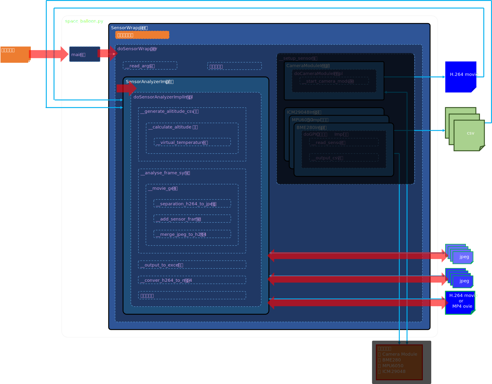

# space_balloon.pyについて

## 変更履歴

| 日付 | 変更概要 |
|-----------------------------------------------|--------------------|
| 2025/05/04 | 新規作成 |
| 2025/05/21 | 「[1. space_balloon.py概要](#1-space_balloonpy概要)」について<br>　「[1-2. クラス構成](#1-2-クラス構成)」の図修正<br>　「[1-3-1. 実行オプション](#1-3-1-実行オプション)」へオプション追加<br>　「[1-4-3.モード別クラスデータパス](#1-4-3モード別クラスデータパス)」の図修正<br>「[4. カメラモジュールを用いた動画取得について](#4-カメラモジュールを用いた動画取得について)」について<br>　「[4-3. センサーデータ解析モード時の動画ファイル](#4-3-センサーデータ解析モード時の動画ファイル)」追加<br>「[8. ICM-20948を用いた加速度、角速度および地磁気の取得について](#8-icm-20948を用いた加速度角速度および地磁気の取得について)」を追加<br>「[9. IVK172 G-Mouse USB GPSを用いた計測データの取得について](#9-IVK172-G-Mouse-USB-GPSを用いた計測データの取得について)」を追加<br>「[11. 今後の課題](#11-今後の課題)」について<br>　「[11-4. 動画データと計測データのハードウェア同期](#11-4-動画データと計測データのハードウェア同期)」を追加<br>「[付録](#付録)」について<br>　「[Python実行環境準備](#Python実行環境準備)」へライブラリ追加<br>　「[I2C通信](#I2C通信)」へICM-20948追加<br>　「[カメラモジュールの比較](#カメラモジュールの比較)」へRaspberry Pi HQ Cameraを追加<br>　「[Raspberry Piのスペック表](#Raspberry-Piのスペック表)」へCPUコア数追加<br>　「[消費電力の見積り](#消費電力の見積り)」の内容修正<br>　「[GoogleEarth Proでの可視化](#GoogleEarth-Proでの可視化)」を追加<br>「[参考情報](#参考情報)」を追加 |
| 2025/05/27 | 「[付録](#付録)」について<br>　「[Raspberry Pi OSの準備](#Raspberry-Pi-OSの準備)」を更新<br>　「[Ubuntu 22.04.2 LTSでの解析環境準備](#Ubuntu-22042-LTSでの解析環境準備)」を追加 |
| 2025/06/01 | 「[付録](#付録)」について<br>　「[I2C通信における性能比較](#I2C通信における性能比較)」を追加 |
| 2025/06/03 | 「[付録](#付録)」について<br>　「[I2C通信バスのGPIOピン割り当て](#I2C通信バスのGPIOピン割り当て)」を追加 |
| 2025/06/22 | 「[1-3-1. 実行オプション](#1-3-1-実行オプション)」について<br>　フレーム同期でI2Cセンサーからデータを取得するため、<br>　`--camera`オプションおよび`--interval`オプションを削除<br>　`--gps_interval`オプションを追加<br>　I2C通信バスを追加割り当てできるように、<br>　`--imc20948_i2cbus`、`--bme280_i2cbus`および`--mpu6050_i2cbus`オプション追加<br>ICM-20948採用に伴い、MPU9250の説明記述が中途半端な状態で残していたため削除<br>「[10. センサーから取得する動画およびcsv出力に伴うオーバヘッドの回避](#10-センサーから取得する動画およびcsv出力に伴うオーバヘッドの回避)」について<br>　ソフトウェアVSYNC実装で動作できたため次回削除 |
| 2025/06/24 | 「[1-3-1. 実行オプション](#1-3-1-実行オプション)」について<br>　Power Monitorの機能を追加したためイネーブルオプションの`--powermonitor`オプションを追加 |
| 2025/06/29 |  「[1-3-1. 実行オプション](#1-3-1-実行オプション)」について<br>　フレーム同期でI2Cセンサーからデータを取得し、出力ディレクトリ構成が変更に伴い、<br>　`--input_dir`オプションでcsvを一括読み込みするように変更<br>　csv読み込みオプションを削除<br>　計測時刻が最も近い時間でマージするため`--tolerance`および`--tolerance_gps`オプション削除<br>　`--altitude`オプションをBME280のcsvが存在する場合必ず実行するようにするため削除 |
| 2025/07/01 | 「[8-2-1. ハードアイアン補正](#8-2-1-ハードアイアン補正)」および「[8-2-2. ソフトアイアン補正](#8-2-2-ソフトアイアン補正)」を追記  |
| 2025/07/06 | 「[1-3. 入出力](#1-3-入出力)」について出力にICM-20948キャリブレーション結果を追加<br>「[1-3-1. 実行オプション](#1-3-1-実行オプション)」について<br>　--modeにICM-20948キャリブレーションモード:2を追加<br>　`--calib_json`オプションを追加<br>「[1-4-1.センサー取得モード](#1-4-1-センサー取得モード)」について取得するデータをセンサーレジスタデータに変更<br>「[1-4-1-1. 動画取得](#1-4-1-1-動画取得)」について動画取得をpicmera2に変更した内容に修正<br>「[1-4-1-2. BME280計測データ取得](#1-4-1-2-BME280計測データ取得)」について<br>　実行時間elapsed_time、計測開始時刻start_epoch_timeを削除<br>　計測データをセンサーレジスタ値に修正<br>「[1-4-1-3. MPU6050計測データ取得](#1-4-1-3-MPU6050計測データ取得)」について<br>　実行時間elapsed_time、計測開始時刻start_epoch_timeを削除<br>　計測データをセンサーレジスタ値に修正<br>「[1-4-1-4. MPU9250計測データ取得](#1-4-1-4-MPU9250計測データ取得)」について削除<br>「[1-4-1-4. ICM-20948計測データ取得](#1-4-1-4-ICM-20948計測データ取得)」について<br>　実行時間elapsed_time、計測開始時刻start_epoch_timeを削除<br>　計測データをセンサーレジスタ値に修正<br>「[1-4-1-5. IVK172 G-Mouse USB GPS計測データ取得](#1-4-1-5-IVK172 G-Mouse USB GPS計測データ取得)」について<br>　データ更新時間が長いためフレーム同期取得はせず、経度、緯度および高度を優先しないように修正<br>「[1-4-1-6. PowerMonitorデータ取得](#1-4-1-6-PowerMonitorデータ取得)」について追加<br>「[1-4-2.センサーデータ解析モード](#1-4-2-センサーデータ解析モード)」について<br>　ICM-20948の内容追加<br>　GPSデータ追加<br>　PowerMonitorの内容追加<br>「[1-4-2-1. 高度の算出](#1-4-2-1-高度の算出)」について削除<br>「[1-4-2-1. 動画データとセンサーデータの同期](#1-4-2-1-動画データとセンサーデータの同期)」について内容修正<br>「[1-4-2-2. BME280から取得したデータのグラフ作成機能](#1-4-2-2-BME280から取得したデータのグラフ作成機能)」について削除<br>「[1-4-2-3. MPU6050から取得したデータのグラフ作成機能](#1-4-2-3-MPU6050から取得したデータのグラフ作成機能)」について削除<br>「[1-4-2-4. MPU9250から取得したデータのグラフ作成機能](#1-4-2-4-MPU9250から取得したデータのグラフ作成機能)」について削除<br>「[1-4-3.ICM-20948キャリブレーションモード](#1-4-3-ICM-20948キャリブレーションモード)」について追加<br>「[2. 動作環境](#2-動作環境)」についてBulleseyeからBookwarmに修正<br>「[3. 実行方法](#3-実行方法)」について<br>　オプション構成変更<br>　説明修正<br>　*ICM-20948キャリブレーションモード*の説明追加<br>「[4-2. Pythonコードの説明](#4-2-Pythonコードの説明)」について説明とコード修正<br>「[6-2. Pythonコードの説明](#6-2-Pythonコードの説明)」について説明とコード修正<br>「[7. MPU9250を用いた加速度、角速度および地磁気の取得について](#7-MPU9250を用いた加速度、角速度および地磁気の取得について)」について削除<br>「[7. ICM-20948を用いた加速度、角速度および地磁気の取得について](#7-ICM-20948を用いた加速度、角速度および地磁気の取得について)」について修正<br>「[8. PowerMonitorを用いた計測データの取得について](#8-PowerMonitorを用いた計測データの取得について)」について追加<br>「[9. IVK172 G-Mouse USB GPSを用いた計測データの取得について](#9-IVK172 G-Mouse USB GPSを用いた計測データの取得について)」について修正<br>「[付録](#付録)」について<br>　「[Raspberry Pi OSの準備](#Raspberry-Pi-OSの準備)」<br>　Bookwarmを追加<br>　「[Python実行環境準備](#Python実行環境準備)」<br>　MPU9250の記述削除<br>　gpac削除<br> |

## 1. space_balloon.py概要

### 1-1. 機能概要

space_balloon.pyは以下機能を提供する。
センサーからデータを取得しcsv形式で出力する機能。
センサーから取得したデータを解析し加工する機能。
ICM-20948のキャリブレーション機能。

### 1-2. クラス構成

space_balloon.pyのクラス構成を以下に示す。


| クラス名                   | 説明                                                              |
|---------------------------|-------------------------------------------------------------------|
| `SensorWrapper`クラス      | 入力オプションによってモード別動作を管理する。                        |
| `CameraModuleImpl`クラス   | カメラモジュールから動画を取得するためlibcamera-vidコマンドを実行する。|
| `BME280Impl`クラス         | BME280から温度、気圧および湿度を取得しcsvに出力する。                 |
| `MPU6050Impl`クラス        | MPU6050から加速度、角速度および温度を取得しcsvに出力する。            |
| `MPU9250Impl`クラス        | MPU9250から加速度、角速度および地磁気を取得しcsvに出力する。          |
| `ICM20948Impl`クラス       | ICM-20948から加速度、角速度および地磁気を取得しcsvに出力する。          |
| `IVK172GpsImpl`クラス        | IVK172 G-Mouse USB GPSから加速度、角速度および地磁気を取得しcsvに出力する。 |
| `SensorAnalyzerImpl`クラス | 各センサーから取得したデータを解析し加工データを出力する。             |

### 1-3. 入出力

space_balloon.pyは実行開始時および実行中に有効機能に応じて以下を入力とする。

- モード選択
- 機能イネーブル
- 機能別パラメータ
- 出力格納先
-  センサー計測データ

次に実行結果として以下を出力する。

- センサー計測データ
- センサー計測加工後データ
- ICM-20948キャリブレーション結果

#### 1-3-1. 実行オプション

前述した入力は実行オプションで設定する。
以下にオプション一覧を示す。

<!--
|`--camera`             | センサー取得モード | FalseでOFF      | カメラモジュールによる撮影を有効化するイネーブルオプション                                                       |
|`--mpu9250`                                | センサー取得モード        | FalseでOFF     | MPU9250からのデータ取得を有効化するイネーブルオプション |
|`--interval <計測間隔>` | センサー取得モード | 0.0015(1.5msec) | カメラモジュール以外のセンサーからデータを取得する間隔<br>csvへの出力は1/3を掛けた秒数<br>例: `--interval 0.0015` |

|`--movie_csv <動画のcsvファイル>`           | センサーデータ解析モード  | FalseでOFF     | センサー取得モードにおいて取得した各フレームのタイムスタンプ出力ファイルを指定する<br>例: `--movie_csv video.csv` |
|`--gps_csv <IVK172 G-Mouse USB GPSのcsvファイル>` | センサーデータ解析モード  | -              | センサー取得モードにおいて、IVK172 G-Mouse USB GPSから取得した計測データのcsvファイル名<br>例: `--gps_csv ./gps.csv` |
|`--bme280_csv <BME280のcsvファイル>`        | センサーデータ解析モード  | -              | センサー取得モードにおいて、BME280から取得した計測データのcsvファイル名<br>例: `--bme280_csv ./bme280.csv` |
|`--mpu6050_csv <MPU6050のcsvファイル>`      | センサーデータ解析モード  | -              | センサー取得モードにおいて、MPU6050から取得した計測データのcsvファイル名<br>例: `--mpu6050_csv ./mpu6050.csv` |
|`--mpu9250_csv <MPU9250のcsvファイル>`      | センサーデータ解析モード  | -              | センサー取得モードにおいて、MPU9250から取得した計測データのcsvファイル名<br>例: `--mpu9250_csv ./mpu9250.csv` |
|`--icm20948_csv <ICM-20948のcsvファイル>`   | センサーデータ解析モード  | -              | センサー取得モードにおいて、ICM-20948から取得した計測データのcsvファイル名<br>例: `--icm20948_csv ./icm20948.csv` |
|`--bme280_graph`                            | センサーデータ解析モード  | FalseでOFF     | 機能未実装のため指定しても動作しない |
|`--mpu6050_graph`                           | センサーデータ解析モード  | FalseでOFF     | 機能未実装のため指定しても動作しない |
|`--mpu9250_graph`                           | センサーデータ解析モード  | FalseでOFF     | 機能未実装のため指定しても動作しない |
|`--icm20948_graph`                          | センサーデータ解析モード  | FalseでOFF     | 機能未実装のため指定しても動作しない |
|`--movie <動画ファイル名>`                  | センサーデータ解析モード  | -              | センサー取得モードにおいて、カメラモジュールから取得したH264形式動画ファイルを指定する<br>例: `--movie video.h264` |
|`--tolerance <許容誤差>`                    | センサーデータ解析モード  | 0.032          | --frame_syncオプションでフレーム毎の取得時間とセンサー取得時間で同期を取る際に取得時間で発生する時間の誤差許容範囲を指定する<br>秒単位で指定する<br>例: `--tolerance 0.015` |
|`--tolerance_gps <許容誤差>`                    | センサーデータ解析モード  | 1          | --frame_syncオプションでフレーム毎の取得時間とIVK172 G-Mouse USB GPSからの取得時間で同期を取る際に取得時間で発生する時間の誤差許容範囲を指定する<br>秒単位で指定する<br>例: `--tolerance_gps 1` |
|`--altitude`                                | センサーデータ解析モード  | FalseでOFF     | BME280で取得したデータをもとに高度を算出する<br>--bme280_csvオプションでBME280計測データを指定する必要がある<br>--frame_syncオプションで本オプションを有効にすれば高度データも追加する |
-->

| オプション                                 | モード                    | デフォルト値   | 説明                       |
|--------------------------------------------|---------------------------|----------------|--------------------------- |
|`--help`                                    | -                         | -              | ヘルプメッセージを表示する |
|`--mode <モード番号>`                       | -                         | 0              | モード選択<br>センサー取得モード:0<br>センサーデータ解析モード:1<br>ICM-20948キャリブレーションモード:2<br>例: `--mode 0` |
|`--output_dir <出力先ディレクトリ名>`       | センサー取得モード        | ./             | センサーから取得したデータの出力先ディレクトリを指定する<br>例: `--output_dir ./output` |
|`--framerate <フレームレート>`              | センサー取得モード        | 30             | 撮影時のフレームレート設定<br>例: `--framerate 30` |
|`--bitrate <ビットレート>`                  | センサー取得モード        | 8000000(8Mbps) | 撮影時のビットレート設定<br>ビット単位で指定する<br>例: `--bitrate 8000000` |
|`--width <水平サイズ>`                      | センサー取得モード        | 1920           | 撮影時の水平サイズ設定<br>例: `--width 1920` |
|`--height <垂直サイズ>`                     | センサー取得モード        | 1080           | 撮影時の垂直サイズ設定<br>例: `--height 1080` |
|`--gps`                                    | センサー取得モード        | FalseでOFF     | IVK172 G-Mouse USB GPSからのデータ取得を有効化するイネーブルオプション |
|`--gps_port`                               | センサー取得モード        | /dev/ttyACM0     | IVK172 G-Mouse USB GPSのUSBシリアルポート |
|`--gps_interval <計測間隔>`                 | センサー取得モード        | 1.0(1.0sec)    | IVK172 G-Mouse USB GPSからデータを取得する間隔<br>例: `--gps_interval 1.0` |
|`--bme280`                                 | センサー取得モード        | FalseでOFF     | BME280からのデータ取得を有効化するイネーブルオプション |
|`--mpu6050`                                | センサー取得モード        | FalseでOFF     | MPU6050からのデータ取得を有効化するイネーブルオプション |
|`--icm20948`                              | センサー取得モード        | FalseでOFF     | ICM-20948からのデータ取得を有効化するイネーブルオプション |
|`--powermonitor`                          | センサー取得モード        | FalseでOFF     | Power Monitorデータ取得を有効化するイネーブルオプション |
|`--bme280_i2cbus <BME280のI2Cバス番号>`  | センサー取得モード        | 1           | BME280のI2Cバス番号<br>例: `--bme280_i2cbus 4` |
|`--mpu6050_i2cbus <MPU6050のI2Cバス番号>`| センサー取得モード        | 1           | MPU6050のI2Cバス番号<br>例: `--mpu6050_i2cbus 3` |
|`--icm20948_i2cbus <ICM-20948のI2Cバス番号>`| センサー取得モード        | 1           | ICM-20948のI2Cバス番号<br>例: `--icm20948_i2cbus 1` |
|`--bme280_addr <BME280のデバイスアドレス>`  | センサー取得モード        | 0x76           | BME280のデバイスアドレス<br>16進数で先頭に0xをつける必要あり<br>例: `--bme280_addr 0x76` |
|`--mpu6050_addr <MPU6050のデバイスアドレス>`| センサー取得モード        | 0x68           | MPU6050のデバイスアドレス<br>16進数で先頭に0xをつける必要あり<br>例: `--mpu6050_addr 0x68` |
|`--icm20948_addr <ICM-20948のデバイスアドレス>`| センサー取得モード        | 0x69           | ICM-20948のデバイスアドレス<br>16進数で先頭に0xをつける必要あり<br>例: `--icm20948_addr 0x69` |
|`--input_dir <入力元ディレクトリ名>`          |  センサーデータ解析モード  | ./     | センサーから取得したデータの入力元ディレクトリを指定する<br>指定したディレクトリ以下に存在するcsvを読み込む<br>例: `--input_dir ./input` |
|`--frame_sync`                              | センサーデータ解析モード  | FalseでOFF     | センサー取得モードにおいて、カメラモジュールから取得したデータと他センサーの計測データを同期する |
|`--mp4`                                     | センサーデータ解析モード  | FalseでOFF     | H264形式動画ファイルをMP4形式で出力<br>--frame_syncオプションを有効にすることで同期データを加えた動画もMP4で出力する |
|`--excel`                                   | センサーデータ解析モード  | FalseでOFF     | センサーデータ解析モードで出力する加工csvファイルをcsvでなく.xlsx形式で出力する |
|`--map_animation`                           |  センサーデータ解析モード  | FalseでOFF     | GPS取得データをもとにアニメーション付きマップデータ出力をする<br>時系列データ加工機能未実装のため指定しても動作しない |
|`--calib_json <ICM-20948のキャリブレーション結果jsonファイル名>` |  センサーデータ解析モード  | ./mag_calib.json | ICM-20948キャリブレーションモードで出力したjsonファイルを指定する。<br>例:`--calib_json ./mag_calib.json` |


#### 1-3-3. csvファイルおよびDataFrame

csvファイルについてセンサー取得モード時はオプションで有効設定にしたセンサーから取得したデータを出力する。センサーデータ解析モードでは解析対象をオプションで設定し、それに応じて加工したcsvを出力する。
また、Excelでの出力オプションを有効にすることで、Excelファイルとして出力可能。
後述する[1-4. 動作モード](#1-4-動作モード)にcsvの形式を示している。

#### 1-3-2. 動画ファイル

動画ファイルについてセンサー取得モード時はカメラモジュールから取得したデータをもとに動画を出力する。一方、センサーデータ解析モードは加工した動画を出力する。加工には読み込んだcsvファイルから取得したデータを動画に埋め込む。

以下は、カメラモジュールから取得したデータを表している。
(※一部別ソフトウェアを通してぼかしをいれている。)


以下は、カメラモジュールの出力csvおよび他センサーデータ計測データをカメラモジュールから取得したデータに埋め込んだ結果を表している。


### 1-4. 動作モード

#### 1-4-1.センサー取得モード

センサー取得モードでは、オプションに応じて以下を取得する。
- カメラモジュールからH264フォーマットの動画
- 動画の1フレーム毎のタイムスタンプ
- BME280の計測温度、気圧および湿度
- MPU6050の計測加速度、角速度および温度
- ICM-20948の計測加速度、角速度、地磁気および温度
- IVK172 G-Mouse USB GPSの計測緯度・経度など

##### 1-4-1-1. 動画取得

以下はカメラモジュールの出力csvは以下で、*センサー取得モード*時に出力する。
先頭行にカメラモジュールバージョンがログ説明が必ず入る。
なお、後述する[4. カメラモジュールを用いた動画取得について](#4-カメラモジュールを用いた動画取得について)の[4-2. Pythonコードの説明](#4-2-pythonコードの説明)に記載してあるように、Pythonのpicamera2ライブラリでフレーム毎に同期した結果となっている。

```text
      start_epoch_time  end_unix_epoch_time  frame_count
0         1.751543e+09         1.751543e+09            0
1         1.751543e+09         1.751543e+09            1
2         1.751543e+09         1.751543e+09            2
3         1.751543e+09         1.751543e+09            3
4         1.751543e+09         1.751543e+09            4
...                ...                  ...          ...
2743      1.751543e+09         1.751543e+09         2743
2744      1.751543e+09         1.751543e+09         2744
2745      1.751543e+09         1.751543e+09         2745
2746      1.751543e+09         1.751543e+09         2746
2747      1.751543e+09         1.751543e+09         2747
```

##### 1-4-1-2. BME280計測データ取得

以下はBME280の出力csvは以下で、*センサー取得モード*時に出力する。
- end_unix_epoch_timeはcsv出力可能時刻のUNIXエポックタイムを表している。
- bme280_byte_**はセンサーレジスタ値を表している。

```text
    end_unix_epoch_time  bme280_byte_00  bme280_byte_01  bme280_byte_02  bme280_byte_03  bme280_byte_04  bme280_byte_05  bme280_byte_06  bme280_byte_07  bme280_byte_08  bme280_byte_09  ...  bme280_byte_29  bme280_byte_30  bme280_byte_31  bme280_byte_32  bme280_byte_33  bme280_byte_34  bme280_byte_35  bme280_byte_36  bme280_byte_37  bme280_byte_38  bme280_byte_39
0          1.751543e+09             168             110              88             104              50               0              86             149             167             214  ...              39               3              30              77             175               0             132             111               0             132             160
1          1.751543e+09             168             110              88             104              50               0              86             149             167             214  ...              39               3              30              77             175               0             132             110               0             132             161
2          1.751543e+09             168             110              88             104              50               0              86             149             167             214  ...              39               3              30              77             173               0             132             111               0             132             160
3          1.751543e+09             168             110              88             104              50               0              86             149             167             214  ...              39               3              30              77             177               0             132             110               0             132             162
4          1.751543e+09             168             110              88             104              50               0              86             149             167             214  ...              39               3              30              77             175               0             132             110               0             132             163
..                  ...             ...             ...             ...             ...             ...             ...             ...             ...             ...             ...  ...             ...             ...             ...             ...             ...             ...             ...             ...             ...             ...             ...
87         1.751543e+09             168             110              88             104              50               0              86             149             167             214  ...              39               3              30              77             184               0             132             134               0             132              89
88         1.751543e+09             168             110              88             104              50               0              86             149             167             214  ...              39               3              30              77             181               0             132             134               0             132              90
89         1.751543e+09             168             110              88             104              50               0              86             149             167             214  ...              39               3              30              77             181               0             132             133               0             132              94
90         1.751543e+09             168             110              88             104              50               0              86             149             167             214  ...              39               3              30              77             180               0             132             132               0             132              95
91         1.751543e+09             168             110              88             104              50               0              86             149             167             214  ...              39               3              30              77             181               0             132             131               0             132              97
```

##### 1-4-1-3. MPU6050計測データ取得

以下はMPU6050の出力csvは以下で、*センサー取得モード*時に出力する。
- end_unix_epoch_timeはcsv出力可能時刻のUNIXエポックタイムを表している。
- mpu6050_byte_**はセンサーレジスタ値を表している。

```text
      end_unix_epoch_time  mpu6050_byte_00  mpu6050_byte_01  mpu6050_byte_02  mpu6050_byte_03  mpu6050_byte_04  mpu6050_byte_05  mpu6050_byte_06  mpu6050_byte_07  mpu6050_byte_08  mpu6050_byte_09  mpu6050_byte_10  mpu6050_byte_11  mpu6050_byte_12  mpu6050_byte_13
0            1.751543e+09              255              196                2               32               73              144              248              112              255              178              255              125              255               18
1            1.751543e+09              255              152                1              232               73              136              248              112              255              139              255              136              254              246
2            1.751543e+09              255              212                2              124               73              100              248               96              255              195              255              168              254              201
3            1.751543e+09              255              172                2                0               73               84              248               96              255              194              255              114              254              159
4            1.751543e+09                0               28                1              228               73              140              248               80              255              229              255              113              254              132
...                   ...              ...              ...              ...              ...              ...              ...              ...              ...              ...              ...              ...              ...              ...              ...
2743         1.751543e+09              255              148                2               44               73               76              248              144              255              160              255               34              255                2
2744         1.751543e+09              255              136                2               12               73              184              248              160              255              196              255               53              254              232
2745         1.751543e+09              255              204                2              124               73              232              248               96              255              212              255               72              255               16
2746         1.751543e+09              255              216                1              228               73               64              248              112                0                3              255              135              255               42
2747         1.751543e+09              255               20                2               56               73               76              248              128                0               28              255              152              255               54
```

##### 1-4-1-4. ICM-20948計測データ取得

以下はICM-20948の出力csvは以下で、*センサー取得モード*時に出力する。
- end_unix_epoch_timeはcsv出力可能時刻のUNIXエポックタイムを表している。
- icm-20948_rawa*はICM-20948から取得したセンサー生データの加速度を表している。
- icm-20948_rawg*はICM-20948から取得したセンサー生データの角速度を表している。
- icm-20948_rawm*はICM-20948から取得したセンサー生データの地磁気を表している。
- icm-20948_rawtemperatureはから取得したセンサー生データの温度を表している。

```text
      end_unix_epoch_time  icm-20948_rawax  icm-20948_raway  icm-20948_rawaz  icm-20948_rawgx  icm-20948_rawgy  icm-20948_rawgz  icm-20948_rawmx  icm-20948_rawmy  icm-20948_rawmz  icm-20948_rawtemperature
0            1.751543e+09            -1712              400            16320              -89               34              -53               49             -266               49                      3360
1            1.751543e+09            -1720              264            16344              -91              240              -38               37             -281               37                      3376
2            1.751543e+09            -1624              192            16352               12              295              117               44             -279               44                      3312
3            1.751543e+09            -1616              424            16432               39              220             -211               50             -270               50                      3248
4            1.751543e+09            -1712              304            16296                3              414             -147               52             -274               52                      3248
...                   ...              ...              ...              ...              ...              ...              ...              ...              ...              ...                       ...
2743         1.751543e+09            -1656              320            16368              -42              236              -84               54             -279               54                      3296
2744         1.751543e+09            -1728              192            16232             -186              143             -295               50             -280               50                      3360
2745         1.751543e+09            -1616              216            16496                7              110              -31               45             -272               45                      3264
2746         1.751543e+09            -1616              360            16584              128              -47              378               49             -287               49                      3264
2747         1.751543e+09            -1568              216            16256              150              399             -233               44             -276               44                      3248
```

##### 1-4-1-5. IVK172 G-Mouse USB GPS計測データ取得

以下はIVK172 G-Mouse USB GPSの出力csvは以下で、*センサー取得モード*時に出力する。
- end_unix_epoch_timeはcsv出力可能時刻のUNIXエポックタイムを表している。
- 他計測値は、[9. IVK172 G-Mouse USB GPSを用いた計測データの取得について](#9-IVK172-G-Mouse-USB-GPSを用いた計測データの取得について)に記載している。

```text
   end_unix_epoch_time  ivk172_latitude  ivk172_longitude  ivk172_altitude ivk172_altitude_units  ivk172_num_sats ivk172_datestam ivk172_timestamp  ivk172_spd_over_grnd  ivk172_true_course  ivk172_true_track  ivk172_spd_over_grnd_kmph  ivk172_pdop  ivk172_hdop  ivk172_vdop  ivk172_num_sv_in_view
0         1.751543e+09        35.452590        139.643981             62.9                     M                5      2025-07-03   11:43:24+00:00                 3.365              349.08             349.08                      6.232         2.26         1.52         1.67                     10
1         1.751543e+09        35.453642        139.644025             63.6                     M                5      2025-07-03   11:43:25+00:00                 3.745              352.80             352.80                      6.935         2.26         1.52         1.67                     10
2         1.751543e+09        35.462870        139.645365             64.4                     M                5      2025-07-03   11:43:26+00:00                 3.383              352.72             352.72                      6.265         2.26         1.52         1.67                     10
3         1.751543e+09        35.465572        139.645680             65.2                     M                5      2025-07-03   11:43:27+00:00                 3.260              352.38             352.38                      6.037         2.26         1.52         1.67                     10
4         1.751543e+09        35.476835        139.645683             66.1                     M                5      2025-07-03   11:43:28+00:00                 2.995              354.45             354.45                      5.546         2.26         1.52         1.67                     10
5         1.751543e+09        40.962111        140.174137             67.0                     M                5      2025-07-03   11:43:29+00:00                 1.966                 NaN                NaN                      3.641         2.27         1.52         1.69                     10
6         1.751543e+09        40.980784        140.174461             67.7                     M                5      2025-07-03   11:43:30+00:00                 1.517                 NaN                NaN                      2.809         2.26         1.52         1.67                     10
7         1.751543e+09        40.968532        140.174894             68.4                     M                5      2025-07-03   11:43:31+00:00                 1.211                 NaN                NaN                      2.242         2.26         1.52         1.67                     10
8         1.751543e+09        40.989889        140.175123             69.0                     M                5      2025-07-03   11:43:32+00:00                 0.995                 NaN                NaN                      1.843         2.26         1.52         1.67                     10
9         1.751543e+09        40.981492        140.175168             69.7                     M                5      2025-07-03   11:43:33+00:00                 1.306                 NaN                NaN                      2.418         2.26         1.52         1.67                     10
```

##### 1-4-1-6. PowerMonitorデータ取得

以下はPowerMonitorの出力csvは以下で、*センサー取得モード*時に出力する。
- end_unix_epoch_timeはcsv出力可能時刻のUNIXエポックタイムを表している。
- 取得データについては[8-1. PowerMonitorについて](#8-1-PowerMonitorについて)に記載してある。

```text
    end_unix_epoch_time  voltage throttled_status  cpu_utilization  memory_usage  memory_capacity  memory_usage_percentage  cpu_temperature   disk_usage  total_disk_capacity  disk_utilization
0          1.751543e+09   0.8375              0x0              6.0     567164928       3981889536                     17.2            42842  14999670784         125242245120              12.6
1          1.751543e+09   0.8375              0x0              4.1     560594944       3981889536                     17.0            44303  15004790784         125242245120              12.6
2          1.751543e+09   0.8375              0x0             10.8     551673856       3981889536                     16.8            44303  15009771520         125242245120              12.6
3          1.751543e+09   0.8375              0x0             11.1     544198656       3981889536                     16.6            43816  15014752256         125242245120              12.6
4          1.751543e+09   0.8375              0x0             10.9     536068096       3981889536                     16.4            43329  15019757568         125242245120              12.6
5          1.751543e+09   0.8375              0x0             10.9     534990848       3981889536                     16.4            44790  15024775168         125242245120              12.6
6          1.751543e+09   0.8375              0x0             12.7     534900736       3981889536                     16.4            43816  15029755904         125242245120              12.6
7          1.751543e+09   0.8375              0x0             10.6     534134784       3981889536                     16.3            43329  15034757120         125242245120              12.6
8          1.751543e+09   0.8375              0x0             11.1     533495808       3981889536                     16.3            44303  15039922176         125242245120              12.7
9          1.751543e+09   0.8375              0x0             11.4     534990848       3981889536                     16.4            43816  15044902912         125242245120              12.7
10         1.751543e+09   0.8375              0x0             11.7     533229568       3981889536                     16.3            44790  15049883648         125242245120              12.7
11         1.751543e+09   0.8375              0x0             11.6     532779008       3981889536                     16.3            44303  15054909440         125242245120              12.7
12         1.751543e+09   0.8375              0x0             11.6     532480000       3981889536                     16.3            43329  15059939328         125242245120              12.7
13         1.751543e+09   0.8375              0x0             11.8     532836352       3981889536                     16.3            44790  15064944640         125242245120              12.7
14         1.751543e+09   0.8375              0x0             11.1     532381696       3981889536                     16.3            44790  15070007296         125242245120              12.7
15         1.751543e+09   0.8375              0x0             11.4     532963328       3981889536                     16.3            45277  15075057664         125242245120              12.7
16         1.751543e+09   0.8375              0x0             11.1     532381696       3981889536                     16.3            44303  15080058880         125242245120              12.7
17         1.751543e+09   0.8375              0x0             11.1     533110784       3981889536                     16.3            45277  15085096960         125242245120              12.7
18         1.751543e+09   0.8375              0x0             10.7     533385216       3981889536                     16.3            43816  15090069504         125242245120              12.7
```

#### 1-4-2.センサーデータ解析モード

センサーデータ解析モードでは、オプションに応じて以下を取得する。
- カメラモジュールからH264フォーマットの動画
- 動画の1フレーム毎のタイムスタンプ
- BME280の計測温度、気圧および湿度
- MPU6050の計測加速度、角速度および温度
- ICM-20948の計測加速度、角速度、地磁気および温度
- IVK172 G-Mouse USB GPSの緯度、経度、高度など
- PowerMonitorデータ(byteをGBやMBに変換)

##### 1-4-2-1. 動画データとセンサーデータの同期

以下は*センサーデータ解析モード*時に出力する、カメラモジュールの出力csvおよびI2Cセンサー計測結果をマージしたcsvである。
- current_timeは、カメラモジュールの出力csvから*センサー取得モード*時に取得したend_unix_epoch_timeを日時・時刻形式にした結果を表している。
- マージデータはI2Cセンサーの*センサー取得モード*時のcsvから抽出し、end_unix_epoch_timeが近いデータを表している。 

なお、高度の算出は後述する[5-2. 高度の算出方法について](#5-2-高度の算出方法について)に示す。

```text
      start_epoch_time  frame_count  movie_end_unix_epoch_time  bme280_end_unix_epoch_time  ivk172_latitude  ivk172_longitude  ivk172_altitude ivk172_altitude_units  ivk172_num_sats ivk172_datestam ivk172_timestamp  ivk172_spd_over_grnd  ivk172_true_course  ivk172_true_track  ivk172_spd_over_grnd_kmph  ivk172_pdop  ivk172_hdop  ivk172_vdop  ivk172_num_sv_in_view  gps_end_unix_epoch_time  icm20948_end_unix_epoch_time  mpu6050_end_unix_epoch_time             current_time  bme280_temperature  bme280_pressure  bme280_humidity  bme280_altitude  mpu6050_ax  mpu6050_ay  mpu6050_az  mpu6050_gx  mpu6050_gy  mpu6050_gz  mpu6050_temperature  icm-20948_ax  icm-20948_ay  icm-20948_az  icm-20948_gx  icm-20948_gy  icm-20948_gz  icm-20948_mx  icm-20948_my  icm-20948_mz  icm-20948_temperature  icm-20948_heading_rad  icm-20948_heading_deg
0         1.751543e+09            0               1.751543e+09                1.751543e+09        35.452590        139.643981             62.9                     M                5      2025-07-03   11:43:24+00:00                 3.365              349.08             349.08                      6.232         2.26         1.52         1.67                     10             1.751543e+09                  1.751543e+09                 1.751543e+09  2025-07-03 20:43:23.445               28.41      1009.106891        64.659180        36.154032   -0.003662    0.033203    1.149414   -0.595420   -1.000000   -1.816794            30.835882     -0.104492      0.024414      0.996094     -0.679389      0.259542     -0.404580          49.0        -266.0          49.0              31.063797              -1.388628             280.437475
1         1.751543e+09            1               1.751543e+09                1.751543e+09        35.453642        139.644025             62.9                     M                5      2025-07-03   11:43:24+00:00                 3.365              349.08             349.08                      6.232         2.26         1.52         1.67                     10             1.751543e+09                  1.751543e+09                 1.751543e+09  2025-07-03 20:43:23.479               28.41      1009.106891        64.659180        36.154032   -0.006348    0.029785    1.148926   -0.893130   -0.916031   -2.030534            30.835882     -0.104980      0.016113      0.997559     -0.694656      1.832061     -0.290076          37.0        -281.0          37.0              31.111720              -1.439877             277.501132
2         1.751543e+09            2               1.751543e+09                1.751543e+09        35.462870        139.645365             62.9                     M                5      2025-07-03   11:43:24+00:00                 3.365              349.08             349.08                      6.232         2.26         1.52         1.67                     10             1.751543e+09                  1.751543e+09                 1.751543e+09  2025-07-03 20:43:23.512               28.41      1009.106891        64.659180        36.154032   -0.002686    0.038818    1.146729   -0.465649   -0.671756   -2.374046            30.788824     -0.099121      0.011719      0.998047      0.091603      2.251908      0.893130          44.0        -279.0          44.0              30.920029              -1.414379             278.962081
3         1.751543e+09            3               1.751543e+09                1.751543e+09        35.465572        139.645680             62.9                     M                5      2025-07-03   11:43:24+00:00                 3.365              349.08             349.08                      6.232         2.26         1.52         1.67                     10             1.751543e+09                  1.751543e+09                 1.751543e+09  2025-07-03 20:43:23.546               28.41      1009.106891        64.659180        36.154032   -0.005127    0.031250    1.145752   -0.473282   -1.083969   -2.694656            30.788824     -0.098633      0.025879      1.002930      0.297710      1.679389     -1.610687          50.0        -270.0          50.0              30.728337              -1.387686             280.491477
4         1.751543e+09            4               1.751543e+09                1.751543e+09        35.476835        139.645683             62.9                     M                5      2025-07-03   11:43:24+00:00                 3.365              349.08             349.08                      6.232         2.26         1.52         1.67                     10             1.751543e+09                  1.751543e+09                 1.751543e+09  2025-07-03 20:43:23.579               28.41      1009.106891        64.659180        36.154032    0.001709    0.029541    1.149170   -0.206107   -1.091603   -2.900763            30.741765     -0.104492      0.018555      0.994629      0.022901      3.160305     -1.122137          52.0        -274.0          52.0              30.728337              -1.383246             280.745857
...                ...          ...                        ...                         ...              ...               ...              ...                   ...              ...             ...              ...                   ...                 ...                ...                        ...          ...          ...          ...                    ...                      ...                           ...                          ...                      ...                 ...              ...              ...              ...         ...         ...         ...         ...         ...         ...                  ...           ...           ...           ...           ...           ...           ...           ...           ...           ...                    ...                    ...                    ...
2743      1.751543e+09         2743               1.751543e+09                1.751543e+09        40.962111        140.174137             69.7                     M                5      2025-07-03   11:43:33+00:00                 1.306                 NaN                NaN                      2.418         2.26         1.52         1.67                     10             1.751543e+09                  1.751543e+09                 1.751543e+09  2025-07-03 20:44:54.873               28.51      1009.124860        64.325195        36.008910   -0.006592    0.033936    1.145264   -0.732824   -1.694656   -1.938931            30.930000     -0.101074      0.019531      0.999023     -0.320611      1.801527     -0.641221          54.0        -279.0          54.0              30.872106              -1.379612             280.954063
2744      1.751543e+09         2744               1.751543e+09                1.751543e+09        40.980784        140.174461             69.7                     M                5      2025-07-03   11:43:33+00:00                 1.306                 NaN                NaN                      2.418         2.26         1.52         1.67                     10             1.751543e+09                  1.751543e+09                 1.751543e+09  2025-07-03 20:44:54.909               28.51      1009.124860        64.325195        36.008910   -0.007324    0.031982    1.151855   -0.458015   -1.549618   -2.137405            30.977059     -0.105469      0.011719      0.990723     -1.419847      1.091603     -2.251908          50.0        -280.0          50.0              31.063797              -1.394087             280.124672
2745      1.751543e+09         2745               1.751543e+09                1.751543e+09        40.968532        140.174894             69.7                     M                5      2025-07-03   11:43:33+00:00                 1.306                 NaN                NaN                      2.418         2.26         1.52         1.67                     10             1.751543e+09                  1.751543e+09                 1.751543e+09  2025-07-03 20:44:54.943               28.51      1009.124860        64.325195        36.008910   -0.003174    0.038818    1.154785   -0.335878   -1.404580   -1.832061            30.788824     -0.098633      0.013184      1.006836      0.053435      0.839695     -0.236641          45.0        -272.0          45.0              30.776260              -1.406840             279.393991
2746      1.751543e+09         2746               1.751543e+09                1.751543e+09        40.989889        140.175123             69.7                     M                5      2025-07-03   11:43:33+00:00                 1.306                 NaN                NaN                      2.418         2.26         1.52         1.67                     10             1.751543e+09                  1.751543e+09                 1.751543e+09  2025-07-03 20:44:54.977               28.51      1009.124860        64.325195        36.008910   -0.002441    0.029541    1.144531    0.022901   -0.923664   -1.633588            30.835882     -0.098633      0.021973      1.012207      0.977099     -0.358779      2.885496          49.0        -287.0          49.0              30.776260              -1.401695             279.688787
2747      1.751543e+09         2747               1.751543e+09                1.751543e+09        40.981492        140.175168             69.7                     M                5      2025-07-03   11:43:33+00:00                 1.306                 NaN                NaN                      2.418         2.26         1.52         1.67                     10             1.751543e+09                  1.751543e+09                 1.751543e+09  2025-07-03 20:44:55.006               28.51      1009.124860        64.325195        36.008910   -0.014404    0.034668    1.145264    0.213740   -0.793893   -1.541985            30.882941     -0.095703      0.013184      0.992188      1.145038      3.045802     -1.778626          44.0        -276.0          44.0              30.728337              -1.412706             279.057888
```

#### 1-4-3.ICM-20948キャリブレーションモード

ICM-20948キャリブレーションモードでは以下を取得する。
- ハードアイアン補正値
- ソフトアイアン補正値

補正方法は[7-3. 地磁気センサーのキャリブレーション](#7-3-地磁気センサーのキャリブレーション)に説明を記載している。
jsonファイルの内容は、
- offsetは上から順にハードアイアン補正のx、y、zの補正値
- soft_iron_matrixは上から順にソフトアイアン補正の補正行列x、y、z
- accel_rangeは加速度レンジの値
- gyro_rangeは角速度レンジの値
となっている。

以下に補正値の出力jsonファイルを示す。

```json
{
    "offset": [
        152.5,
        -106.0,
        222.0
    ],
    "soft_iron_matrix": [
        [
            0.013894771286452817,
            0.00015007502436521568,
            0.003798217783241616
        ],
        [
            0.00015007502436521574,
            0.011795454252510742,
            0.0008783428149767477
        ],
        [
            0.003798217783241617,
            0.0008783428149767475,
            0.038231411170073996
        ]
    ],
    "accel_range": 2,
    "gyro_range": 250
}
```

この補正値を読み込み、取得した計測データに反映する。

#### 1-4-4.モード別クラスデータパス

センサー取得モード時は以下のデータパスで動作する。


センサーデータ解析モード時は以下のデータパスで動作する。



## 2. 動作環境

計測はRaspberry Pi Zero 2 W、計測結果の加工はRaspberry Pi 4Bを使用する。
それぞれのスペックについては[付録](#付録)の[Raspberry Piのスペック表](#Raspberry-Piのスペック表)に記載している。
OSはRaspberry Pi OSでDebinanベースのディストリビューションバージョンBookwarmを使用する。

## 3. 実行方法

実行にはモードを選択し*センサー取得モード*または*センサーデータ解析モード*を選択する。
また有効にしたいセンサーを選択し実行する。

*センサー取得モード*でカメラ、BME280、MPU6050、ICM-20948、PowerMonitorおよびIVK172 G-Mouse USB GPSを有効にし各デバイスアドレスおよびI2C bus番号を指定した上で、出力結果格納先を指定した実行例は以下となる。

```sh
python space_balloon.py      \
       --mode 0              \
       --bme280              \
       --bme280_addr 0x76    \
       --bme280_i2cbus 4     \
       --mpu6050             \
       --mpu6050_addr 0x68   \
       --mpu6050_i2cbus 3    \
       --icm20948            \
       --icm20948_addr 0x68  \
       --icm20948_i2cbus 1   \
       --powermonitor        \
       --gps                 \
       --gps_interval 1      \
       --output_dir ./output
```

*センサーデータ解析モード*でカメラ・I2Cセンサー計測データとの同期をしてICM-20948のキャリブレーションデータを使用しMP4で動画を出力し、Excelファイルで同期結果を出力するための実行例は以下となる。

```sh
python space_balloon.py                                     \
       --mode 1                                             \
       --mp4                                                \
       --frame_sync                                         \
       --excel                                              \
       --calib_json ./output/20250701_223019/mag_calib.json \
       --input_dir ./output/20250702_222933
```

*ICM-20948キャリブレーションモード*を実行する例は以下となる。

```sh
python space_balloon.py     \
       --mode 2             \
       --icm20948_addr 0x68 \
       --icm20948_i2cbus 1  \
       --output_dir output
```

## 4. カメラモジュールを用いた動画取得について

カメラモジュールはv2およびv3での2種類で撮影可能である。
v2かv3でPythonスクリプトの差分は発生しないが、今回はv2で撮影した場合の説明で記載する。

### 4-1. センサー取得モード時の動画ファイルおよび出力csvファイル

動画ファイルはH264フォーマットの動画ファイル、csvファイルは[1-4-1-1. 動画取得](#1-4-1-1-動画取得)に示すようなcsvファイルを出力する。

### 4-2. Pythonコードの説明

カメラモジュールを用いて撮影し動画を出力するには、`CameraModuleImpl`クラスで取得できる。
Pythonのコードを以下に示す。

以下がコンストラクタで、`CameraModuleImpl`クラスインスタンス時にcsvのファイルの変数、csvのファイル名、保存動画ファイル名、フレームレート、ビットレート、水平サイズおよび垂直サイズを指定する。
コンストラクタでpicamera2ライブラリを用いて撮影準備をする。
- フレームレートは1フレーム当たりの秒数をμ秒単位で設定する。
- H264ハードウェアエンコードをビットレート指定で使用するための設定をする。
- picamera2のライブラリの構成設定をして画素フォーマット、画サイズ設定およびフレームレート設定をする。

```py
def __init__( self , csvFileName , csvFile , movieFileName , framerate , bitrate , width , height ):
    print("[Info] Create an instance of the CameraModuleImpl class.")
    self.__frame_ready   = threading.Event()
    self.__frame_count   = 0
    framerate_microsec   = int(1.0/framerate*1_000_000) # ex) 30fps = 1/30s = 33333μs
    self.__picamera2     = Picamera2()
    self.__encoder       = H264Encoder(bitrate=bitrate)
    config               = self.__picamera2.create_video_configuration(
        main     = { "format"             : "YUV420" , "size": ( width , height )       } ,
        controls = { "FrameDurationLimits": ( framerate_microsec , framerate_microsec ) }
    )
    self.__picamera2.configure( config )
    self.__picamera2.post_callback = self.__process_frame
    self.__movieFile               = movieFileName
    self.__csvFileWriter           = csv.writer( csvFile )
    self.__end_unix_epoch_time     = None
```

以下`__process_frame`関数はpicamera2ライブラリで動画を取得した際に、1フレーム毎に発行するソフトVSYNCをもとに実行する関数となる。
`SensorWrapper`クラスで設定した`threading.Condition()`を用いてマルチスレッドで並列動作しているI2CセンサーにソフトVSYNC同期で実行をするための同期処理をしている。
なお、I2Cセンサーデータで取得する1回あたりの実行時間がフレームレート毎に決まる1フレーム当たりの秒数以内に完了する制約がある。
[付録](#付録)の[I2C通信クロック別実行時間計測](#I2C通信クロック別実行時間計測)に示すようにI2C通信バスクロック別に1回あたりの実行時間例を示している。
I2C通信バスでデータを取得する場合BME280でレジスタデータのみ取得するのであれば100KHzで100回あたり0.5979秒であるため1回あたり0.005979秒となる。
フレームレート30fpsの場合、1フレームあたり1/30=0.03333秒で処理することからBME280を100KHzで使用する場合、制約を満たしていることとなる。

```py
def __process_frame( self, request ):
    SensorWrapper.camera_module_cond   .acquire()
    SensorWrapper.bme280_cond          .acquire()
    SensorWrapper.mpu6050_cond         .acquire()
    SensorWrapper.icm20948_cond        .acquire()
    SensorWrapper.powermonitor_cond    .acquire()
    SensorWrapper.camera_module_cond   .notify()
    if ((self.__frame_count % 30) == 0) :
        SensorWrapper.bme280_cond      .notify()
    if ((self.__frame_count % 150) == 0) :
        SensorWrapper.powermonitor_cond.notify()
    SensorWrapper.mpu6050_cond         .notify()
    SensorWrapper.icm20948_cond        .notify()
    SensorWrapper.camera_module_ready = True
    SensorWrapper.bme280_ready        = True
    SensorWrapper.mpu6050_ready       = True
    SensorWrapper.icm20948_ready      = True
    SensorWrapper.powermonitor_ready  = True
    SensorWrapper.camera_module_cond   .release()
    SensorWrapper.bme280_cond          .release()
    SensorWrapper.mpu6050_cond         .release()
    SensorWrapper.icm20948_cond        .release()
    SensorWrapper.powermonitor_cond    .release()
    self.__end_unix_epoch_time = time.time()
    self.__frame_ready.set()
```

以下`doCameraModuleImpl`関数はコンストラクタで設定したpicamera2ライブラリから動作撮影およびH264エンコード処理を有効化し非同期で開始する。
また`__output_camera_module_csv`関数もマルチスレッドで非同期実行している。
ソフトVSYNCの制御も実施しており、`SensorWrapper`クラスで設定した`running`変数が有効な間はソフトVSYNCのHIGH/LOW切り替えを行う。

```py
def doCameraModuleImpl( self ):
    print("[Info] Start the doCameraModuleImpl function.")
    SensorWrapper.start_unix_epoch_time = time.time()
    cameraThread = threading.Thread( target=self.__output_camera_module_csv )
    cameraThread.start()
    self.__picamera2.start()
    self.__picamera2.start_encoder( self.__encoder , output=self.__movieFile )
    while SensorWrapper.running.is_set():
        try:
            if self.__frame_ready.wait(timeout=1.0):
                self.__frame_ready.clear()
            cameraThread.join()
        except (KeyboardInterrupt , ValueError) as e:
            SensorWrapper.running.clear()
        except Exception as e:
            print(e)
        finally:
            self.__picamera2.stop_encoder()
            self.__picamera2.stop()
```

以下`__output_camera_module_csv`関数はcsvで動画の1フレーム取得時刻およびフレーム番号をcsvに出力する。

```py
def __output_camera_module_csv( self ):
    while SensorWrapper.running.is_set():
        try:
            SensorWrapper.camera_module_cond.acquire()
            while not SensorWrapper.camera_module_ready:
                SensorWrapper.camera_module_cond.wait()
            SensorWrapper.camera_module_cond.release()

            data = [
                [
                    SensorWrapper.start_unix_epoch_time , self.__end_unix_epoch_time , self.__frame_count
                ]
            ]
            self.__csvFileWriter.writerows( data )
            self.__frame_count += 1
            SensorWrapper.camera_module_ready = False
        except (KeyboardInterrupt , ValueError) as e:
             SensorWrapper.running.clear()
        except Exception as e:
            print(e)
```

### 4-3. センサーデータ解析モード時の動画ファイル

***センサーデータ解析モード***では`SensorAnalyzerImpl`クラスから`MovieAnalyzerImpl`クラスをインスタンスし***センサー取得モード時***のH.264動画を変換している。

以下に実行の流れを記載する。
- `__separation_h264_to_jpeg`関数で***センサー取得モード時***のH.264動画をJPEG画像に1フレームずつ分割する。
  - 出力先はカレントディレクトリ以下にtmpディレクトリを自動生成し保存する。
  - `__add_sensor_frame`関数でOpenCVを用いて動画以外のセンサー計測データを文字列でJPEG画像に埋め込む
- `__merge_jpeg_to_h264`関数でJPEG画像を再度動画データにまとめる
- `__convert_h264_to_mp4`関数で動画を確認しやすいようにMP4に変換する。

`__separation_h264_to_jpeg`関数でH.264動画をJPEGに分割するのに`ffmpeg`コマンドを用いて分割している。
以下、実際に実行するコマンドとなる。

```sh
$ ffmpeg -i ./出力先ディレクトリ名/日付/movie.h264 -qscale:v 2 tmp/frame_%08d.jpg
```

`__merge_jpeg_to_h264`関数でJPEG画像を動画をまとめるのにも`ffmpeg`コマンドを用いてまとめている。
以下、実際に実行するコマンドとなる。
フレームレート設定は、入力動画ファイルからOpenCVを用いて取得できるため、30.0の箇所は自動で決まる。

```sh
$ ffmpeg -framerate 30.0 -i tmp/frame_opencv_%08d.jpg   \
       -c:v libx264 -f h264 -y                          \
       ./出力先ディレクトリ名/日付/movie.h264.sensor.h264
```

`__convert_h264_to_mp4`関数でまとめた動画を`ffmpeg`コマンドを用いてMP4に変換する。
以下、実際に実行するコマンドとなる。

```sh
$ ffmpeg -y -i ./出力先ディレクトリ名/日付/video_video_UNIXエポックタイム.h264.sensor.h264 \
       -c copy ./出力先ディレクトリ名/日付/movie.h264.sensor.h264.mp4
```

## 5. BME280を用いた高度算出について

### 5-1. BME280について

BME280で計測可能なデータは以下である。

| 気圧                                          | 温度               | 湿度                |
|-----------------------------------------------|-------------------|---------------------|
| 単位:ヘクトパスカル(hPa)                       | 単位:℃(摂氏)       | 単位:%(RH)          |
| 計測範囲:300\~1100hPa<br>(標高換算-500~+9000m) | 計測範囲:-40\~+85℃ | 計測範囲:0%\~100%RH |

### 5-2. 高度の算出方法について

高度を求める場合、気圧から算出可能である。
高度の算出には、パラメトリック方程式または等温パラメトリック方程式を使用する。

#### 5-2-1. パラメトリック方程式について

パラメトリック方程式は対流圏といった0km~11kmの範囲で使用する方程式。
成層圏以上では誤差が大きくなる。
理由として、気温が一定の割合で低下すると仮定しているが、成層圏では気温が上昇するためである。

<!--------------------------------------------------------------------------------->

```math
h=
\left( \frac{T}{L} \right)
\left( 1-\left( \frac{P}{P_0} \right)^{\!\!\frac{RL}{gM}} \right)
```

```math
h:高度[m]\hspace{0pt}
```

```math
T:仮想温度または実測温度 [K]\hspace{0pt}
```

```math
L:温度減率(0.0065[K/m])\hspace{0pt}
```

```math
P:測定地点の気圧[hPa]\hspace{0pt}
```

```math
P_0:海面上の標準気圧(1013.25[hPa])\hspace{0pt}
```

```math
R:気体定数(8.314462618[J/(mol·K)])\hspace{0pt}
```

```math
g:重力加速度(9.80665[m/s^2])\hspace{0pt}
```

```math
M:空気のモル質量(0.0289644[kg/mol])\hspace{0pt}
```

<!--------------------------------------------------------------------------------->

#### 5-2-2. 等温パラメトリック方程式について

成層圏といった11km~20kmの範囲で使用する方程式。
成層圏では温度が一定なため、パラメトリック方程式より誤差を抑えられる。

```math
h=11000+\frac{RT}{gM}×ln\left( \frac{P_u}{P} \right)
```

```math
h:高度[m]\hspace{0pt}
```

```math
R:気体定数(8.314462618[J/(mol·K)])\hspace{0pt}
```

```math
T:仮想温度または実測温度 [K]\hspace{0pt}
```

```math
g:重力加速度(9.80665[m/s^2])\hspace{0pt}
```

```math
M:空気のモル質量(0.0289644[kg/mol])\hspace{0pt}
```

```math
P_u:層の下端の気圧(約22632Pa[hPa]\ 11km)\hspace{0pt}
```

```math
P:測定地点の気圧[hPa]\hspace{0pt}
```

<!--------------------------------------------------------------------------------->

#### 5-2-3. 湿度を用いた仮想温度について

湿度を考慮しするため仮想温度を算出することで、高度の算出精度を向上できる。
湿度が高いと空気密度が変化し高度の算出精度が変わるため、湿度を考慮し精度を上げることが可能。
仮想温度を求める上で、混合比、水蒸気圧および飽和水蒸気圧をを用いて求める。

<!--------------------------------------------------------------------------------->

##### 5-2-3-1. 仮想温度(Virtual Temperature)

仮想温度は湿度を考慮し、乾燥空気の密度と等しい密度を持つ理想気体の温度として定義する。
空気が湿っていると密度が下がるため、温度を高く見積もる。
仮想温度は以下式で求める。

```math
T_v=T×\left( 1+0.61×r \right)
```

```math
T_v:仮想温度[K]\hspace{0pt}
```

```math
r:混合比[kg/kg]\hspace{0pt}
```

##### 5-2-3-2. 混合比(Mixing Ratio)

混合比は乾いた空気1gに対して何gの水蒸気が含まれているかを表す。
0.622は水蒸気と乾燥空気の分子量比。

```math
r=\frac{\frac{0.622×e}{P-e}}{1000}
```

```math
r:混合比[kg/kg]\hspace{0pt}
```

```math
e:実際の水蒸気圧[hPa]\hspace{0pt}
```

```math
P:測定地点の気圧[hPa]\hspace{0pt}
```

##### 5-2-3-3. 水蒸気圧(Vapor Pressure)

実際の空気中の水蒸気圧力は以下の式で求める。
湿度が100%である時eは飽和水蒸気圧の値となり、それ以下の場合は比例して小さくなる。

```math
e=e_s×\left( \frac{RH}{100} \right)
```

```math
e:実際の水蒸気圧[hPa]\hspace{0pt}
```

```math
e_s:飽和水蒸気圧[hPa]\hspace{0pt}
```

```math
RH:実測湿度[\%]\hspace{0pt}
```

<!--------------------------------------------------------------------------------->

##### 5-2-3-4. 飽和水蒸気圧(Saturation Vapor Pressure)

空気は気温が高いほど空気はより多くの水蒸気を保持できる。
飽和水蒸気圧は近似式(Tetensの式)を用いて求められる。
以下に式を示す。

```math
e_s=6.112×exp\left( \frac{17.67×T_c}{T_c-243.5} \right)
```

```math
e_s:飽和水蒸気圧[hPa]\hspace{0pt}
```

```math
T_c:実測温度[℃]\hspace{0pt}
```

<!--------------------------------------------------------------------------------->

### 5-3. Pythonコードの説明

I2C通信バス経由でBME280からデータを取得する機能は`BME280Impl`クラスの`__read_sensor`関数で実施している。

```py
def __read_sensor(self):
    self.__bus.write_byte_data( self.__address , 0xF2 , 0x01 )  # Humidity oversampling x1
    self.__bus.write_byte_data( self.__address , 0xF4 , 0x27 )  # Normal mode, temp/press oversampling x1
    self.__bus.write_byte_data( self.__address , 0xF5 , 0xA0 )  # Config
    read24byte    = self.__bus.read_i2c_block_data ( self.__address , 0x88 , 24 )
    read1Byte0xA1 = self.__bus.read_byte_data      ( self.__address , 0xA1      )
    read7byte     = self.__bus.read_i2c_block_data ( self.__address , 0xE1 ,  7 )
    read8byte     = self.__bus.read_i2c_block_data ( self.__address , 0xF7 ,  8 )
    return read24byte , read1Byte0xA1 , read7byte , read8byte
```

BME280から取得したデータをレジスタデータから物理量データに変換する機能は`I2CAnalyzerImpl`クラスの`__convert_bme280_batch`関数で実施している。

```py
def __convert_bme280_batch(
        self       ,
        byteData00 , byteData01 , byteData02 , byteData03 , byteData04 , byteData05 , byteData06 ,
        byteData07 , byteData08 , byteData09 , byteData10 , byteData11 , byteData12 , byteData13 ,
        byteData14 , byteData15 , byteData16 , byteData17 , byteData18 , byteData19 , byteData20 ,
        byteData21 , byteData22 , byteData23 , byteData24 , byteData25 , byteData26 , byteData27 ,
        byteData28 , byteData29 , byteData30 , byteData31 , byteData32 , byteData33 , byteData34 ,
        byteData35 , byteData36 , byteData37 , byteData38 , byteData39
):
    dig_T1 = byteData01 << 8 | byteData00
    dig_T2 = (byteData03 << 8 | byteData02) if byteData03 < 128 else (byteData03 << 8 | byteData02) - 65536
    dig_T3 = (byteData05 << 8 | byteData04) if byteData05 < 128 else (byteData05 << 8 | byteData04) - 65536
    dig_P1 = byteData07 << 8 | byteData06
    dig_P2 = ( byteData09 << 8 | byteData08 ) if byteData09 < 128 else ( byteData09 << 8 | byteData08 ) - 65536
    dig_P3 = ( byteData11 << 8 | byteData10 ) if byteData11 < 128 else ( byteData11 << 8 | byteData10 ) - 65536
    dig_P4 = ( byteData13 << 8 | byteData12 ) if byteData13 < 128 else ( byteData13 << 8 | byteData12 ) - 65536
    dig_P5 = ( byteData15 << 8 | byteData14 ) if byteData15 < 128 else ( byteData15 << 8 | byteData14 ) - 65536
    dig_P6 = ( byteData17 << 8 | byteData16 ) if byteData17 < 128 else ( byteData17 << 8 | byteData16 ) - 65536
    dig_P7 = ( byteData19 << 8 | byteData18 ) if byteData19 < 128 else ( byteData19 << 8 | byteData18 ) - 65536
    dig_P8 = ( byteData21 << 8 | byteData20 ) if byteData21 < 128 else ( byteData21 << 8 | byteData20 ) - 65536
    dig_P9 = ( byteData23 << 8 | byteData22 ) if byteData23 < 128 else ( byteData23 << 8 | byteData22 ) - 65536
    dig_H1 = byteData24
    dig_H2 = ( byteData26 << 8 | byteData25 ) if byteData26 < 128 else ( byteData26 << 8 | byteData25 ) - 65536
    dig_H3 = byteData27
    dig_H4 = ( byteData28 << 4 ) | ( byteData29 & 0x0F )
    if dig_H4 & 0x800: dig_H4 -= 4096
    dig_H5 = ( byteData30 << 4 ) | ( byteData29 >> 4 )
    if dig_H5 & 0x800: dig_H5 -= 4096
    dig_H6 = byteData31
    if dig_H6 > 127: dig_H6 -= 256
    calib = {
        'T': ( dig_T1 , dig_T2 , dig_T3 ) ,
        'P': ( dig_P1 , dig_P2 , dig_P3 , dig_P4 , dig_P5 , dig_P6 , dig_P7 , dig_P8 , dig_P9 ) ,
        'H': ( dig_H1 , dig_H2 , dig_H3 , dig_H4 , dig_H5 , dig_H6 )
    }
    adc_P = ( byteData32 << 12 ) | ( byteData33 << 4 ) | ( byteData34 >> 4 )
    adc_T = ( byteData35 << 12 ) | ( byteData36 << 4 ) | ( byteData37 >> 4 )
    adc_H = ( byteData38 <<  8 ) |   byteData39
    temp, t_fine = self.__compensate_temperature( adc_T , calib['T']          )
    press        = self.__compensate_pressure   ( adc_P , calib['P'] , t_fine )
    hum          = self.__compensate_humidity   ( adc_H , calib['H'] , t_fine )
    alti         = self.__calculate_altitude( temp , hum , press )
    return temp , press , hum , alti
```

高度算出は`I2CAnalyzerImpl`クラスの``__calculate_altitude`および`__virtual_temperature`関数で実施している。
なお、Tc、RH、Pはそれぞれセンサーデー計測した温度、湿度、気圧となっている。
`__virtual_temperature`関数で湿度を用いた仮想温度を算出している。仮想温度算出には飽和水蒸気圧、水蒸気圧および混合比を算出する必要がある。

```py
def __calculate_altitude( self , Tc , RH , P ):
    P0  = 1013.25     # 海面上の標準気圧[hPa]
    L   = 0.0065      # 温度減率[K/m]
    g   = 9.80665     # 重力加速度[m/s^2]
    R   = 8.314462618 # 気体定数[J/(mol·K)]
    M   = 0.0289644   # 空気のモル質量[kg/mol]
    Pu  = 226.32      # 標準大気における11kmの気圧[hPa]
    if RH is None or RH <= 0: # 湿度データが無い場合は実測温度を使う
        Tu = Tc + 273.15 # [K]
    else:                     # 湿度データがある場合は仮想温度を使う
        Tu = self.__virtual_temperature( Tc , RH , P )
    if P > Pu:                # 対流圏 (11km以下)
        h = (Tu / L) * (1 - (P / P0) ** ((R * L) / (g * M)))
    else:                     # 成層圏 (11km以上)
        h = 11000 + ( R * Tu ) / ( g * M ) * math.log( Pu / P )
    return h
##############################################################################
def __virtual_temperature( self , Tc , RH , P ):
    Tk  = Tc + 273.15  # 気温をKに変換
    es  = 6.112 * math.exp( (17.67*Tc) / (Tc+243.5) ) # 飽和水蒸気圧(Tetensの式)es[hPa]
    e   = (RH / 100.0) * es                           # 実際の水蒸気圧e[hPa]
    r   = ((0.622*e) / (P-e)) / 1000                  # 混合比r[kg/kg]
    Tkv = Tk * ( 1 + 0.61 * r )                       # 仮想温度[K]
    return Tkv
```

## 6. MPU6050を用いた加速度および角速度の取得について

### 6-1. MPU6050について

MPU6050で計測可能なデータは以下である。

| x軸加速度・y軸加速度・z軸加速度 | x軸角速度・y軸角速度・z軸角速度 | 温度            |
|------------------------------|-------------------------------|-----------------|
| 単位:g(重力加速度)             | 単位:°/S(度毎秒)               | 単位:℃(摂氏)    |
| ±2g、±4g、±8g、±16g           | ±250、±500、±1000、±2000°/s  |計測範囲:-40\~+85℃|

### 6-2. Pythonコードの説明

I2C通信バス経由でMPU6050からデータを取得する機能は`MPU6050Impl`クラスの`__read_sensor`関数で実施している。

```py
def __read_sensor( self ):
    try:
        mpu6050_data = self.__bus.read_i2c_block_data( self.__address , 0x3B , 14 )
        return mpu6050_data
    except:
        return None
```

MPU6050から取得したデータをレジスタデータから物理量データに変換する機能は`I2CAnalyzerImpl`クラスの`__convert_mpu6050_batch`関数で実施している。

```py
def __convert_mpu6050_batch(
        self       ,
        byteData00 , byteData01 , byteData02 , byteData03 , byteData04 , byteData05 , byteData06 ,
        byteData07 , byteData08 , byteData09 , byteData10 , byteData11 , byteData12 , byteData13
):
    ax          = self.__convert_mpu6050( byteData00 , byteData01 )
    ay          = self.__convert_mpu6050( byteData02 , byteData03 )
    az          = self.__convert_mpu6050( byteData04 , byteData05 )
    temperature = self.__convert_mpu6050( byteData06 , byteData07 )
    gx          = self.__convert_mpu6050( byteData08 , byteData09 )
    gy          = self.__convert_mpu6050( byteData10 , byteData11 )
    gz          = self.__convert_mpu6050( byteData12 , byteData13 )
    return (
        ax/16384.0 , ay/16384.0 , az/16384.0 ,
        gx/131.0   , gy/131.0   , gz/131.0   ,
        temperature/340.0+36.53
    )
##############################################################################
def __convert_mpu6050( self , msb , lsb ):
    value = struct.unpack('>h', bytes( [ msb , lsb ]))[0]
    return value
```

## 7. ICM-20948を用いた加速度、角速度および地磁気の取得について

### 7-1. ICM-20948について

ICM-20948で計測可能なデータは以下である。

| x軸加速度・y軸加速度・z軸加速度 | x軸角速度・y軸角速度・z軸角速度 | 地磁気                 | 温度            |
|------------------------------|-------------------------------|-----------------------|-----------------|
| 単位:g(重力加速度)             | 単位:°/S(度毎秒)              | 単位:マイクロテスラ(µT) | 単位:℃(摂氏)    |
| ±2g、±4g、±8g、±16g           | ±250、±500、±1000、±2000°/s   | ±4900µT               | 計測範囲:-40\~+85℃|

### 7-2. Pythonコードの説明

ICM-20948のキャリブレーションは`CalibrationICM20948Impl`クラスで実施する。
`doCalibrationICM20948Impl`関数を実行し、キャリブレーション結果のjsonファイルを出力する。

```py
def doCalibrationICM20948Impl( self ):
    timestamp            = datetime.datetime.now().strftime("%Y%m%d_%H%M%S")
    output_timestamp_dir = self.__output_dir + "/" + timestamp
    os.makedirs( self.__output_dir    , exist_ok=True )
    os.makedirs( output_timestamp_dir , exist_ok=True )
    localDriver = qwiic_i2c.getI2CDriver( iBus=self.__i2cbusnum )
    imu         = qwiic_icm20948.QwiicIcm20948( address=self.__address, i2c_driver=localDriver )
    if not imu.connected:
        print("[Error] Could not connect to the ICM-20948.")
        return
    imu.begin()
    samples          = self.__collect_mag_samples(imu)
    offset           = self.__compute_offsets(samples)
    centered         = samples - offset
    soft_iron_matrix = self.__compute_soft_iron_matrix(centered)
    self.__save_calibration_to_json( offset , soft_iron_matrix , output_timestamp_dir+"/mag_calib.json" )
```

補正については、後述する[7-3. 地磁気センサーのキャリブレーション](#7-3-地磁気センサーのキャリブレーション)に示すハードアイアン補正およびソフトアイアン補正の補正値を出力する。

ハードアイアン補正は`__compute_offsets`関数、ソフトアイアン補正は`__compute_soft_iron_matrix`関数で実施する。

```py
def __compute_offsets( self , samples ):
    mx, my, mz = samples[:, 0], samples[:, 1], samples[:, 2]
    offset_x   = (mx.max() + mx.min()) / 2
    offset_y   = (my.max() + my.min()) / 2
    offset_z   = (mz.max() + mz.min()) / 2
    return numpy.array([offset_x, offset_y, offset_z])
#######################################################################
def __compute_soft_iron_matrix( self , centered ):
    cov              = numpy.cov(centered.T)
    eigvals, eigvecs = numpy.linalg.eigh(cov)
    scale            = numpy.diag(1.0 / numpy.sqrt(eigvals))
    soft_iron_matrix = eigvecs @ scale @ eigvecs.T
    return soft_iron_matrix
```

次に、加速度・角速度のレンジを調べる場合、`__read_accel_range`関数および`__read_gyro_range`関数を用いて取得できる。
これは、ICM-20948のレジスタから読み込みそれに対応したレンジ設定を解析モード時に使用する。
対応表を以下に示す。

| `fs_sel` | 加速度レンジ | スケーリング係数 |
| -------- | ------ | ----------------- |
| `0b00`   | ±2g    | `32768.0`         |
| `0b01`   | ±4g    | `8192.0`          |
| `0b10`   | ±8g    | `4096.0`          |
| `0b11`   | ±16g   | `2048.0`          |

| `fs_sel` | 角速度レンジ   | スケーリング係数 |
| -------- | --------- | -------- |
| `0b00`   | ±250 °/s  | `131.0`  |
| `0b01`   | ±500 °/s  | `65.5`   |
| `0b10`   | ±1000 °/s | `32.8`   |
| `0b11`   | ±2000 °/s | `16.4`   |

```py
def __read_accel_range( self , imu ):
    imu.setBank(2)
    reg_val = imu._i2c.readByte( imu.address , 0x14 )
    fs_sel  = (reg_val >> 1) & 0x03
    ranges = {
        0b00: 2  ,
        0b01: 4  ,
        0b10: 8  ,
        0b11: 16
    }
    return ranges.get( fs_sel , 0 )
#######################################################################
def __read_gyro_range( self , imu ):
    imu.setBank(2)
    reg_val = imu._i2c.readByte( imu.address , 0x01 )
    fs_sel  = (reg_val >> 1) & 0x03
    ranges = {
        0b00: 250  ,
        0b01: 500  ,
        0b10: 1000 ,
        0b11: 2000
    }
    return ranges.get( fs_sel , 0 )
```

計測データの取得は`ICM20948Impl`クラスで実施する。
まず、コンストラクタでI2Cアドレス、I2C bus番号およびcsvのファイルの変数を引数で渡す。
コンストラクタ内でqwiic_i2cライブラリでI2C bus番号設定をする。
次にqwiic_icm20948ライブラリでI2CアドレスおよびI2C bus番号設定を渡してICM-20948を使用する準備をする。

```py
def __init__( self , address , i2cbus , csvFile ):
    print("[Info] Create an instance of the ICM20948Impl class.")
    print("[Info] The device address of the ICM-20948 is " + str(hex(address)) )
    self.__csvFileWriter = csv.writer( csvFile )
    localDriver          = qwiic_i2c.getI2CDriver( iBus=i2cbus )
    self.__imu           = qwiic_icm20948.QwiicIcm20948( address=address, i2c_driver=localDriver )
```

I2C通信バス経由でMPU6050からデータを取得する機能は`doIcm20948Impl`関数で実施している。
取得後、csvファイルに出力する。

```py
def doIcm20948Impl(self):
    print("[Info] Start the doIcm20948Impl function.")
    self.__imu.begin()
    while SensorWrapper.running.is_set():
        try:
            SensorWrapper.icm20948_cond.acquire()
            while not SensorWrapper.icm20948_ready:
                SensorWrapper.icm20948_cond.wait()
            SensorWrapper.icm20948_cond.release()

            if self.__imu.dataReady():
                self.__imu.getAgmt()
                data = [
                    [
                        time.time()       ,
                        self.__imu.axRaw  , self.__imu.ayRaw , self.__imu.azRaw ,
                        self.__imu.gxRaw  , self.__imu.gyRaw , self.__imu.gzRaw ,
                        self.__imu.mxRaw  , self.__imu.myRaw , self.__imu.mxRaw ,
                        self.__imu.tmpRaw
                    ]
                ]
                self.__csvFileWriter.writerows( data )
                SensorWrapper.icm20948_ready = False
        except (KeyboardInterrupt , ValueError) as e:
            SensorWrapper.running.clear()
        except Exception as e:
            print(e)
```

ICM-20948から取得したデータをレジスタデータから物理量データに変換する機能は`I2CAnalyzerImpl`クラスの`__convert_icm20948_batch`関数で実施している。
キャリブレーション値による補正は`__apply_mag_calibration`関数で算出しており、キャリブレーション時に取得したjsonファイルの値はこの際に使用する。
その後、方位角および0~360°の範囲に正規化する。
`__calculate_tilt_compensated_heading`関数は加速度データを用いて傾き補正付き方位角算出関数となっている。

```py
def __convert_icm20948_batch( self , rawax , raway , rawaz , rawgx , rawgy , rawgz , rawmx , rawmy , rawmz , rawtemp ):
    temperature = rawtemp / 333.87 + 21
    if os.path.isfile( self.__calib_json ):
        f     = open( self.__calib_json , "r" )
        calib = json.load(f)
        f.close()
        offset           = numpy.array(calib["offset"])
        soft_iron_matrix = numpy.array(calib["soft_iron_matrix"])
        mx , my , mz = self.__apply_mag_calibration( rawmx , rawmy , rawmz , offset , soft_iron_matrix )
        accel_range = calib["accel_range"]
        gyro_range  = calib["gyro_range"]
        accel_scale = 32768.0
        if   accel_range == 250:
            accel_scale = 131.0
        elif accel_range == 500:
            accel_scale = 65.5
        elif accel_range == 1000:
            accel_scale = 32.8
        elif accel_range == 2000:
            accel_scale = 16.4
        gyro_scale = 131.0
        if   gyro_range == 250:
            gyro_scale = 131.0
        elif gyro_range == 500:
            gyro_scale = 65.5
        elif gyro_range == 1000:
            gyro_scale = 32.8
        elif gyro_range == 2000:
            gyro_scale = 16.4
        ax = rawax / accel_scale
        ay = raway / accel_scale
        az = rawaz / accel_scale
        gx = rawgx / gyro_scale
        gy = rawgy / gyro_scale
        gz = rawgz / gyro_scale
    else:
        mx = rawmx
        my = rawmy
        mz = rawmz
        ax = rawax / 32768.0
        ay = raway / 32768.0
        az = rawaz / 32768.0
        gx = rawgx / 131.0
        gy = rawgy / 131.0
        gz = rawgz / 131.0
    heading_rad = numpy.arctan2( my , mx )
    heading_deg = numpy.degrees( heading_rad )
    heading_deg = ( heading_deg + 360 ) % 360
    crr_heading = self.__calculate_tilt_compensated_heading( ax , ay , az , mx , my , mz )
    mx = mx * 0.15
    my = my * 0.15
    mz = mz * 0.15
    return ax , ay , az , gx , gy , gz , mx , my , mz , temperature , heading_rad , heading_deg , crr_heading
```

加速度データを用いて傾き補正付き方位角算出関数`__calculate_tilt_compensated_heading`関数は以下となる。
[7-5. 地磁気データおよび加速度データを用いた方位角の算出](#7-5-地磁気データおよび加速度データを用いた方位角の算出)に算出式の説明を記載している。

```py
def __normalize( self , v ):
    norm = numpy.linalg.norm(v)
    return v / norm if norm != 0 else v
##############################################################################
def __calculate_tilt_compensated_heading( self , ax , ay , az , mx , my , mz ):
    acc   = self.__normalize(numpy.array([ ax , ay , az ]))
    pitch = numpy.arcsin( -acc[0] )
    roll  = numpy.arctan2( acc[1] , acc[2] )
    mx2   = mx * numpy.cos( pitch ) + mz * numpy.sin( pitch )
    my2   = (mx * numpy.sin( roll ) * numpy.sin( pitch ) +
             my * numpy.cos( roll ) -
             mz * numpy.sin( roll ) * numpy.cos( pitch ) )
    heading_rad = numpy.arctan2( my2 , mx2 )
    #heading_rad = numpy.arctan2( -my2 , mx2 )
    heading_deg = numpy.degrees( heading_rad )
    if heading_deg < 0:
        heading_deg += 360
    return heading_deg
```

### 7-3. 地磁気センサーのキャリブレーション

ICM-20948で地磁気を取得する場合、実際の計測(打ち上げ)前にキャリブレーションを行う必要がある。
これは、算出精度を向上させるのに必要となる。

キャリブレーションで取得した補正値をもとに計測時は補正後データを取得する。

キャリブレーションは以下の条件に応じて実施する必要がある。

| 条件 | キャリブレーション頻度 |
|--|--|
| センサーを固定して計測する場合 　　　　　　　　　　　　　| 事前に1回実施しておく |
| 筐体・周囲の変化がある場合(機器の位置・姿勢が変わる場合) | その都度または環境が変わるたびに再キャリブレーションする |
| 磁石や金属の近くで使用する場合                        | 磁場が影響するため頻繁に実施する |

キャリブレーションで取得した補正値を実際の計測時に読み込み、計測していくことで算出精度が向上する。

#### 7-2-1. ハードアイアン補正

ハードアイアン補正は、磁場の定常的なバイアス(オフセット)を補正する。
これにより、「バイアス除去(センサ内部磁場や固定磁場の除去)」を実施する。
補正方法は、キャリブレーション中に取得した mx, my, mz の最大値・最小値から中心(オフセット)を計算し、取得したデータからその中心値を引く。

#### 7-2-2. ソフトアイアン補正

ソフトアイアン補正は、センサ周辺にある磁性体や筐体による歪み(楕円形への変形)を補正する。
これにより「歪み補正(磁場が楕円状に変形する影響を除去)」を実施する。
補正方法は、計測したmx, my データを楕円にフィットさせて、それを単位円に変換するような線形変換(＝2x2行列)を算出する。算出した補正式(補正行列)を使って、行列演算で補正する。

#### 7-2-3. 補正例

以下に補正例を示す。

補正データを2次元および3次元でプロットした結果となっている。
補正前データが取得したデータで、ハードアイアン補正をした後、ソフトアイアン補正を実施する。


### 7-4. 地磁気データを用いた方位角の算出

ラジアンでの方位角は以下式で算出する。

```math
\theta_{rad}=arctan2( m_y , m_x )\hspace{0pt}
```

```math
m_x:補正済みの地磁気X成分
```

```math
m_y:補正済みの地磁気Y成分
```

次に、度数法での方位角について以下式で算出する。

```math
\theta_{deg}=\left( \frac{180}{\pi} \right)⋅\theta_{rad}=\left( \frac{180}{\pi} \right)⋅\arctan2(m_y , m_x )\hspace{0pt}
```
```math
if\theta_{deg}<0 ⇒ \theta_{deg}:=\theta_{deg}+360
```

前提としてセンサーを水平に設置している場合の方位角を求める式となる。

### 7-5. 地磁気データおよび加速度データを用いた方位角の算出

加速度データを用いたラジアンでの方位角は以下式で算出する。
これによりセンサーを水平に設置できないときに傾き補正をして方位角を求められる。


#### 7-5-1. 傾き補正を適用して算出した方位角

水平面に投影した磁気ベクトルを用いて傾き補正適用の方位角を算出できる。

```math
\theta_{rad} = \arctan2( m_y^h , m_x^h )\hspace{0pt}
```

```math
\theta_{deg}=\left( \frac{180}{\pi} \right)⋅\theta_{rad}\hspace{0pt}
```

```math
m_y^h:水平面上の磁気ベクトルY成分
```

```math
m_x^h:水平面上の磁気ベクトルX成分
```

#### 7-5-2. 傾き補正適用の磁気ベクトルを水平面への投影

重力加速度ベクトルを用いて回転行列を作成し、地磁気ベクトルを水平面に投影する。
水平面上のX、Y成分は以下式で求められる。

```math
m_x^h = m_x⋅\cos\theta+m_z⋅\sin\theta\hspace{0pt}
```
```math
m_y^h = m_x⋅\sin\phi⋅\sin\theta+m_y⋅\cos\phi-m_z⋅\sin\phi⋅\cos\theta\hspace{0pt}
```
```math
m=\left[\begin{matrix} m_x \\ m_y \\ m_z \end{matrix}\right]
```
```math
\theta:pitch(横軸xを中心に回転する角度)\hspace{0pt}
```
```math
\phi:roll(前後軸yを中心に回転する角度)\hspace{0pt}
```
```math
m:地磁気ベクトル(ハードアイアン・ソフトアイアン補正済み)
```
```math
m_x:x軸の磁気ベクトル\hspace{0pt}
```
```math
m_y:y軸の磁気ベクトル\hspace{0pt}
```
```math
m_z:z軸の磁気ベクトル\hspace{0pt}
```

#### 7-5-3. 加速度から算出するピットおよびロール

pitchは横軸xを中心に回転する角度、rollは前後軸yを中心に回転する角度である。
これは加速度から以下式で算出できる。

```math
pitch=\arctan( -a_x^{norm} )
```

```math
roll=\arctan2( a_y^{norm} , a_z^{norm} )
```

```math
a_x^{norm}:x軸の単位加速度ベクトル\hspace{0pt}
```

```math
a_y^{norm}:y軸の単位加速度ベクトル\hspace{0pt}
```

```math
a_z^{norm}:z軸の単位加速度ベクトル\hspace{0pt}
```

#### 7-5-4. 加速度の単位ベクトル算出

pitchおよびrollを算出するために使用する加速度の単位ベクトルは以下式で算出できる。

```math
a=\left[\begin{matrix} a_x \\ a_y \\ a_z \end{matrix}\right]
```
```math
\vec{a}_{\text{norm}} = \frac{\vec{a}}{\|\vec{a}\|} = \frac{1}{\sqrt{a_x^2 + a_y^2 + a_z^2}} \cdot \begin{bmatrix} a_x \\ a_y \\ a_z \end{bmatrix}
```
<!--
$\vec{v}_{\text{norm}} = \frac{\vec{v}}{\|\vec{v}\|}$
-->
<!--
$\vec{a}_{\text{norm}} = \frac{1}{\sqrt{a_x^2 + a_y^2 + a_z^2}} \cdot \begin{bmatrix} a_x \\ a_y \\ a_z \end{bmatrix}$
-->

```math
a:重力加速度ベクトル
```
```math
\vec{a}_{\text{norm}}:加速度の単位ベクトル
```

## 8. PowerMonitorを用いた計測データの取得について

### 8-1. PowerMonitorについて

PowerMonitorで取得可能なデータは以下である。

| 項目 | 単位 | 概要 |
| -- | -- | -- |
| voltage                 | Vボルト | Raspberry Piのコア電圧 |
| throttled_status        | ステータス | スロットリング状態 |
| cpu_utilization         | % | CPU使用率 |
| memory_usage            | byte | メモリ使用量 |
| memory_capacity         | byte | メモリ総容量 |
| memory_usage_percentage | % | メモリ使用率 |
| cpu_temperature         | ミリ℃、ミリ度摂氏、1/1000°C | CPU温度 |
| disk_usage              | byte | ディスク使用量 |
| total_disk_capacity     | byte | ディスク総容量 |
| disk_utilization        | % | ディスク使用率 |

### 8-2. Pythonコードの説明

Raspberry Piからデータを取得する機能は`PowerMonitorImpl`クラスで実施している。
処理としては、Raspbian OS上のファイル読み込み、psutilライブラリおよびLinuxコマンドで実施している。

計測データを変換する機能は`I2CAnalyzerImpl`クラスの`__convert_powermonitor_batch`関数で実施している。
なお、PowerMonitorはRaspberry Pi本体から取得するため、I2Cセンサー経由では無いが、計測結果csvをマージするため`I2CAnalyzerImpl`クラスで変換処理を実装している。

```py
def __convert_powermonitor_batch(
        self ,
        memory_usage    , memory_capacity     , free_memory_space    ,
        cpu_temperature ,
        disk_usage      , total_disk_capacity , available_disk_space
):
    return (
        memory_usage/(1024*1024) , memory_capacity/(1024*1024)   , free_memory_space/(1024*1024)  ,
        cpu_temperature/1000     ,
        disk_usage/(1024**3)     , total_disk_capacity/(1024**3) , available_disk_space/(1024**3)
    )
```

## 9. IVK172 G-Mouse USB GPSを用いた計測データの取得について

### 9-1. IVK172 G-Mouse USB GPSについて

IVK172 G-Mouse USB GPSで計測可能なデータは以下である。

|緯度<br>(Latitude)|経度<br>(Longitude)|高度<br>(Altitude)|速度(Speed)|進行方位<br>(Course)|UTC時刻|日付(Date)|衛星数<br>(Satellites)|HDOP|Fix種別|
|--|--|--|--|--|--|--|--|--|--|
|単位:度(°)+小数点以下|単位:度(°)+小数点以下|単位:メートル(m)|単位:ノット(knots)<br>または km/h|単位:単位:度(°)|単位:時:分:秒|単位:ddmmyy|単位:個数|単位:数値<br>(低いほど高精度)|単位:<br>0:なし<br>1:2D<br>2:3D|
|計測範囲:±90°|計測範囲:±180°|計測範囲:<br>-500〜+18000m程度|計測範囲:GPSによる|計測範囲:<br>0〜359.99°|計測範囲:NMEAのGGA<br>RMCに含まれる|計測範囲:例: 170524|計測範囲:0〜12<br>(またはそれ以上)|計測範囲:例:0.8|計測範囲:<br>GGA文などで取得|
|現在位置の<br>緯度|現在位置の<br>経度|海抜高度|地表速度|北からの<br>進行方向|世界協定時刻|現在の日付<br>(RMC文)|使用中の<br>GPS衛星数|水平方向の<br>精度低下因子|位置が特定されているか<br>(Fix Status)|

### 9-2. Pythonコードの説明

以下コードはIVK172 G-Mouse USB GPSからデータを取得する`IVK172GpsImpl`クラスのコンストラクタである。
コンストラクタでIVK172 G-Mouse USB GPSにアクセスするためのUSBシリアルポートを設定する。
引数で、USBシリアルポート、csvのファイルの変数およびデータ取得間隔を設定する。
データ取得間隔は実行時の`--gps_interval`オプションで設定できる。

```py
def __init__( self , port  , csvFile , interval ):
    print("[Info] Create an instance of the GPSModuleImpl class.")
    print("[Info] The port for the IVK172 G-Mouse USB GPS is " + str(port) + ".")
    self.__csvFile       = csvFile
    self.__csvFileWriter = csv.writer( csvFile )
    self.__ser           = serial.Serial( port , 9600 , timeout=1 )
    self.__interval      = interval
```

以下コードはデータを取得する`__read_sensor`関数である。

```py
def __read_sensor( self ):
    frame = {"GGA": None, "RMC": None, "VTG": None, "GSA": None, "GSV": None}
    try:
        while True:
            raw = self.__ser.readline().decode('ascii', errors='replace').strip()
            if not raw.startswith('$'):
                continue
            msg = None
            try:
                rawmsg = pynmea2.parse(raw)
                msg = rawmsg
            except pynmea2.ParseError:
                pass
            if msg is None:
                continue
            key = msg.sentence_type
            if key in frame:
                frame[key] = msg
            if all(frame.values()):
                gga , rmc , vtg , gsa , gsv = (
                    frame["GGA"] , frame["RMC"] , frame["VTG"] , frame["GSA"] , frame["GSV"]
                )
                latitude            = gga.latitude
                longitude           = gga.longitude
                altitude            = gga.altitude
                altitude_units      = gga.altitude_units
                num_sats            = gga.num_sats
                datestamp           = rmc.datestamp
                timestamp           = rmc.timestamp
                spd_over_grnd       = rmc.spd_over_grnd
                true_course         = rmc.true_course
                true_track          = vtg.true_track
                spd_over_grnd_kmph  = vtg.spd_over_grnd_kmph
                pdop                = gsa.pdop
                hdop                = gsa.hdop
                vdo                 = gsa.vdop
                num_sv_in_view      = gsv.num_sv_in_view
                frame               = dict.fromkeys(frame, None)
                data = [
                    [
                        time.time()    ,
                        latitude       , longitude          , altitude       ,
                        altitude_units , num_sats           , datestamp      ,
                        timestamp      , spd_over_grnd      , true_course    ,
                        true_track     , spd_over_grnd_kmph , pdop           ,
                        hdop           , vdo                , num_sv_in_view
                    ]
                ]
                self.__csvFileWriter.writerows( data )
            time.sleep( self.__interval )
    except KeyboardInterrupt as e:
        pass # ignore
    finally:
        self.__ser.close()
```

上記コードでは以下表の計測データを取得している。

|変数|センテンス|意味 / 単位|説明|
|--|--|--|--|
|gga.latitude|GGA|緯度[°]|北緯は正、南緯は負。十進度に変換済み(pynmea2 が自動変換)。|
|gga.longitude|GGA|経度[°]|東経は正、西経は負。十進度。|
|gga.altitude|GGA|高度[メートル]|海抜高度。gga.altitude_units が 'M' なら m。|
|gga.altitude_units|GGA|M=メートル|高度の単位コード。通常 'M'。|
|gga.num_sats|GGA|使用中衛星数|位置計算に使われた衛星の個数。|
|rmc.datestamp|RMC|日付(YYYY‑MM‑DD)|UTC 日付。pynmea2 が datetime.date に変換。|
|rmc.timestamp|RMC|時刻 (hh:mm:ss)|UTC 時刻。datetime.time 型。|
|rmc.spd_over_grnd|RMC|速度 [ノット]|1 knot ≈ 1.852 km/h。|
|rmc.true_course|RMC|進行方位 [°]|北＝0°、時計回り。|
|vtg.true_track|VTG|進行方位 [°]|上と同じ（冗長情報）。|
|vtg.spd_over_grnd_kmph|VTG|速度 [km/h]|速度を km/h に換算済み。|
|gsa.pdop|GSA|位置DOP|位置精度低下係数 (小さいほど高精度)。|
|gsa.hdop|GSA|水平DOP|水平方向の精度指標。|
|gsa.vdop|GSA|垂直DOP|高度方向の精度指標。|
|gsv.num_sv_in_view|GSV|可視衛星総数|受信機が見えている衛星の個数。|

GPSデータの解析は`GPSAnalyzerImpl`クラスで実施する。
解析は`__generate_map_html`関数で地図データを生成し、`__generate_map_kml`関数でGoogleEarth Pro向けKMLファイルを生成する。

`__generate_map_html`関数ではアニメーション無しか有りの地図データを作成できる。
地図データの生成は`folium`ライブラリで実施し、アニメーションON/OFFは実行時の`--map_animation`オプションで設定できる。

```py
def __generate_map_html( self ):
    print("[Info] Start the __generate_map_html function.")
    dataFrame     = pandas.read_csv( self.__csvFileName )
    dataFrame     = dataFrame.reset_index()
    dataFrame["iso_8601_time"] = pandas.to_datetime(dataFrame["end_unix_epoch_time"], unit='s', utc=True).dt.strftime('%Y-%m-%dT%H:%M:%SZ')
    if self.__animation_en:
        features = []
        for _, row in dataFrame.iterrows():
            features.append(
                { "type": "Feature", "geometry": { "type": "Point", "coordinates": [ row["longitude"], row["latitude"]], },
                  "properties": {
                      "time"      : row["iso_8601_time"]                      ,
                      "duration"  : 1000                                      ,
                      "popup"     : f"{row['latitude']} , {row['longitude']}" ,
                      "icon"      : "circle"                                  ,
                      "iconstyle" : {
                          "fillColor"   :"blue" ,
                          "fillOpacity" : 0.8   ,
                          "stroke"      :"true" ,
                          "radius"      : 6
                      },
                  }
                 })

        geojson    = { "type": "FeatureCollection", "features": features, }
        folium_map = folium.Map(
            location=[
                dataFrame["ivk172_latitude"].iloc[0] ,
                dataFrame["ivk172_latitude"].iloc[0]
            ],
            zoom_start=10
        )
        TimestampedGeoJson(
            geojson                  ,
            period         = "PT2S"  ,
            duration       = "PT0S"  ,
            add_last_point = False   ,
            auto_play      = True    ,
            loop           = True    ,
            max_speed      = 1       ,
        ).add_to(folium_map)
    else:
        folium_figure = folium.Figure(width=1500, height=700)
        folium_map    = folium.Map(
            location=[
                dataFrame["ivk172_latitude"] .iloc[0] ,
                dataFrame["ivk172_longitude"].iloc[0]
            ] ,
            zoom_start=4.5
        ).add_to( folium_figure )
        folium.PolyLine(
            dataFrame[["ivk172_latitude", "ivk172_longitude"]].values.tolist(),
            color="blue",
            weight=3,
            opacity=0.8
        ).add_to(folium_map)
        # for i in range( dataFrame.count()["latitude"] ):
        #     folium.Marker( location=[ dataFrame.loc[ i , "latitude" ] , dataFrame.loc[ i , "longitude" ] ] ).add_to( folium_map )
    folium_map.save( self.__csvFileName + ".html" )
```

### 9-3. USBシリアルポートの確認

USBでIVK172 G-Mouse USB GPSを接続しシリアルポートをPythonコードで指定する必要がある。
以下コマンドで確認でき、USBはttyACM0で接続している。

```sh
$ dmesg | grep tty
[    1.554622] fe201000.serial: ttyAMA0 at MMIO 0xfe201000 (irq = 36, base_baud = 0) is a PL011 rev2
[    1.554893] printk: console [ttyAMA0] enabled
[    3.370332] systemd[1]: Created slice system-getty.slice.
[    3.373040] systemd[1]: Created slice system-serial\x2dgetty.slice.
[    7.686883] cdc_acm 1-1.1:1.0: ttyACM0: USB ACM device
```

### 9-4. 衛星の捕捉について

屋内・屋外、建造物および電波干渉などにより衛星捕捉ができず計測ができないことがある。
そこで、以下設定をすることで可能な限り衛星を捕捉できるように準備する。

#### 9-4-4. Wi-FIおよびBluetoothのOFF

電波干渉に寄りSNR(Signal to Noise Ratio:信号対雑音比)が低くなる。
Raspberry Pi本体から距離を離した方がよりSNRが高くなり干渉影響を少なくできる。
また、Wi-FIおよびBluetoothを切ることも干渉影響を少なくできる。
以下に、Wi-FIおよびBluetoothを切る方法を記載する。

```sh
# ハードウェア無線のON/OFF状態を確認
$ rfkill list
0: phy0: Wireless LAN
        Soft blocked: no
        Hard blocked: no
1: hci0: Bluetooth
        Soft blocked: no
        Hard blocked: no
```

`1: hci0: Bluetooth`が存在するためBluetoothがONとなっている。
/boot/config.txtへ`dtoverlay=disable-bt`を追記する。

```sh
$ sudo vi /boot/config.txt
# For more options and information see
# http://rpf.io/configtxt
# Some settings may impact device functionality. See link above for details

# uncomment if you get no picture on HDMI for a default "safe" mode
#hdmi_safe=1

# uncomment the following to adjust overscan. Use positive numbers if console
# goes off screen, and negative if there is too much border
#overscan_left=16
#overscan_right=16
#overscan_top=16
#overscan_bottom=16
                                 省略
[all]

[pi4]
# Run as fast as firmware / board allows
arm_boost=1

[all]
dtoverlay=w1-gpio
enable_uart=1
dtoverlay=disable-bt
```

再起動し設定を読み込む。

```sh
sudo reboot
```

再度`rfkill list`コマンドを実行し`1: hci0: Bluetooth`が存在しないことを確認する。

```sh
$ rfkill list
0: phy0: Wireless LAN
        Soft blocked: no
        Hard blocked: no
```

#### 9-4-5. コールドスタート完了待ち

GPS受信機には起動直後衛星起動データ存在しない。
最初の10\~15分程度のコールドスタート時間中はGPS受信機を使わず待つ必要がある。
コールドスタート以降はウォームスタートで数秒\~数十秒毎にデータを取得できる。

以下画像のように左側では赤いLEDのみ光っている場合は衛星軌道データは取得できていない。
一方右側のように緑色のLEDが点滅していれば取得できている。
なお、画像のUSBドングルは軽量化のためカバーを外している。


### 9-5. GPSデータ解析によるMAPデータ出力

計測データの経度および緯度データを用いることでMAP上にペイロードの通過経路をHTMLファイル形式で出力可能である。


`--map_animation`オプションを設定することでMAPデータにアニメーションを追加することも可能である。


また、高度情報があればkmlファイルを生成することができる。
これは、[付録](#付録)の[GoogleEarth Proでの可視化](#GoogleEarth-Proでの可視化)に示すように、GoogleEarth Proに出力kmlファイルを読み込むことでペイロードの進んだ経路を表示することができる。

## 10. 今後の課題

### 10-1. C++による実装

今回はPythonで実装した。しかし、Pythonは内部でCコードを呼び出しセンサーへのアクセスをしている。
このため、センサーアクセスはPythonでなくC/C++コードは直接のセンサーアクセスが可能で高速に処理できることからオーバヘッドを削減しより時間的精度を高く処理ができる。
また、調査によるとカメラモジュールの制御もlibcameraのC++ライブラリによりアクセス可能な可能性がある。
このことから、C++でカメラモジュールおよびセンサー制御を実装することで時間的精度を上げてアクセス可能である。
消費電力の観点からも精度が上がることでカメラモジュールアクセス起点でセンサーアクセスをすることで改善する可能性が高い。

### 10-2. 撮影時間の停止および再開制御

今回、Pythonスクリプト実行から停止までは撮影およびセンサーデータ取得は動き続ける。
このことから、定期的に停止や再開をすることで消費電力を下げたり、動作が不要な場合のスケジューリング機能を実装は必要な場合が想定される。

### 10-3. 動画データと計測データのハードウェア同期

現在、Camera Module V2およびV3で動画を取得しているがGPIOピンが搭載されておらず、ソフトウェア制御で同期を取る必要がある。
一方、Raspberry Pi HQ Cameraには[付録](#付録)の[カメラモジュールの比較](#カメラモジュールの比較)に示すようにGPIOピン搭載モデルがある。
このことから、GPIOピンで垂直同期信号を取得しGPIOピン経由で取得できる可能性がある。
垂直同期信号を動画時に取得しそのタイミングで他センサーからI2C通信で計測データを取得することで同期を試行し消費電力軽減ができる可能性がある。

## 付録

### Raspberry Pi OSの確認

以下コマンドでDebinanベースのディストリビューションバージョンを確認可能。
Codenameの欄が該当箇所。
BullseyeとBookwormからカメラモジュールの設定ファイルやIPアドレス固定向けファイルの配置場所が変わっている。

```sh
$ lsb_release -a
No LSB modules are available.
Distributor ID: Raspbian
Description:    Raspbian GNU/Linux 11 (bullseye)
Release:        11
Codename:       bullseye
```

```sh
$ lsb_release -a
No LSB modules are available.
Distributor ID:	Debian
Description:	Debian GNU/Linux 12 (bookworm)
Release:	12
Codename:	bookworm
```

### Python実行環境準備

Python実行環境を分離し管理しやすいように仮想環境を使用する。
これによりバージョンが異なるライブラリや依存関係を使い分けやすくする。

今回、使用するPythonバージョンは以下となっている。

```sh
$ python -V
Python 3.9.2
```

仮想環境は以下コマンドで作成できる。

```sh
$ python -m venv --system-site-packages python_space_balloon
```

`--system-site-packages`オプションによりRaspberry Piのグローバル環境にインストール済みのライブラリも使えるため、picamera2ライブラリを使えるようにしておくためつけている。

仮想環境は以下コマンドで有効かできる。

```sh
$ source python_space_balloon/bin/activate
```

有効化後、space_balloon.pyを実行するために必要なライブラリをインストールする。

<!--
```sh
$ sudo apt install -y gpac
$ sudo apt install -y libopenjpeg-dev
$ pip install FaBo9Axis_MPU9250
```
-->

```sh
$ sudo apt install -y ffmpeg
$ sudo apt install -y libjpeg-dev
$ sudo apt install -y zlib1g-dev
$ sudo apt install -y libfreetype6-dev
$ sudo apt install -y liblcms2-dev
$ sudo apt install -y libtiff5-dev
$ sudo apt install -y tk-dev
$ sudo apt install -y tcl-dev
$ sudo apt install -y libatlas-base-dev
$ sudo apt install -y gfortran
$ sudo apt install -y libopenblas-dev
$ pip install --upgrade pip setuptools wheel
$ pip install smbus2
$ pip install smbus
$ pip install rpi.bme280
$ pip install pyserial
$ pip install pynmea2
$ pip install sparkfun-qwiic-icm20948
$ pip install pandas
$ pip install numpy
$ pip install matplotlib
$ pip install opencv-python
$ pip install openpyxl
$ pip install folium
$ pip install simplekml
```

<!--
FaBo9Axis_MPU9250はpython 2系のコードでprint文がpython 3系で実行できないためコードを編集する。
まず、pythonコマンドを実行し、エラーが以下ファイルで発生するためエディタで編集する。
print文を検索し、python 3系の記述に変更する。

```sh
$ emacs python_space_balloon/lib/python3.9/site-packages/FaBo9Axis_MPU9250/MPU9250.py
```
※emacsはviやnanoでも問題ない。
-->

### Sambaの設定

Raspberry Piで何らかの開発をする場合、Window間-Raspberry Piでファイルのやり取りをすることが多々あるかと思われる。
例えば、出力Excelファイルなどの確認で使用する。
この際にネットワーク経由でファイル共有が可能な場合効率が上がることがあるため、ファイル共有設定を説明する。
なお、実際にバルーン打ち上げ時に余計なプロセスが動作していると消費電力に影響があるため不要な場合は動作しないようにした方が良い。

インストールコマンドは以下。

```sh
sudo apt-get install -y samba
```

Sambaの設定は/etc/samba/smb.confに追記する。

```sh
$ sudo エディタ(vi、emacsやnanoなど) /etc/samba/smb.conf
```

アカウント名は共有したいユーザディレクトリを記載する。

```sh
#                                                                                               
# Sample configuration file for the Samba suite for Debian GNU/Linux.                           
#                                                                                               
#                                                                                               
# This is the main Samba configuration file. You should read the                                
# smb.conf(5) manual page in order to understand the options listed                             
# here. Samba has a huge number of configurable options most of which  

                                 省略

# Windows clients look for this share name as a source of downloadable
# printer drivers
[print$]
   comment = Printer Drivers
   path = /var/lib/samba/printers
   browseable = yes
   read only = yes
   guest ok = no
# Uncomment to allow remote administration of Windows print drivers.
# You may need to replace 'lpadmin' with the name of the group your
# admin users are members of.
# Please note that you also need to set appropriate Unix permissions
# to the drivers directory for these users to have write rights in it
;   write list = root, @lpadmin

[アカウント名]
   comment = アカウント名 user file space
   path = /home/アカウント名
   force user = アカウント名
   guest ok = no
   create mask = 0666
   directory mask = 0777
   read only = no
```

以下コマンドでSambaのシステムを再起動し設定を読み込む。

```sh
$ sudo systemctl restart smbd
```

```sh
sudo smbpasswd -a アカウント名
New SMB password:(設定したいパスワードを入力しEnter)
Retype new SMB password:(設定したいパスワードを入力しEnter)
Added user アカウント名.
```

これでWindowsからエクスプローラーのアドレス欄へ「\\\IPアドレス」を入力するとアクセスできる。
できない場合はWindowsを再起動すると解決することがある。

### IPアドレスの固定

Raspberry Pi OSがBullseyeおよびBookwarmで説明を記載。

まず、現在のIPアドレスは以下コマンドで調べられる。

```sh
$ ifconfig
lo: flags=73<UP,LOOPBACK,RUNNING>  mtu 65536
        inet 127.0.0.1  netmask 255.0.0.0
        inet6 ::1  prefixlen 128  scopeid 0x10<host>
        loop  txqueuelen 1000  (ローカルループバック)
        RX packets 42  bytes 4920 (4.8 KiB)
        RX errors 0  dropped 0  overruns 0  frame 0
        TX packets 42  bytes 4920 (4.8 KiB)
        TX errors 0  dropped 0 overruns 0  carrier 0  collisions 0

wlan0: flags=4163<UP,BROADCAST,RUNNING,MULTICAST>  mtu 1500
        inet 192.168.0.67  netmask 255.255.255.0  broadcast 192.168.0.255
        inet6 fe80::db06:eca1:833c:e925  prefixlen 64  scopeid 0x20<link>
        inet6 1455b:10:53c0:3e00:bbbd:bd1:f345:a4a4  prefixlen 64  scopeid 0x0<global>
        ether 省略  txqueuelen 1000  (イーサネット)
        RX packets 72780  bytes 9847351 (9.3 MiB)
        RX errors 0  dropped 0  overruns 0  frame 0
        TX packets 95607  bytes 53115827 (50.6 MiB)
        TX errors 0  dropped 0 overruns 0  carrier 0  collisions 0
```

#### BullseyeでのIPアドレス固定

wlan0がWi-Fiで接続しているインタフェース名でinetがIPv4アドレスとなっている。
ネットマスクは255.255.255.0で24ビットがネットワーク部となっている。
wlan0のIPアドレスを固定する場合は/etc/dhcp.confをエディタで編集する。
以下に、IPアドレスを192.168.0.55に固定するための記述を示す。

```sh
$ sudo エディタ(vi、emacsやnanoなど) /etc/dhcp.conf
```

```sh
# A sample configuration for dhcpcd.                                                             
# See dhcpcd.conf(5) for details.                                                                

# Allow users of this group to interact with dhcpcd via the control socket.
#controlgroup wheel

# Inform the DHCP server of our hostname for DDNS.
hostname

                    省略

# fallback to static profile on eth0
#interface eth0
#fallback static_eth0

interface wlan0
static ip_address=192.168.0.55/24
static routers=192.168.0.1
```

interfaceのwlan0の箇所が設定となっている。
static ip_addressで固定するIPアドレスを記載する。
/24はサブネットマスクのネットワーク部ビット数を記載する。
static routersはデフォルトゲートウェイ(ルーター)のIPアドレスを記載する。
一般的に1がルーターのIPアドレスになるが、何らかの理由で異なる場合は以下コマンドで調べる。

```sh
$ ip route
default via 192.168.0.1 dev wlan0 src 192.168.0.67 metric 302 
192.168.0.0/24 dev wlan0 proto dhcp scope link src 192.168.0.67 metric 302 
```

default via 192.168.0.1がルーターのIPアドレスとなる。

#### BookwarmでのIPアドレス固定

BookwarmではRaspberry Pi OS設定時などにWi-Fiに接続済みという前提で説明を記載する。

接続済みの前提でまず、SSIDを確認する。

```sh
$ wpa_cli status
Selected interface 'wlan0'
bssid=xx:xx:xx:xx:xx:xx
freq=5240
ssid=TP-Link_HOGE
id=0
mode=station
wifi_generation=5
pairwise_cipher=CCMP
group_cipher=CCMP
key_mgmt=WPA2-PSK
wpa_state=COMPLETED
ip_address=192.168.0.55
p2p_device_address=xx:xx:xx:xx:xx:xx
address=xx:xx:xx:xx:xx:xx
uuid=xxxxxxxx-xxxx-xxxx-xxxx-xxxxxxxxxxxx
ieee80211ac=1
```

`ssid=TP-Link_HOGE`がSSIDとなる。

次にIPアドレス固定のため以下ファイルを編集する。
`ipv4`の箇所へ固定する設定を追記する。

```sh
$ sudo vi /etc/NetworkManager/system-connections/SSID名.nmconnection # SSID名はTP-Link_HOGE.nmconnection
[connection]
id=SSID名
uuid=xxxxxxxx-xxxx-xxxx-xxxx-xxxxxxxxxxxx
type=wifi
interface-name=wlan0

[wifi]
mode=infrastructure
ssid=SSID名

[wifi-security]
auth-alg=open
key-mgmt=wpa-psk
psk=Wi-Fiのパスワード

# ここへ設定するIPアドレスを記述する。
[ipv4]
method=auto
address1=192.168.0.55/24,192.168.0.1
dns=8.8.8.8;
method=manual

[ipv6]
addr-gen-mode=default
method=auto

[proxy]
```

### Raspberry Piのピン配置確認コマンド

以下コマンドでRaspberry Piのピン配置を確認できる。

```sh
$ pinout
```


### I2C通信

I2Cは複数のセンサーを2本の信号線(SCL:クロック、SDA:データ)で接続しデータ通信できる。

ICM-20948、BME280およびMPU6050はI2Cでデータ通信しそれぞれのデータを取得する。
以下に配線図を示す。


ICM-20948のAD0端子に3.3V端子を接続しているのは、ICM-20948とデバイスアドレスが0x68で重複が発生することから、0x69に変更にしている。

3.3Vを使用しているのは、ICM-20948にレギュレータ回路が搭載されていないと発熱により破損することがあるためである。BME280(GY-BME280)およびMPU6050(GY521)にはレギュレータ回路で5Vから3.3Vに変圧していることが多い。
一方、ICM-20948は搭載されてないことがあり、破損することがある。


i2cdetectコマンドで接続しているデバイスアドレスを確認できる。

```sh
$ i2cdetect -y 1

     0  1  2  3  4  5  6  7  8  9  a  b  c  d  e  f
00:                         -- -- -- -- -- -- -- -- 
10: -- -- -- -- -- -- -- -- -- -- -- -- -- -- -- -- 
20: -- -- -- -- -- -- -- -- -- -- -- -- -- -- -- -- 
30: -- -- -- -- -- -- -- -- -- -- -- -- -- -- -- -- 
40: -- -- -- -- -- -- -- -- -- -- -- -- -- -- -- -- 
50: -- -- -- -- -- -- -- -- -- -- -- -- -- -- -- -- 
60: -- -- -- -- -- -- -- -- 68 69 -- -- -- -- -- -- 
70: -- -- -- -- -- -- 76 --  
```

ICM-20948の端子説明を以下に示す。

| ピン名     | 意味                        | 説明                                         |
| ------- | ------------------------- | ------------------------------------------ |
| **VCC** | 電源入力                      | センサーへの電源供給（**通常3.3V**）。5Vを直接供給すると壊れる可能性あり。 |
| **GND** | グラウンド                     | 電源のマイナス側(GND)に接続する。                                |
| **SCL** | Serial Clock Line         | I2C通信のクロック信号線。Raspberry PiではGPIO3(物理ピン5)に接続する。       |
| **SDA** | Serial Data Line          | I2C通信のデータ信号線。Raspberry PiではGPIO2(物理ピン3)に接続する。                     |
| **NCS** | チップセレクト（SPI専用）            | SPI通信時にスレーブ選択に使う。I2C使用時は**プルアップ推奨**。       |
| **AD0** | アドレス選択（I2C専用）             | I2Cアドレスの下位ビットを設定:GND=0x68、VCC=0x69         |
| **INT** | 割り込み出力                    | 特定のイベント(データ準備完了など)をマイコンに通知。                |
| **FSY** | フレーム同期入力（FSYNC）           | 他のデバイスとの同期用(一般には未使用でと良い)。                   |
| **ACL** | Auxiliary Clock / AUX\_CL | 磁気センサとのI2C通信(内部用)。通常外部配線は不要。               |
| **ADA** | Auxiliary Data / AUX\_DA  | 同上。磁気センサとのデータ通信ライン(内部用)。                   |

BME280の端子説明を以下に示す。

| ピン名        | 機能                      | 説明                                                                 |
| ------------ | ---------------           | -------------------------------------------------------------------  |
| **VCC**      | 電源入力                   | センサーに電源を供給する。通常は**3.3V**で駆動する。                    |
| **GND**      | グラウンド                 | 電源のマイナス側(GND)に接続する。                                       |
| **SCL**      | シリアルクロックライン      | I2C通信のクロック信号線。Raspberry PiではGPIO3(物理ピン5)に接続する。    |
| **SDA**      | シリアルデータライン        | I2C通信のデータ信号線。Raspberry PiではGPIO2(物理ピン3)に接続する。      |
| **CSB** 　　　| チップセレクト             | I2Cモードでは **"High"(未接続でも良い)** にする。<br>SPIモードでのみ使用。|
| **SDO**      | アドレス選択またはSPIデータ | I2Cでは、**接地(GND)するとアドレス0x76**、**VCCにするとアドレス0x77** になる。<br>SPIではデータ出力ピンとして使用される。 |

MPU6050の端子説明を以下に示す。

| ピン名   | 機能                 | 説明                                                                     |
| ------- | -----------          | -------------------------------------------------------------------      |
| **VCC** | 電源入力              | 通常**3.3Vまたは5V**で動作(モジュールにより異なる)。                         |
| **GND** | グラウンド            | 電源のマイナス側(GND)に接続する。                                                   |
| **SCL** | シリアルクロックライン | I2C通信のクロック信号線。Raspberry PiではGPIO3(物理ピン5)に接続。            |
| **SDA** | シリアルデータライン   | I2C通信のデータ信号線。Raspberry Piでは GPIO2(物理ピン3)に接続。             |
| **XDA** | 補助I2Cデータ         | 未使用でよい(センサ同士のデイジーチェーン接続用)。                            |
| **XCL** | 補助I2Cクロック       | 同上。                                                                    |
| **AD0** | アドレス選択          | I2Cでは、**接地(GND)するとアドレス0x68**、**VCCにするとアドレス0x69** になる。|
| **INT** | 割り込み出力          | モーションイベントなどの割り込み信号。GPIOピンに接続して使用可能。

### I2C通信における性能比較

Raspberry Pi OSがBullseyeおよびBookwarmで説明を記載。

#### BullseyeでのI2C通信クロック確認

BullseyeでのI2C通信クロックは以下ファイルに記載してある内容で確認できる。

```sh
sudo cat /boot/config.txt | grep i2c_arm_baudrate
dtparam=i2c_arm_baudrate=400000
```

結果が表示されない場合、デフォルト値の100kHz(=100000)で設定してある。

#### BookwarmでのI2C通信クロック確認

```sh
sudo cat /boot/firmware/config.txt | grep i2c_arm_baudrate
dtparam=i2c_arm_baudrate=400000
```

結果が表示されない場合、デフォルト値の100kHz(=100000)で設定してある。

#### I2C通信クロックの変更

Bullseyeは`/boot/config.txt`、Bookwarmは`/boot/firmware/config.txt`にI2Cクロックの設定を追記することでクロック周波数を変更することが可能である。
以下は、Bookwarmの例で示す。

```sh
sudo vi /boot/firmware/config.txt
# For more options and information see
# http://rptl.io/configtxt
# Some settings may impact device functionality. See link above for details

# Uncomment some or all of these to enable the optional hardware interfaces
dtparam=i2c_arm=on
#dtparam=i2s=on
#dtparam=spi=on
dtparam=i2c_arm_baudrate=400000

            省略
```

`dtparam=i2c_arm_baudrate=400000`と追記した場合、`400KHz`に変更できる。
変更後、再起動することで設定を反映できる。

```sh
$ sudo reboot
```

#### I2C通信クロック別実行時間計測

今回、MPU6050およびBME280を用いて、クロック周波数別で比較を行う。

比較は100回I2C通信バスからデータ取得を実施した際の実行時間を計測する。
`read_byte_data`関数と`read_i2c_block_data`関数とで異なる関数を用いて計測するのは、1byteのデータ取得かI2C通信バス32byte以内で指定し、データを取得する方法で通信頻度が異なる。

以下に前提条件を記載する。
- 確認するI2C通信バスクロック
  - 100KHz
  - 400Khz
- MPU6050
  - [6-2. Pythonコードの説明](#6-2-Pythonコードの説明)に示すように関数別でも比較する。
    - `read_byte_data`関数を使用する場合
    - `read_i2c_block_data`関数を使用する場合
- BM280
  - 100KHzと400KHzで比較する。
  - 温度、湿度、気圧算出まで行い比較する。

比較結果表は以下となる。

| センサ名 | 関数 |  100KHz | 400KHz | 
|--|--|--|--|
| MPU6050 | `read_byte_data`関数      | 0.5223sec | 0.1544sec  |
|         | `read_i2c_block_data`関数 | 0.1775sec | 0.0454sec  |
| BME280  | `read_i2c_block_data`関数<br>※一部`read_byte_data`関数 | 1.8098sec | 1.6865sec |

まず、MPU6050の比較結果から読み取れる内容としては以下がある。
- 1回あたりのI2Cバス通信でのデータ取得平均時間(100で割る)
  - `read_byte_data`関数の場合
    - 100KHzは5.2msec(0.005223sec)
    - 400KHzは1.5msec(0.001544sec)
  - `read_i2c_block_data`関数の場合
    - 100KHzは1.7msec(0.001775sec)
    - 400KHzは0.4msec(0.000454sec)
これら結果から、`read_i2c_block_data`関数の方がI2C通信バス負荷を少なく、実行時間を短く処理できる。
また、ChatGPT調べ結果では、`read_byte_data`関数で取得すると、CPUをI/O処理で使用する頻度が上がり、数mWの増加が通信中に発生する見積りとなる。
よって、`read_i2c_block_data`関数で制御が推奨となる。

次に、BME280の比較結果について以下が読み取れる。
- 1回あたりのI2Cバス通信でのデータ取得平均時間(100で割る)
  - 100KHzは1.8msec(0.0018098sec)
  - 400KHzは1.6msec(0.0016865sec)

これらの結果から、400KHzの方が高速にデータを取得できる。

BME280については、今回Pythonのライブラリを用いて温度・湿度・気圧を取得している。
MPU6050とBME280と比較すると、BME280の方が取得データ容量が少ないが、実行時間が**100KHzで3.6倍**、**400KHzで10倍**も増加している。
これは、センサー生データ取得後にCPUを用いた補正計算量の差にあると思われる。
MPU6050は生データの補正計算量が[6-2. Pythonコードの説明](#6-2-Pythonコードの説明)にあるように除算が1回および温度の補正に加算が2回程度である。

一方、BME280はライブラリ内部の演算処理で多くの除算・乗算・加算が行われる。
また、I2C通信バスを`read_i2c_block_data`関数および`read_byte_data`関数の両方で使用し複数回アクセスしている。
なお、ライブラリを使わずセンサー生データを取得しユーザー記述で補正計算し取得も可能である。
しかし、補正計算をする場合CPUを用いて処理をすることからユーザー記述により消費電力・実行時間が増加するため注意が必要である。
センサー生データで問題ないデータの場合は後ほど補正計算するようにした方が良い場合があるため、使用用途を検討した上で補正計算の実施は検討した方が良い。

例1)MPU6050で姿勢制御をしたい場合、リアルタイムで補正計算しないとデータが使用できない。

例2)BME280で気圧から高度を取得し、高度を後日確認し状況把握したい場合は生データでも問題ない。

以下に参考として補正計算をRaspberry Pi 4上で実施した際の計測結果を示す。

| センサ名  | 補正計算| 100KHz | 400KHz | 
|--|--|--|--|
| BME280  | 有り | 1.8098sec | 1.6865sec |
|         | 無し | 0.5979sec | 0.1704sec |

このように、補正計算を実施するかどうかで3倍または10倍の差が発生する。

さらに、I2C通信クロック周波数についても、I2Cバス上に接続するデバイスおよびデバイス使用用途によって変更した方が良い。
これは、周波数が高いほど消費電力が高い一方、バス通信占有時間に伴う消費電力増加がトレードオフの関係となる。
ChatGPT調べでは、100KHzと400KHzで大きな差はないが、複数デバイス接続・0.033secで複数回取得をしたい用途であれば、400KHzが推奨とされている。

#### I2C通信バスの制約

今回のPythonスクリプトではセンサー取得はマルチスレッドで非同期・排他制御無しで実施している。
しかし、I2C通信バスにおいて、複数デバイスからデータを同時に取得するリクエストを出すと以下問題がある。
- データの欠落
- 通信エラー
- バスロック・ハングアップ

上記から、排他制御を実施してリクエストを同時に発生しないように実装が必要となる。

### I2C通信バスのGPIOピン割り当て

I2C通信バスをGPIOピンに追加で割り当てられる。

Bookwarmでは`/boot/firmware/config.txt`を以下のように追加し、再起動すると割り当てられる。

```sh
sudo vi /boot/firmware/config.txt
# For more options and information see
# http://rptl.io/configtxt
# Some settings may impact device functionality. See link above for details

# Uncomment some or all of these to enable the optional hardware interfaces
dtparam=i2c_arm=on
#dtparam=i2s=on
#dtparam=spi=on

dtoverlay=i2c3,pins_4_5 # 追加 SDA=GPIO4/SCL=GPIO5
dtoverlay=i2c4,pins_6_7 # 追加 SDA=GPIO6/SCL=GPIO7

            省略
```

`dtoverlay=i2c3,pins_4_5`この場合、SDAをGPIO4、SCLをGPIO5へ割り当てる。

`dtoverlay=i2c3,pins_6_7`この場合、SDAをGPIO6、SCLをGPIO7へ割り当てる。

再起動することで上記設定を反映できる。

```sh
$ sudo reboot
```

以下コマンドでI2Cデバイスアドレスを確認できる。

I2C通信バス1にICM-20948を接続しアドレス0x68が確認できる。

```sh
$ i2cdetect -y 1
     0  1  2  3  4  5  6  7  8  9  a  b  c  d  e  f
00:                         -- -- -- -- -- -- -- -- 
10: -- -- -- -- -- -- -- -- -- -- -- -- -- -- -- -- 
20: -- -- -- -- -- -- -- -- -- -- -- -- -- -- -- -- 
30: -- -- -- -- -- -- -- -- -- -- -- -- -- -- -- -- 
40: -- -- -- -- -- -- -- -- -- -- -- -- -- -- -- -- 
50: -- -- -- -- -- -- -- -- -- -- -- -- -- -- -- -- 
60: -- -- -- -- -- -- -- -- -- 68 -- -- -- -- -- -- 
70: -- -- -- -- -- -- -- --  
```

I2C通信バス1にMPU6050を接続しアドレス0x68が確認できる。

```sh
$ i2cdetect -y 3
     0  1  2  3  4  5  6  7  8  9  a  b  c  d  e  f
00:                         -- -- -- -- -- -- -- -- 
10: -- -- -- -- -- -- -- -- -- -- -- -- -- -- -- -- 
20: -- -- -- -- -- -- -- -- -- -- -- -- -- -- -- -- 
30: -- -- -- -- -- -- -- -- -- -- -- -- -- -- -- -- 
40: -- -- -- -- -- -- -- -- -- -- -- -- -- -- -- -- 
50: -- -- -- -- -- -- -- -- -- -- -- -- -- -- -- -- 
60: -- -- -- -- -- -- -- -- 68 -- -- -- -- -- -- -- 
70: -- -- -- -- -- -- -- --   
```

I2C通信バス1にBM280を接続しアドレス0x76が確認できる。

```sh
$ i2cdetect -y 4
     0  1  2  3  4  5  6  7  8  9  a  b  c  d  e  f
00:                         -- -- -- -- -- -- -- -- 
10: -- -- -- -- -- -- -- -- -- -- -- -- -- -- -- -- 
20: -- -- -- -- -- -- -- -- -- -- -- -- -- -- -- -- 
30: -- -- -- -- -- -- -- -- -- -- -- -- -- -- -- -- 
40: -- -- -- -- -- -- -- -- -- -- -- -- -- -- -- -- 
50: -- -- -- -- -- -- -- -- -- -- -- -- -- -- -- -- 
60: -- -- -- -- -- -- -- -- -- -- -- -- -- -- -- -- 
70: -- -- -- -- -- -- 76 -- 
```

[I2C通信バスの制約](#I2C通信バスの制約)に示すように同時にI2C通信バスを使う場合、センサー毎で逐次的に取得しなければならない。
一方、I2C通信バスを増やすことで競合することがないため並列で取得が可能となる。
実行時間の制約がアプリケーションにある場合、並列に実行できるようにした方が良い。

PythonのコードでI2C通信バスを選択する場合以下のように記述する。
```py
import smbus2
bus = smbus2.SMBus(3)
bus = smbus2.SMBus(4)
```

ICM-20948でI2C通信バスを1以外でqwiic_icm20948を使用する場合はライブラリを書き換えないとできない。
方法が判明した後追記する。


なお、I2C通信バスが異なれば、デバイスアドレスが重複しても問題無い。
よって、MPU6050とICM-20948でデバイスアドレス0x68が重複しても問題無く、同じデバイスを複数接続することも可能である。

### TeraTermで公開鍵認証で接続する方法

Windowsからssh接続し制御したい場合TeraTermを用いて接続できる。
接続時にパスワード認証が必要となるが、公開鍵認証でパスワード認証せずに接続できる。

まず、Raspberry Piにssh接続をして公開鍵を生成する。

```sh
$ ssh-keygen -t rsa
Generating public/private rsa key pair.
Enter file in which to save the key (/home/ユーザ名/.ssh/id_rsa): Enterを押す
Enter passphrase (empty for no passphrase): Enterを押す
Enter same passphrase again: Enterを押す
Your identification has been saved in /home/ユーザ名/.ssh/id_rsa
Your public key has been saved in /home/ユーザ名/.ssh/id_rsa.pub
The key fingerprint is:
SHA256:TFjj5HtSq/yWaP2aqPG4iUqAPzWlQV0QTM8F4ZgXfmk ユーザ名@raspberrypi
The key's randomart image is:
+---[RSA 3072]----+
|    .+++Oo.      |
|   .  o& + .     |
|    . = X E      |
|.    + + = .     |
|o   +   S o      |
| o . . . +       |
|  +   . oo .     |
| . . . =oo+.     |
|  ... =+o.+o.    |
+----[SHA256]-----+
```

id_rsa.pubが公開鍵、id_rasが秘密鍵となる。

```sh
$ ls ~/.ssh
id_rsa  id_rsa.pub
```
Authorized Keysへ公開鍵を登録する。

```sh
$ cat ~/.ssh/id_rsa.pub >> ~/.ssh/authorized_keys
```

WinSCPなどでWindows上に秘密鍵id_rsaを転送し、任意のフォルダに配置する。

TeraTermの新しい接続画面で「ホスト(T)」の欄へ公開鍵認証をできるよう記載する。

```text
RaspberryPiのIPアドレス /auth=publickey /user=ユーザー名 /keyfile=任意のフォルダパス\id_ras

例)192.168.0.55 /auth=publickey /user=iamuser_name /keyfile=C:\User\iamuser_windws_name\id_ras
```

### Raspberry Pi OSの準備

Raspberry Pi OSのインストール構成を設定していく。
Raspberry Pi Imagerは[参考情報](#参考情報)にリンクを記載してある。


まず、デバイスからどのRaspberry piにするか決定する。


OSを選択する。OSには「Legacy, 32-bit:Bullseye」および「32bit:Bookwarm」がある。


インストール先SDカードを選択する。間違えたインストール先を選択するとデータが消えるため要注意。


構成設定が完了したら「次へ」ボタンを押し、インストールを開始する。


完了したらSDカードを取り出し、Raspberry piへ差し込む。


Raspberry Piに電力供給すればSDカードから起動できる。

起動後は、Bluetoothの設定、Raspbianユーザーの作成、Wi-Fiの設定およびソフトウェアアップデートの確認をした後、デスクトップ画面へ遷移する。

### カメラモジュールの比較

|仕様|Camera Module V2|Raspberry Pi HQ Camera|Camera Module V3|
|--|--|--|--|
|搭載センサー|Sony IMX219|Sony IMX477|Sony IMX708|
|静止画解像度|3280×2464(8MP)|4056×3040 (12.3MP)|4608×2592(11.9MP)|
|最大動画解像度 / FPS|1080p@30fps<br>720p@60fps|4K@30fps<br>1080p@60fps|1080p@50fps<br>1536p@40fps|
|フォーカス|固定|マニュアル (交換レンズ)|オートフォーカス|
|HDR対応|×|×|○|
|ピクセルサイズ|1.12µm|1.55µm|1.4µm|
|センサーサイズ|1/4型(対角4.6mm)|1/2.3型(対角7.9mm)|1/2.43型(対角6.5mm)|
|視野角(FOV)|約62°(水平)|レンズ依存|約102° (水平)|
|レンズ形式|固定レンズ|C/CSマウント交換式|固定(AFモジュール)|
|GPIOピン|なし|3ピン端子(GND,3.3V,CAM_GPIO)|なし|
|I2C接続/リボン|15ピンCSIリボン|15ピンCSIリボンI2C制御あり|15ピンCSIリボン|
|推奨用途|一般撮影、教育、軽量システム|高画質静止画、望遠、産業検査|オートフォーカスが必要な動画・写真撮影|

### Raspberry Piのスペック表

|項目|Raspberry Pi<br>3A+|Raspberry Pi<br>3B+|Raspberry Pi<br>Zero(無印)|Raspberry Pi<br>Zero 2 W|Raspberry Pi<br>4B|Raspberry Pi<br>5|
|-----|-----|-----|-----|-----|-----|-----|
|CPU|Broadcom BCM2837B0,<br>1.4GHz クアッドコア<br>ARM Cortex-A53|Broadcom BCM2837B0,<br>1.4GHz クアッドコア<br>ARM Cortex-A53|Broadcom BCM2835,<br>ARM1176JZF-S|Broadcom BCM2710A1,<br>1GHz クアッドコア<br>ARM Cortex-A53|Broadcom BCM2711,<br>1.5GHz クアッドコア<br>ARM Cortex-A72|Broadcom BCM2712,<br>3.0GHz クアッドコア<br>ARM Cortex-A76|
|CPUコア数|4コア|4コア|1コア|4コア|4コア|4コア|
|GPU|Broadcom<br>VideoCore IV|Broadcom<br>VideoCore IV|Broadcom<br>VideoCore IV|Broadcom<br>VideoCore IV|Broadcom<br>VideoCore VI|Broadcom<br>VideoCore VII|
|RAM|512MB<br>LPDDR2|1GB<br>LPDDR2|512MB<br>LPDDR2|512MB<br>LPDDR2|2GB/4GB/8GB<br>LPDDR4-3200|4GB/8GB/16GB<br>LPDDR4X|
|CPUクロック|1.4GHz|1.4GHz|1.0GHz|1.0GHz|1.5GHz|3.0GHz|
|H.264ハードウェア<br>エンコード|対応(最大1080p30)|対応(最大1080p60)|対応(最大1080p30)|対応(最大1080p30)|対応(最大4K30)|対応(最大4K60)|
|I2C SCLクロック|最大 1.0GHz(CPU)|最大 1.0GHz(CPU)|最大 400kHz(CPU)|最大 1.0GHz(CPU)|最大 1.5GHz(CPU)|最大 1.5GHz(CPU)|
|消費電力|約 2.5W<br>(待機時:約 0.5W)|約 3.7W<br>(待機時:約 0.5W)|約 0.4\~1.0W<br>(利用状況に依存)|約 1.5W<br>(待機時:約 0.2W)|約 5W<br>(待機時:約 1W)|約 8W<br>(待機時:約 2W)|
|アンペアアワー|約 1.0A<br>(フル稼働時)|約 1.5A<br>(フル稼働時)|約 0.08\~0.2A<br>(5V 時)|約 1.0A<br>(フル稼働時)|約 3A<br>(フル稼働時)|約 4A<br>(フル稼働時)|
|H.264ハードウェア<br>デコード|対応<br>(最大1080p30)|対応<br>(最大1080p60)|対応<br>(最大1080p30)|対応<br>(最大1080p30)|対応<br>(最大4K30)|対応<br>(最大4K60)|
|Bluetooth|Bluetooth 4.2|Bluetooth 4.2|非搭載|Bluetooth 4.2|Bluetooth 5.0|Bluetooth 5.2|
|Wi-Fi|802.11n Wi-Fi|802.11ac Wi-Fi(2.4GHz/5GHz)|非搭載|802.11n Wi-Fi|2.4GHz/5GHz Wi-Fi|802.11ac/802.11ax Wi-Fi|
|カメラ接続|CSIカメラポート<br>(カメラモジュール使用可能)|CSIカメラポート<br>(カメラモジュール使用可能)|CSIカメラポート<br>(要変換ケーブル)|CSIカメラポート<br>(カメラモジュール使用可能)|CSIカメラポート<br>(カメラモジュール使用可能)|CSIカメラポート<br>(カメラモジュール使用可能)|
|ディスプレイ接続|HDMI<br>(標準HDMI)|HDMI<br>(標準HDMI)|mini HDMI<br>(最大1080p)|なし<br>(HDMI出力にはマイクロHDMIが必要)|2 x micro HDMI<br>(最大4K30対応)|2 x micro HDMI<br>(最大4K60対応)|
|イーサネット|なし(Wi-Fi使用)|10/100 Mbps イーサネット|非搭載<br>(USB→有線LANアダプタ利用可)|なし(Wi-Fi使用)|Gigabit Ethernet|Gigabit Ethernet|
|電源供給|microUSB 5V<br>(標準供給:2.5A)|microUSB 5V<br>(標準供給:2.5A)|micro USB<br>(5V 1A 推奨)|microUSB 5V<br>(標準供給:2.5A)|USB-C 5V<br>(標準供給:3A)|USB-C 5V<br>(標準供給:4A)|
|消費電流(アイドル時)|約 0.3A|約 0.4A|約 0.12A|約 0.2A|約 0.6A|約 0.8A|
|消費電流(高負荷時)|約 1.5A|約 2.0A|約 0.2A|約 1.2A|約 2.5A|約 3.5A|
|電流換算(1時間使用時)|約 1.0Ah|約 1.2Ah|約 0.2Ah|約 0.8Ah|約 2.0Ah|約 3.0Ah|

### MS-LB3 Smart Mobile Batteryスペック表

|項目|詳細|
|----|----|
|製品名|MS-LB3 Smart Mobile Battery|
|メーカー|milestone(マイルストーン)|
|容量|3,400mAh|
|電圧|3.7V|
|出力電圧|5V(USBポート出力)|
|出力電流|最大 2.1A|
|エネルギー容量|12.58Wh|
|重量|約50g|
|サイズ|直径:65mm、高さ:25mm|
|出力ポート|USB Type-C(付属ケーブル経由でUSB-A出力対応)|
|充電時間|約3.5時間でフル充電|
|発売日|2022年7月中旬|
|備考|急速充電(PD)非対応、残量インジケーターあり(緑色点灯)|

### ICM-20948のスペック表

|項目|内容|
|----|----|
|測定項目|3軸加速度 + 3軸角速度(ジャイロ) + 3軸磁気センサ(9軸)|
|供給電圧(VDD)|1.71V\~3.6V|
|消費電流|通常動作時：2.5mA|
|I2Cアドレス|0x68または0x69(AD0ピンの接続で切替)|
|磁気センサ(AK09916内蔵)測定範囲|±4900 µT|
|動作温度範囲|-40°C\~+85°C|

### BM280のスペック表

|項目|内容|
|----|----|
|測定項目|温度、湿度、気圧|
|供給電圧(VDD)|1.71V\~3.6V|
|消費電流|通常動作時：\~0.6 μA(1Hzモード)スリープ時:0.1 μA|
|通信インターフェース|I2C、SPI(最大3.4 MHz)|
|I2Cアドレス|0x76 または 0x77(SDOピンの接続で切替)|
|動作温度範囲|-40°C\~+85°C|
|動作湿度範囲|0%\~100% RH(結露なし)|
|動作気圧範囲|300 hPa\~1100 hPa(高度で約0m\~9000mに相当)|

### MPU6050のスペック表

|項目|内容|
|----|----|
|測定項目|3軸加速度 + 3軸角速度(ジャイロ)|
|通信インターフェース|I2C(標準)補助用I2Cスレーブバス(別センサ接続用)|
|I2Cアドレス|0x68(AD0ピン=Low)または 0x69(AD0ピン=High)|
|供給電圧(VDD)|2.375V\~3.46V(通常は3.3V)|
|I/Oレベル|1.8V\~VDD(プルアップ必須)|
|消費電流|約3.9mA(動作時)スリープ時：約5μA|
|内蔵DMP|Digital Motion Processor(姿勢推定・センサフュージョン可能)|
|温度センサー|内蔵あり(粗精度)|
|動作温度範囲|-40°C\~+85°C|

### 消費電力の見積り

MS-LB3 Smart Mobile Batteryを使用した想定での消費電力を見積もる。
- バッテリー容量:3,400mAh(=3.4Ah)
- 電圧変換ロス考慮(実効効率 約85%):実使用可能容量≒2.9Ah

- バッテリーのワット時(Wh)を算出
```math
3.4Ah×3.7V=12.58Wh
```
- Raspberry Piの電源供給5Vに対してモバイルバッテリーの電圧を昇圧し共有する。
  - 昇圧に伴う変換効率は一般的に85%で残り15%は熱として失われる。
  - 実効使用可能エネルギー(実際に利用できるエネルギー)は以下のように算出できる。
```math
12.58Wh×0.85≒10.7Wh
```
- Raspberry Pi Zero 2 Wの稼働時間
  - MS-LB3 Smart Mobile Battery(3.7[V])を使用した際のRaspberry Pi Zero 2Wの消費電流は以下のようになる。
    - アイドル時:約0.2[A]
    - 高負荷時:約0.68[A]
  - 稼働時間は以下のように算出できる。
```math
稼働時間[h]=\frac{バッテリー容量[Ah]}{消費電流[A]}または\frac{バッテリーエネルギー容量[Wh]}{消費電力(バッテリー電圧[V]×消費電力[A])[W]}
```
```math
≒\frac{2.9[Ah]}{0.2[A]}≒\frac{10.7[Wh]}{(3.7[V]×0.2[A])[W]}≒14[h]・・・アイドル時
```
```math
≒\frac{2.9[Ah]}{0.68[A]}≒\frac{10.7[Wh]}{(3.7[V]×0.68[A])[W]}≒4[h]・・・高負荷時
```

- Raspberry Pi 4の稼働時間
  - MS-LB3 Smart Mobile Battery(3.7[V])を使用した際のRaspberry Pi 4の消費電流は以下のようになる。
    - アイドル時:約0.8[A]
    - 高負荷時:約2.0[A]
  - 稼働時間は以下のように算出できる。
```math
稼働時間[h]=\frac{バッテリー容量[Ah]}{消費電流[A]}または\frac{バッテリーエネルギー容量[Wh]}{消費電力(バッテリー電圧[V]×消費電力[A])[W]}
```
```math
≒\frac{2.9[Ah]}{0.8[A]}≒\frac{10.7[Wh]}{(3.7[V]×0.8[A])[W]}≒3.6[h]・・・アイドル時
```
```math
≒\frac{2.9[Ah]}{2.0[A]}≒\frac{10.7[Wh]}{(3.7[V]×2.0[A])[W]}≒1.4[h]・・・高負荷時
```

|機器|状態|消費電力[W]|消費電流[A]|稼働時間[時間]|
|--|--|--|--|--|
|Raspberry Pi Zero 2W|アイドル時|約0.7W|約0.2A|約14時間|
||高負荷時|約2.5W|約0.68A|約4時間|
|Raspberry Pi 4|アイドル時|約3.0W|約0.8A|約3.6時間|
||高負荷時|約7.4W|約2.0A|約1.4時間|

※計算結果は理論値で温度など外的要因で影響を受ける。

### GoogleEarth Proでの可視化

kmlファイルを読み込むことでGoogleEarth Proで可視化することができる。
以下に可視化例を表示する。
例では、神奈川県の横浜赤レンガ倉庫から上昇し、青森県付近の日本海側に落下した場合となっている。


まず、GoogleEarth Proのインストールは[参考情報](#参考情報)のリンクからインストーラーをダウロードし実行する。
インストール完了後はファイル(F)タブをクリックし開くをクリックした後、kmlファイルを選択することで可視化できる。

### Raspberry Pi 4を用いた評価

作成中(映像を取得した時の実際に動かしてみたときの結果を記載予定)

### 他PCを用いたデータ解析例

Raspberry Pi 4やZero 2 Wを使って取得動画を解析すると1分程度の動画ファイルだけで5~10分程度の時間がかかってくる。
より性能の高いPCで解析できるよう今回はVirtual Box上の仮想マシンでUbuntuを起動して解析を実施する。

なお、GPUを用いた解析を行う場合はVirtual Box上の仮想マシンでなく、物理マシンに直接Ubuntuなどをインストールして環境構築をすることを推奨する。(Virtual Box上でも設定可能な場合があるが設定が困難な様子)

#### 他PCを用いた環境概要

|項目| OS | CPU | メモリ|
|--|--|--|--|
|物理マシン| Windows 11 Home | Intel(R) Core(TM) i9-10900 CPU @ 2.80GHz<br>10コア | 64GB |
|仮想マシン| Ubuntu 22.04.2 LTS | 4コア | 40GB | 
|物理マシン| Raspbian  | Broadcom BCM2711,1.5GHz クアッドコア ARM Cortex-A72<br>4コア | 4GB |

#### 他PCを用いた実行時間比較

1時間以上の動画では比較していないが、1、2分程度で差を確認する。

| 動画時間 | PC | 動画からフレームに<br>分割する時間 | フレームにセンサーデータを<br>埋め込む時間 | 埋め込みフレームデータを<br>動画に変換する時間 |
|--|--|--|--|--|
| 約1分| Ubutu 22.04 PC<br>(仮想マシン) | 7秒 | 20秒 | 43秒 |
|| Raspberry Pi 4<br>(マイコン) | 約1分 | 約6分 | 約5分 |
| 約2分| Ubutu 22.04 PC<br>(仮想マシン) | 14秒 | 48秒 | 約1分 |
|| Raspberry Pi 4<br>(マイコン) | 約3分 | 約11分 | 約8分 |

上記結果から4時間の動画を変換する場合、Raspberry Pi 4だと2、3日程度かかる想定となる。

#### Ubuntu 22.04.2 LTSでの解析環境準備

#### VirtualBoxでの仮想マシン作成およびUbuntuの起動

仮想マシンを作成し、OS(Ubuntu)をインストールする手順を説明する。

まず、仮想マシンを新規で作成する。


OS選択画面で赤枠を埋める。
名前および保存先フォルダは任意で、ISOイメージはUbuntuのページから事前にダウンロードしてから選択する。


割り当てメモリとCPUを選択する。


初期ユーザーを作成する。
画像では一般ユーザーでvboxuser、パスワードにchagemeを設定している。
このパスワードrootユーザーのパスワードとなる。


ディスク容量を割り当てる。
(※後で変更は可能であるが、変更時にUbuntuのディスクチェックが動き、長時間起動できなくなることがあるため、初回で余裕のある容量にしておいた方が良い。)


構成最終チェックをして問題なければUbuntuのインストールが開始する。


#### Ubuntuでターミナルが起動しないときの設定

Ubuntuで作業する際にターミナルが起動しないことがある。以下設定をする事で解決することがあるため発生した際は確認する。

Ctrl+Alt+F3を押しCLIを起動する。
以下画面が出たらCLIで起動できている。


ubuntuインストール時に設定したユーザー(ここではvboxuser)でログインする。
パスワードも設定したパスワードとなる。
ログイン後に、以下コマンドでrootユーザーに切り替える。
パスワードはUbuntuインストール時に設定したパスワードとなる。


rootユーザに変更後、エディタで`/etc/default/locale`を開き以下の箇所を確認し変更をする。

```sh
$ cat /etc/default/locale
#  File generated by update-locale
LANG="en_US"
LANGUAGE="en_US:"
LC_NUMERIC="ja_JP.UTF-8"
LC_TIME="ja_JP.UTF-8"
LC_MONETARY="ja_JP.UTF-8"
LC_PAPER="ja_JP.UTF-8"
LC_NAME="ja_JP.UTF-8"
LC_ADDRESS="ja_JP.UTF-8"
LC_TELEPHONE="ja_JP.UTF-8"
LC_MEASUREMENT="ja_JP.UTF-8"
LC_IDENTIFICATION="ja_JP.UTF-8"
```

```sh
$ vi /etc/default/locale
#  File generated by update-locale
LANG="en_US.UTF-8" #ここを変更
LANGUAGE="en_US:"
LC_NUMERIC="ja_JP.UTF-8"
LC_TIME="ja_JP.UTF-8"
LC_MONETARY="ja_JP.UTF-8"
LC_PAPER="ja_JP.UTF-8"
LC_NAME="ja_JP.UTF-8"
LC_ADDRESS="ja_JP.UTF-8"
LC_TELEPHONE="ja_JP.UTF-8"
LC_MEASUREMENT="ja_JP.UTF-8"
LC_IDENTIFICATION="ja_JP.UTF-8"
```

変更後、`reboot`コマンドで再起動する。

#### Ubuntuでユーザを追加しroot権限を付与する方法

ユーザーの追加は以下コマンドで可能。

```sh
$ sudo adduser ユーザー名
```

ユーザーの削除は以下コマンドで可能。

```sh
$ sudo userdel -r ユーザー名
```

root権限の付与は以下コマンドで可能。

```sh
$ sudo gpasswd -a ユーザー名 sudo
```

#### WindowsからUbuntuにTeraTermでSSH接続する設定

WindowsからTeraTermで接続したいときは以下設定をする。
まず、VirtualBoxのメニューで設定したい仮想マシンを右クリックし「設定(S)...」をクリックする。
設定メニューを開いたら、「システム」を選択。

マザーボードタブの起動順序(B)でネットワークにチェックを入れる。


ネットワークメニューを選択し、ポートフォワーディングボンタンを押す。


ポートフォワーディング ルールでホストポート、ゲストポートをそれぞれ編集する。
ホストポートはTeraTermで接続する際に使用し、ゲストポートはUbuntuでSSHサーバーを設定しているポートとなる。
22はデフォルトのポートであるため、Ubuntu側で変更している場合は、その変更した番号を入れる。


TeraTermを起動し、ホスト(T)に`127.0.0.1:3000`と入力し接続する。


#### Ubuntuのスクリーンセイバー設定

まず、Settingsを開く。
Privacyを選択し、次にScreenを選択する。

Blank Screen DelayからNeverを選択することでスクリーンサイバーが起動しないようにできる。


#### Ubuntuのキーボード設定

まず、Settingsを開く。
Keyboardメニューを選択し、Input Sourcesからキーボード配列を選択できる。
不要なキーボード設定は追加後にRemoveで消した方が良い。


#### Ubuntuのディスプレイ設定

まず、Settingsを開く。
Displaysメニューを選択し、Resolutionから設定したいディスプレイサイズを選択できる。


#### Windows VirtualBox上でWindowsからUbuntuにコピー&ペーストする設定

WindowsだコピーしたテキストをUbuntuに貼り付けたい場合、以下設定が必要である。

まず、VirtualBoxのメニューからデバイスをクリックする。
クリックすると、「クリップボードの共有」メニューが出る。
そこから「双方向」を選択する。
次に再度デバイスをクリックし、「Guest Additions CDイメージの挿入...」をクリックする。


Ubuntuの左メニューバーにディスクアイコンが出るためクリックする。
「VBoxLinuxAdditions.run」を右クリックしPropertiesをクリックする。


Parent folderの欄に記載のパスをコピーしておく。


ターミナルを開き、rootユーザーに切り替える。
切り替え後、cdコマンドで先ほどコピーしたパスへ移動する。
移動後、VBoxLinuxAdditions.runを実行する。
実行が終了すれば、コピー&ペーストが可能となる。


#### Raspbian と合わせたPythonライブラリのインストール

[Python実行環境準備](#Python実行環境準備)に記載した内容はPython仮想環境も構築を含めUbuntu 22.04.2 LTS上で実施してある前提として追加で必要なパッケージ以下に記載する。

なお、`libopenjpeg-dev`およびGPIOやUSBからデータを取得するためのPythonライブラリはUbuntu 22.04.2 LTSでは使わないためインストール不要である。

[Python実行環境準備](#Python実行環境準備)に記載した`apt-get`でインストール可能なパッケージはインストールしてから以下を実行する。

```sh
$ sudo apt-get install -y build-essential
$ sudo apt-get install -y libffi-dev
$ sudo apt-get install -y libssl-dev
$ sudo apt-get install -y zlib1g-dev
$ sudo apt-get install -y liblzma-dev
$ sudo apt-get install -y libbz2-dev
$ sudo apt-get install -y libreadline-dev
$ sudo apt-get install -y libsqlite3-dev
$ sudo apt-get install -y libopencv-dev
$ sudo apt-get install -y tk-dev
$ sudo apt-get install -y git
$ git clone https://github.com/pyenv/pyenv.git ~/.pyenv
# ダウンロードが開始(ログ省略)
$ echo '' >> ~/.bashrc
$ echo 'export PYENV_ROOT="$HOME/.pyenv"' >> ~/.bashrc
$ echo 'export PATH="$PYENV_ROOT/bin:$PATH"' >> ~/.bashrc
$ echo 'eval "$(pyenv init --path)"' >> ~/.bashrc
$ source ~/.bashrc
$ pyenv install 3.9.2
# インストールが開始(ログ省略)
$ pyenv global 3.9.2
```

pythonのバージョンを確認し3.9.2になっていれば問題ない。
Python仮想環境を3.9.2で構築する。


#### MP4動画を確認するためのパッケージインストール

UbuntuでMP4に変換した動画を再生するのに以下パッケージをインストールすることで可能である。

```sh
$ sudo apt-get install ubuntu-restricted-extras
```
OKにカーソルをあわせEnterキーを押す。


YesにカーソルをあわせEnterキーを押す。


## 参考情報
- Raspberry Pi OS
  - [Raspberry Pi OS](https://www.raspberrypi.com/software/)
- GitHub
  - [PyGPS-VK-172](https://github.com/Cyril-Meyer/PyGPS-VK-172)
- Amazon
  - [BME280](https://www.amazon.co.jp/%E3%82%AA%E3%83%BC%E3%83%87%E3%82%A3%E3%82%AA%E3%83%95%E3%82%A1%E3%83%B3-BME280-%E3%82%BB%E3%83%B3%E3%82%B5%E3%83%BC%E3%83%A2%E3%82%B8%E3%83%A5%E3%83%BC%E3%83%AB-%E3%83%94%E3%83%B3%E3%83%98%E3%83%83%E3%83%80%E3%83%BC%E4%BB%98-GY-BME280-3-3/dp/B0DNS4RYH4/ref=sr_1_4_sspa?__mk_ja_JP=%E3%82%AB%E3%82%BF%E3%82%AB%E3%83%8A&crid=10U6AS3PASSNS&dib=eyJ2IjoiMSJ9.GBeaSdj4CZ6BYOMqRr_HmQXzyflvkdaCx_YCS-1xtHnFrVaELHv_EIcOL4jHCgEvn1whS5gHa7rDXIXq71ZQh0_i42iagIBPTo_y7TiZiZzKU-iP_UDkOVSU02F-rNnEwk8_ZP3db5ddTGVJGdIR4aoy1b-uQ18JQxT7wiTlaZw-AZj0grF2-YYDSSJgNHHHsMk7tTsAmpER-fDLlbMrJRERlSA_IXsPYodwR1kpQwmS-uD33GGL80C05BsbQJIHXICogKcN67XBzK_Tejdf8-DzaH_9WbwUx_bwahzBPts.KnVdyZ3HVZUHnZiQHVw-8BLvL2XMVJ-DemmoWloGnas&dib_tag=se&keywords=BME280&qid=1747223561&sprefix=bme280%2Caps%2C153&sr=8-4-spons&sp_csd=d2lkZ2V0TmFtZT1zcF9hdGY&psc=1)
  - [MPU6050](https://www.amazon.co.jp/FORIOT-MPU6050-%E3%82%B8%E3%83%A3%E3%82%A4%E3%83%AD%E3%83%A2%E3%82%B8%E3%83%A5%E3%83%BC%E3%83%AB-MPU-6050-16%E3%83%93%E3%83%83%E3%83%88AD%E3%82%B3%E3%83%B3%E3%83%90%E3%83%BC%E3%82%BF%E3%83%BC/dp/B0CDL8DVZ7/ref=sr_1_1_sspa?__mk_ja_JP=%E3%82%AB%E3%82%BF%E3%82%AB%E3%83%8A&crid=2ROBT4MXVU9MM&dib=eyJ2IjoiMSJ9.oBeqz8BeOe9TsA_zaRnZCGW7KM9TJ7mtJ3iEJnPlMJJch9IEyoWJJJ5i3dkrbUm-zl0alpHSuurXekSiT-AniFQABh6Gt63xLb0A9odLPkvIswK44lOZN6FvHChORg33D-deh7deJDP0lTpP-G9AETTc53aSdtnIpSFoXS0Xgn9_eMVEZB71rQKJFRuccmxrrI9t_DPVH40xwq7EXiE44adqQTf1LaVbAsuw4lXmbLzWRrgwvXiWZ3BGWEhvdFDQwFTmILrb0WMxz2DrjlmPtvTaNjgID_hSRPinzkPZ_bk.xW7My2ScaOkTlTsLRbkCzkBv-rfEiD_R2ozfN-gTD8E&dib_tag=se&keywords=MPU6050&qid=1747223542&sprefix=mpu6050%2Caps%2C169&sr=8-1-spons&sp_csd=d2lkZ2V0TmFtZT1zcF9hdGY&psc=1)
  - [ICM-20948](https://www.amazon.co.jp/ICM-20948-ICM20948-%E5%AE%B6%E5%BA%AD%E7%94%A8%E8%A3%BD%E5%93%81%E3%81%8A%E3%82%88%E3%81%B3%E6%99%82%E9%96%93%E4%BD%8D%E7%BD%AE%E8%BF%BD%E8%B7%A1%E7%94%A8%E3%81%AE%E4%BD%8E%E9%9B%BB%E5%8A%9B-%E8%BB%B8%E3%83%A2%E3%83%BC%E3%82%B7%E3%83%A7%E3%83%B3-%E3%83%A2%E3%82%B8%E3%83%A5%E3%83%BC%E3%83%AB/dp/B0DLV1P5HH/ref=sr_1_3_sspa?crid=2Z99HKUW8RFPV&dib=eyJ2IjoiMSJ9.H2uBwlzu9nh4QjiMvFHlnRhMWWp99WC6kQpXE4cdo1QomF9UxlvdO1SFd3oJKviSw58-kINqG0fBk_WQOIL5IQYr-XAegLXZi-SJUw2jRnS6TRB2W03XpB1GmtwqJdYUkCh8KjcG3sJOfQCadpknmtX62_nxySF4sE7_laQdrRpkYcIK9Ij2UHke-0mLRTTr3ie0vMWC_rzP2JOV_eFoA1YGxi_cBk2TV43qL7LbMMbOTqxwZ0u025lDTrRLsjgRrc6sH3daTU82pFP-Ga2Y52ckNoGZTpsbiq1oTvVan1E.MXC8NCzLLa1HKKAPvvLzE-hBxnb4CBceQSHmoklEm4c&dib_tag=se&keywords=icm20948&]qid=1747223503&sprefix=%2Caps%2C200&sr=8-3-spons&sp_csd=d2lkZ2V0TmFtZT1zcF9hdGY&psc=1)
  - [拡張ボードモデル RPI GPIO](https://www.amazon.co.jp/dp/B0CLHG2KRQ?ref=ppx_yo2ov_dt_b_fed_asin_title)
  - [VK172 G-Mouse USB GPS/GLONASS USB GPSレシーバー](https://www.amazon.co.jp/dp/B01MTU9KTF?ref=ppx_yo2ov_dt_b_fed_asin_title)
  - [8MP IMX219 HD カメラモジュール](https://www.amazon.co.jp/dp/B0CZ9HSDPY?ref=ppx_yo2ov_dt_b_fed_asin_title&th=1)
  - [カメラモジュール V3](https://www.amazon.co.jp/dp/B0CJN53SDD?ref=ppx_yo2ov_dt_b_fed_asin_title&th=1)
  - [Raspberry Pi Zero 2 WH](https://www.amazon.co.jp/dp/B0DB2JBD9C?ref=ppx_yo2ov_dt_b_fed_asin_title)
  - [UGREEN Mini HDMI 変換 オスメス HDMI ミニHDMI 変換ケーブル](https://www.amazon.co.jp/dp/B09X1L94S8?ref=ppx_yo2ov_dt_b_fed_asin_title&th=1)
  - [USB-A to Micro USB アダプタ](https://www.amazon.co.jp/dp/B0D2XMKPN7?ref=ppx_yo2ov_dt_b_fed_asin_title)
  - [UGREEN Micro HDMI延長ケーブル Micro HDMI to HDMI変換アダプター](https://www.amazon.co.jp/dp/B08P5SDCVT?ref=ppx_yo2ov_dt_b_fed_asin_title&th=1)
  - [絶縁耐熱テープ](https://www.amazon.co.jp/dp/B08GP32DS9?ref=ppx_yo2ov_dt_b_fed_asin_title&th=1)
  - [BNO085 9 軸センサーモジュール](https://www.amazon.co.jp/dp/B0DK2XDQ4G?ref=ppx_yo2ov_dt_b_fed_asin_title)
- スイッチサイエンス
  - [Arducam IMX477搭載 Raspberry Pi用電動式フォーカス HQ Camera](https://www.switch-science.com/products/6878?srsltid=AfmBOorNcQFrCMF4XFcC0mjWJ0WHqSZkA_kR5Jn2Xsk-jJXXz0kwXcwJ)
- その他
  - [GoogleEarth](https://earth.google.com/)
  - [GoogleEarth Pro](https://www.google.com/earth/about/versions/)
  - [GoogleEarth Pro Download for Ubuntu 22.04 LTS](https://www.google.com/earth/download/gep/agree.html)
  - [NATIONAL WEATHER SERVICE](https://nomads.ncep.noaa.gov/pub/data/nccf/com/gfs/prod/)
    